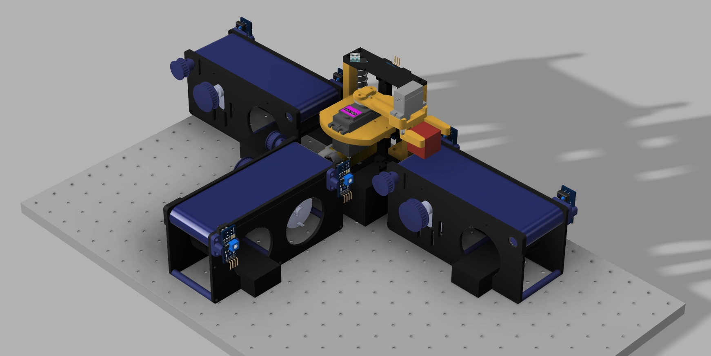
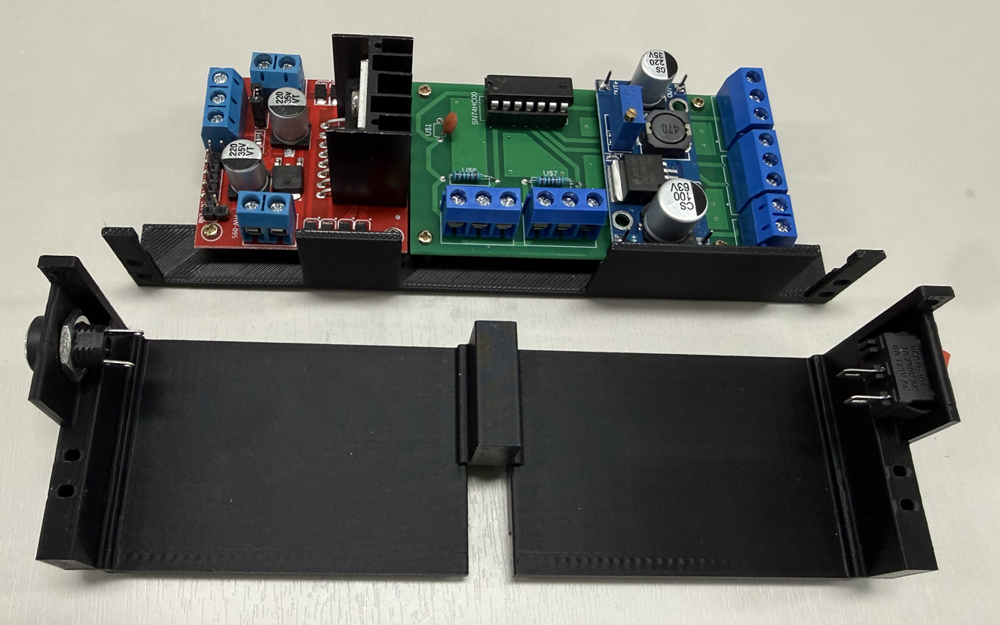

<!-- _class: title -->

# 1-01. 전체 학습 주제 개요 및 기대 학습 성과 이해

전기·전자 기초

---

## 학습 개요

- 기계 설계 과목을 마쳤습니다.
- 지금까지는 기초적인 내용을 중심으로 진행했으며, 이제부터는 기계와 관련된 내용을 프로젝트 단위로 추가해 나갈 예정…
- 굳이 구분하자면 기초 과정과 고급 과정으로 나눌 수 있습니다.
- 다만, 필자 역시 조금 더 복잡한 프로젝트를 완성하려면 많은 시간이 필요했습니다.

<!--
발표자 노트 · 원문

기계 설계 과목을 마쳤습니다.

지금까지는 기초적인 내용을 중심으로 진행했으며, 이제부터는 기계와 관련된 내용을 프로젝트 단위로 추가해 나갈 예정입니다.

굳이 구분하자면 기초 과정과 고급 과정으로 나눌 수 있습니다. 다만, 필자 역시 조금 더 복잡한 프로젝트를 완성하려면 많은 시간이 필요했습니다.

회사에서 진행했던 프로젝트들은 보안 문제로 인해 그대로 공개하기 어려웠습니다. 그렇다고 다른 프로젝트를 선정하려고 하면 늘 두 가지 아쉬움이 남습니다.

완성도는 높지만 필요 이상으로 어렵거나, 반대로 만들기는 쉽지만 완성도가 낮은 경우가 많았습니다. 다른 사람이 만든 키트 역시 실제 교육이나 실습에 활용하려고 하면 아쉬운 점이 생기곤 했습니다.

그래서 필자가 직접 만든 내용을 공유하고자 했습니다. 다만 새로운 프로젝트를 설계하고 제작하는 일은 필자에게도 상당한 시간이 필요한 작업이었습니다.
-->

---

## 핵심 개념 2

- 이러한 이야기를 먼저 하는 이유가 있습니다.
- 교육을 받으며 완성된 키트를 따라 제작하는 데에는 반나절 정도면 충분했습니다.
- 완성된 설계를 다시 그리는 일도 그리 오래 걸리지 않았습니다.
- 앞으로 진행할 고급 프로젝트 역시 학습자의 입장에서는 크게 어렵지 않을 수 있습니다.

<!--
발표자 노트 · 원문

이러한 이야기를 먼저 하는 이유가 있습니다.

교육을 받으며 완성된 키트를 따라 제작하는 데에는 반나절 정도면 충분했습니다. 완성된 설계를 다시 그리는 일도 그리 오래 걸리지 않았습니다.

앞으로 진행할 고급 프로젝트 역시 학습자의 입장에서는 크게 어렵지 않을 수 있습니다. 하지만 어렵지 않게 따라 할 수 있는 프로젝트를 만들어 내기 까지는 많은 시행착오와 고통스러운 과정이 필요합니다.

모든 설계자가 그렇듯 경험에 따라 시행착오의 횟수는 달라질 수 있습니다. 그러나 대부분의 설계는 한 번에 완성되지 않았습니다.

필자가 여러 프로젝트를 완성할 수 있었던 것은 타고난 실력이나 특별한 아과적 감각, 재능이 있었기 때문은 아니었습니다.

실제로 필자는 길을 잘 찾지 못하고 운전에도 능숙하지 않습니다. 개인적으로는 3D 형상을 이해하는 공간 감각도 뛰어난 편이 아니라고 생각이 됩니다.

필자가 무언가를 만들고 실제로 동작시키는 데 필요했던 것은 결국 시간이었습니다. 그리고 그 시간을 견디게 해준 것은 반드시 완성하겠다는 목표의식이었습니다.

지금 작성하고 있는 글과 영상 역시 오랜 시간 반복되는 지루한 과정을 견디고 있기 때문에 만들 수 있었습니다.

필자는 원래 글 읽는 것을 좋아하지 않았고, 글을 쓰는 방법에도 익숙하지 않았습니다. 말주변도 부족하다고 느꼈기 때문에 유튜브를 운영하는 일 역시 쉽지 않았습니다.

그럼에도 불구하고 필요한 내용을 만들고 공유하기 위해 계속해서 작업해 왔습니다.
-->

---

## 핵심 개념 3

- 이제부터는 기계 설계 기초 과정에서 벗어나 프로젝트 단위의 심화 과정으로 진행하겠습니다.
- 또한 기계 설계 기초 과정에서 제작했던 간단한 컨베이어를 실제로 구동하기 위한 내용들을 학습하겠습니다.
- 외형만 보면 단순한 컨베이어처럼 보일 수 있습니다.
- 하지만 이 키트를 제작하면서 센서와 모터를 사용했고, 모터의 회전수를 조절하기 위해 기계적인 기어비를 적용했습니다.

<!--
발표자 노트 · 원문

이제부터는 기계 설계 기초 과정에서 벗어나 프로젝트 단위의 심화 과정으로 진행하겠습니다. 또한 기계 설계 기초 과정에서 제작했던 간단한 컨베이어를 실제로 구동하기 위한 내용들을 학습하겠습니다.

외형만 보면 단순한 컨베이어처럼 보일 수 있습니다.

하지만 이 키트를 제작하면서 센서와 모터를 사용했고, 모터의 회전수를 조절하기 위해 기계적인 기어비를 적용했습니다.

또한 동력을 전달하기 위해 타이밍 벨트를 사용했으며, 타이밍 벨트의 장력을 조절할 수 있도록 텐션 조절 장치도 구성했습니다.

이 키트는 다양한 실습에 활용하기 위해 오랜 시간 준비했습니다.

기계 설계 과정이 끝났다고 해서 이 키트의 활용도 끝나는 것은 아닙니다. 앞으로도 동일한 키트를 활용해 전기, 전자, 임베디드, PLC, Linux, Python, Web, ROS2와 관련된 다양한 내용을 학습하겠습니다.

이번 장에서는 앞으로 학습할 전체 흐름을 조금 더 자세히 살펴보겠습니다.

1. 전기회로
2. PLC
3. 전자회로
4. 임베디드
5. OS
6. 프로그래밍
7. ROS2
8. 인공지능
-->

---

## 핵심 개념 4

- 첫 번째는 전기회로 입니다.
- 전기회로 과정에서는 전기적인 구성만으로 컨베이어 한 대를 왕복 구동해 보겠습니다.
- 먼저 모터를 구동할 수 있는 회로를 구성했습니다.
- 센서의 입력을 받아 모터를 동작시키고, 메모리 기능을 추가해 조건에 따라 컨베이어가 정방향 또는 역방향으로 회전하…

<!--
발표자 노트 · 원문

첫 번째는 전기회로 입니다.

전기회로 과정에서는 전기적인 구성만으로 컨베이어 한 대를 왕복 구동해 보겠습니다.

먼저 모터를 구동할 수 있는 회로를 구성했습니다. 센서의 입력을 받아 모터를 동작시키고, 메모리 기능을 추가해 조건에 따라 컨베이어가 정방향 또는 역방향으로 회전하도록 구성했습니다.

이러한 회로는 전기에서 말하는 시퀀스 회로의 기초가 됩니다.

시퀀스 회로는 전기 부품의 조합을 이용해 정해진 순서와 조건에 따라 장비가 동작하도록 만든 회로입니다. 일종의 전기적인 프로그램 회로라고 볼 수 있습니다.

이 과정에서는 장비의 용량에 맞게 전원을 공급하는 방법을 학습했습니다. 센서의 신호를 구분하고 사용하는 방법, 케이블과 커넥터를 선정하는 방법도 함께 다뤘습니다.

또한 케이블과 커넥터를 연결하기 위한 작업 방법과 공구 사용법을 익혔으며, 실제 회로를 전기 도면으로 표현하는 방법도 학습했습니다.

결과적으로 컨베이어를 왕복 구동하기 위한 도면을 작성하고, 그 도면에 맞춰 전기 패널과 케이블을 제작하고 설치할 수 있도록 구성했습니다.

이 과정에서는 위와 같은 전기 패널을 제작하고, 각 장치를 연결하는 케이블도 직접 만들어 보았습니다.
-->

---

## 핵심 개념 5

- 두 번째는 PLC입니다.
- 컨베이어를 전기 회로만으로 왕복 구동하려면 동작 상태를 기억할 수 있는 메모리 기능이 필요했습니다.
- 전기 회로에서 이러한 역할을 수행하는 대표적인 장치가 릴레이입니다.
- 공장자동화 시스템에서도 릴레이는 매우 중요한 역할을 했습니다.

<!--
발표자 노트 · 원문

두 번째는 PLC입니다.

컨베이어를 전기 회로만으로 왕복 구동하려면 동작 상태를 기억할 수 있는 메모리 기능이 필요했습니다.

전기 회로에서 이러한 역할을 수행하는 대표적인 장치가 릴레이입니다.

공장자동화 시스템에서도 릴레이는 매우 중요한 역할을 했습니다. 하지만 기능이 복잡해질수록 더 많은 릴레이가 필요했고, 회로의 크기와 배선도 함께 증가했습니다.

이러한 다수의 릴레이 기능을 하나의 장치 안에 소형화하고 프로그램으로 제어할 수 있도록 만든 것이 PLC입니다.

따라서 전기회로를 학습한 이후 PLC 과정을 진행했습니다.

전기 기초 과정에서 만들었던 단순한 반복 동작을 시작으로, 더욱 복잡한 컨베이어와 로봇을 활용해 물류 라인을 제어했습니다.

컨베이어 한 대를 단순히 왕복시키는 수준을 넘어, 여러 장비가 정해진 시나리오에 따라 순차적으로 동작하도록 구성했습니다.

다만 개인이 가정에 실제 공장자동화 환경을 구축하려면 많은 비용과 공간이 필요했습니다.

그래서 실제 장비와 유사한 동작을 가상환경에서 연습할 수 있도록 디지털 트윈 환경을 구축했습니다.
-->

---

## 핵심 개념 6

- 세 번째는 전자회로입니다.
- 전기회로에 릴레이가 있다면, 전자회로에는 트랜지스터가 있습니다.
- 전기와 전자는 서로 겹치는 내용이 많기 때문에 명확하게 구분하기 어려운 경우가 많았습니다.
- 가볍게 설명할 때는 감전되었을 때 “앗, 따가워”라고 느낄 정도라면 전자이고, “으악” 할 정도라면 전기라는 농담…

<!--
발표자 노트 · 원문

세 번째는 전자회로입니다.

전기회로에 릴레이가 있다면, 전자회로에는 트랜지스터가 있습니다.

전기와 전자는 서로 겹치는 내용이 많기 때문에 명확하게 구분하기 어려운 경우가 많았습니다.

가볍게 설명할 때는 감전되었을 때 “앗, 따가워”라고 느낄 정도라면 전자이고, “으악” 할 정도라면 전기라는 농담을 하기도 했습니다.

또한 48V를 기준으로 전기와 전자를 나누거나, 릴레이를 사용하면 전기이고 트랜지스터를 사용하면 전자라고 설명하기도 했습니다.

물론 이러한 기준은 전기와 전자를 이해하기 쉽게 설명하기 위한 단순한 구분일 뿐, 절대적인 기준은 아니었습니다.

다만 실제로 제작하는 대상에는 차이가 있었습니다.

전기 분야에서는 주로 전기 패널과 케이블을 제작했고, 전자 분야에서는 PCB와 케이블을 제작했습니다.

전자회로 과정에서는 전기회로에서 제작했던 전기 패널의 기능을 PCB로 변경해 보았습니다.

앞서 릴레이를 사용해 제작했던 패널의 기능을 트랜지스터를 이용한 PCB로 구현했습니다.

겉으로 보면 작은 변화처럼 보일 수 있지만, 실제 시스템의 크기와 구조, 제작 방식에는 큰 차이가 발생했습니다.

전기 패널과 PCB를 비교해 보면 공통점과 차이점을 정확하게 확인할 수 있습니다.

두 시스템 모두 필요한 전압을 만들기 위한 컨버터가 있었으며, 모터를 구동하기 위한 모터 드라이브도 포함되어 있었습니다.

차이점은 동일한 기능을 구현하는 방법에 있었습니다.

전기회로 과정에서는 전기 부품을 배선하여 전기 패널을 제작했고, 전자회로 과정에서는 전자 부품을 배치하고 회로를 설계하여 PCB를 제작했습니다.
-->

---

## 핵심 개념 7

- 네 번째는 임베디드 환경입니다.
- 다수의 릴레이 회로를 소형화하고 프로그램으로 제어할 수 있도록 만든 장치가 PLC라면, 트랜지스터 회로와 다양한…
- 이러한 마이크로컨트롤러를 이용해 특정 기능을 수행하도록 만든 시스템을 일반적으로 임베디드 시스템이라고 합니다.
- 임베디드 환경은 크게 운영체제의 사용 여부에 따라 구분할 수 있습니다.

<!--
발표자 노트 · 원문

네 번째는 임베디드 환경입니다.

다수의 릴레이 회로를 소형화하고 프로그램으로 제어할 수 있도록 만든 장치가 PLC라면, 트랜지스터 회로와 다양한 전자 기능을 하나의 칩에 집적한 장치가 마이크로컨트롤러입니다.

이러한 마이크로컨트롤러를 이용해 특정 기능을 수행하도록 만든 시스템을 일반적으로 임베디드 시스템이라고 합니다.

임베디드 환경은 크게 운영체제의 사용 여부에 따라 구분할 수 있습니다.

이 과정에서는 운영체제가 없는 환경에서 C 또는 C++를 사용했습니다. 아두이노와 ESP32처럼 비교적 저렴한 마이크로컨트롤러를 이용해 컨베이어와 로봇을 구동했습니다.

앞서 제작했던 컨베이어와 로봇 시스템을 임베디드 실습에서도 그대로 활용했습니다.
-->

---

## 핵심 개념 8

- 다섯 번째는 운영체제입니다.
- 앞에서는 운영체제가 없는 환경에서 컨베이어와 로봇 시스템을 구동했습니다.
- 이제는 운영체제가 있는 환경에서 동일한 시스템을 구동해 보았습니다.
- 이를 위해 Linux를 사용했습니다.

<!--
발표자 노트 · 원문

다섯 번째는 운영체제입니다.

앞에서는 운영체제가 없는 환경에서 컨베이어와 로봇 시스템을 구동했습니다.

이제는 운영체제가 있는 환경에서 동일한 시스템을 구동해 보았습니다. 이를 위해 Linux를 사용했습니다.

일반 PC에 Linux를 설치해도 되지만, 이 과정에서는 라즈베리파이를 사용했습니다.

라즈베리파이는 아두이노나 ESP32와 같은 마이크로컨트롤러보다는 소형 PC에 더 가까운 장치입니다.

라즈베리파이에 Linux를 설치하고 Python을 이용해 컨베이어와 로봇을 구동했습니다.
-->

---

## 핵심 개념 9

- 여섯 번째는 소프트웨어입니다.
- 소프트웨어 과정에서는 JavaScript와 Web 환경을 학습했습니다.
- PLC, 아두이노, 라즈베리파이만으로도 장비를 제어할 수 있었지만, 사용자가 장비를 쉽게 조작할 수 있는 사용자…
- 웹 환경은 PLC, 아두이노, 라즈베리파이에서 구동되는 컨베이어를 외부에서 조작할 수 있는 비교적 간단하고 범용적…

<!--
발표자 노트 · 원문

여섯 번째는 소프트웨어입니다.

소프트웨어 과정에서는 JavaScript와 Web 환경을 학습했습니다.

PLC, 아두이노, 라즈베리파이만으로도 장비를 제어할 수 있었지만, 사용자가 장비를 쉽게 조작할 수 있는 사용자 인터페이스를 구현하는 데에는 한계가 있었습니다.

웹 환경은 PLC, 아두이노, 라즈베리파이에서 구동되는 컨베이어를 외부에서 조작할 수 있는 비교적 간단하고 범용적인 방법을 제공했습니다.

최근에는 바이브 코딩과 자동 코딩 방식이 빠르게 확산되었습니다.

앞으로는 AI가 더 많은 코드를 작성하게 될 것이므로 코딩을 따로 공부할 필요가 없다는 의견도 있었습니다.

그러나 필자는 오히려 지금이 코딩을 학습하기 좋은 시기라고 생각했습니다.

AI를 활용하면 과거보다 훨씬 적은 학습량으로도 다양한 결과물을 만들 수 있기 때문입니다. 기본적인 개념만 이해해도 AI의 도움을 받아 더 많은 기능을 구현할 수 있었습니다.

따라서 코딩을 깊게 공부하지 않더라도 최소한의 구조와 동작 원리를 이해하는 것은 충분히 가치가 있다고 판단했습니다.
-->

---

## 핵심 개념 10

- 일곱 번째는 ROS2입니다.
- 앞서 Linux 환경에서 구동했던 컨베이어와 로봇을 ROS2 기반으로도 제어했습니다.
- ROS2는 Robot Operating System 2의 약자로, 로봇 시스템을 개발하기 위한 소프트웨어 프레임워…
- 이름에는 Operating System이 포함되어 있지만 Windows나 Linux와 같은 일반적인 운영체제와는…

<!--
발표자 노트 · 원문

일곱 번째는 ROS2입니다.

앞서 Linux 환경에서 구동했던 컨베이어와 로봇을 ROS2 기반으로도 제어했습니다.

ROS2는 Robot Operating System 2의 약자로, 로봇 시스템을 개발하기 위한 소프트웨어 프레임워크입니다.

이름에는 Operating System이 포함되어 있지만 Windows나 Linux와 같은 일반적인 운영체제와는 성격이 다릅니다.

Linux와 운영체제를 학습할 때 더 자세히 다루겠지만, 한 사람이 작은 프로그램을 개발할 때는 비교적 자유롭게 구조를 만들 수 있습니다.

그러나 프로젝트의 규모가 커지고 여러 명이 함께 개발하게 되면 각 프로그램이 데이터를 주고받는 방식과 기능을 분리하는 방법에 대한 공통 규칙이 필요했습니다.

운영체제 역시 하드웨어와 소프트웨어가 동작하기 위한 공통된 약속을 제공했습니다.

예를 들어 키보드가 눌렸을 때 입력을 어떻게 처리할지, 마우스가 움직였을 때 좌표를 어떻게 전달할지와 같은 규칙을 제공했습니다. 키보드와 마우스 제조사도 이러한 규칙에 맞춰 장치를 개발했습니다.

ROS2 역시 로봇을 구성하는 여러 프로그램이 일정한 규칙에 따라 데이터를 주고받고 함께 동작할 수 있도록 지원했습니다.

이를 활용하면 여러 개발자가 기능을 나누어 개발하고, 각각의 프로그램을 하나의 로봇 시스템으로 연결할 수 있었습니다.

ROS2가 제공하는 디버깅 도구와 시뮬레이션 환경을 활용할 수 있다는 점도 큰 장점이었습니다.
-->

---

## 핵심 개념 11

- 마지막으로 이러한 시스템에 인공지능을 결합했습니다.
- 센서 데이터를 분석하거나, 카메라 영상을 인식하고, 장비의 상태를 판단하는 기능에 인공지능을 활용할 수 있었습니다.
- 기계 설계에서 시작한 하나의 컨베이어는 전기, PLC, 전자, 임베디드, Linux, 프로그래밍, ROS2, 인공…
- 각 과정은 서로 분리된 과목처럼 보일 수 있지만, 실제로는 하나의 장비를 동작시키기 위해 유기적으로 연결되어 있었…

<!--
발표자 노트 · 원문

마지막으로 이러한 시스템에 인공지능을 결합했습니다.

센서 데이터를 분석하거나, 카메라 영상을 인식하고, 장비의 상태를 판단하는 기능에 인공지능을 활용할 수 있었습니다.

기계 설계에서 시작한 하나의 컨베이어는 전기, PLC, 전자, 임베디드, Linux, 프로그래밍, ROS2, 인공지능으로 확장되었습니다.

각 과정은 서로 분리된 과목처럼 보일 수 있지만, 실제로는 하나의 장비를 동작시키기 위해 유기적으로 연결되어 있었습니다.

그 첫 단계로 컨베이어에 전원을 공급하고 왕복 운전할 수 있도록 구성했습니다.

이를 위해 먼저 전기의 기초부터 학습했습니다.
-->

---

## 핵심 내용 정리

- 핵심 용어의 의미를 설명할 수 있습니다.
- 구성 요소의 역할과 연결 관계를 구분할 수 있습니다.
- 실제 회로나 장치에 기본 원리를 적용할 수 있습니다.
