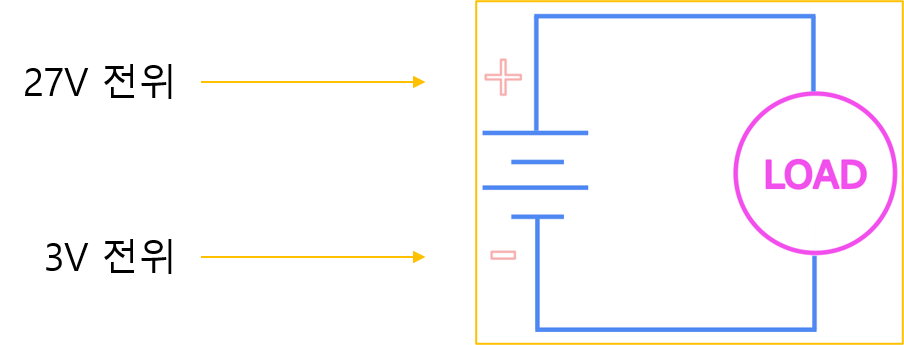
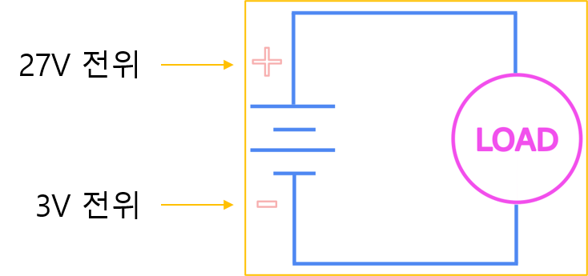
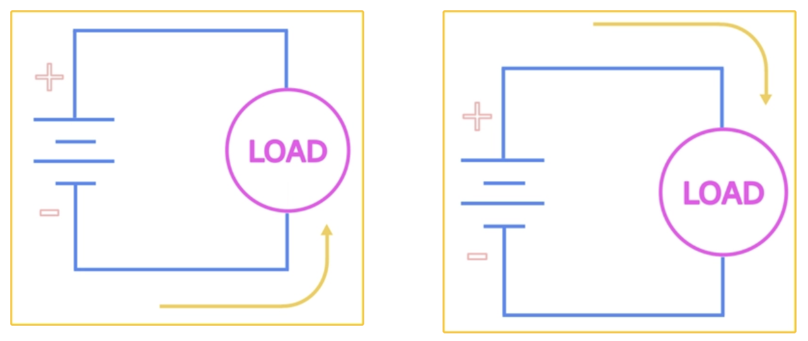
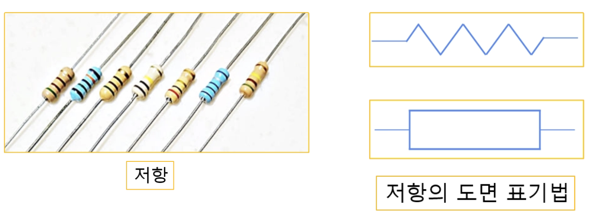

<!-- _class: title -->

# 1-03. 전압, 전류, 저항의 개념

전기·전자 기초

---

## 전기(電氣, Electricity)

- 전기(電氣, Electricity) 전기를 조금 더 깊이 이해하기 위해 잠시 화학 이야기를 먼저 해보겠습니다.
- 이 책의 전체 교육 과정은 기계, 전기, 전자, PLC, 디지털 트윈, 소프트웨어, ROS2, Vision, Ph…
- 현재는 그중 전기·전자 분야를 학습하고 있습니다.
- 전체 과정을 진행하다 보면 여러 분야의 내용이 서로 연결되어 있다는 것을 알 수 있습니다.

<!--
발표자 노트 · 원문

#### 전기(電氣, Electricity)

전기를 조금 더 깊이 이해하기 위해 잠시 화학 이야기를 먼저 해보겠습니다.

이 책의 전체 교육 과정은 기계, 전기, 전자, PLC, 디지털 트윈, 소프트웨어, ROS2, Vision, Physical AI로 구성되어 있습니다. 현재는 그중 전기·전자 분야를 학습하고 있습니다.

전체 과정을 진행하다 보면 여러 분야의 내용이 서로 연결되어 있다는 것을 알 수 있습니다. 전기와 전자는 물론이고, 전기와 PLC, PLC와 소프트웨어 역시 많은 부분에서 공통된 개념을 사용합니다. 또한 전자와 재료를 깊이 이해하기 위해서는 화학의 기초 개념을 함께 알아둘 필요가 있습니다. 화학은 기계, 전기, 전자, 반도체 등 다양한 공학 분야를 이해하기 위한 중요한 기초 학문입니다.

앞서 기계 재료를 설명하면서 이온 결합, 금속 결합, 공유 결합에 대해 다루었습니다. 금속이 왜 가공성이 좋고 쉽게 깨지지 않는지, 그리고 산화를 방지하기 위한 방법에는 어떤 것들이 있는지 설명하기 위해 화학의 기초 내용을 함께 살펴보았습니다.

이번 장에서는 여러 화학 결합 중 금속 결합에 대해서만 알아보겠습니다.

금속은 주기율표의 왼쪽에 위치한 원소들로, 전자를 잃기 쉬운 성질을 가지고 있습니다.

모든 원소는 원자핵의 양성자 수에 의해 구분되며, 중성 상태에서는 전자의 개수도 양성자의 개수와 같습니다. 그러나 원자가 안정한 상태를 유지하기 위해서는 최외각 전자가 8개가 되려는 성질을 가지고 있습니다.

금속 원소는 대부분 최외각 전자가 3개 이하이므로 전자를 더 얻어 8개를 만드는 것보다 전자를 잃는 것이 더 유리합니다.

이렇게 전자를 잃은 금속 원자는 양전하(+)를 띠게 되고, 떨어져 나온 전자는 특정 원자에 속하지 않고 금속 내부를 자유롭게 이동하게 됩니다. 이러한 전자를 자유전자라고 합니다.

자유전자는 양전하를 띠는 금속 원자 사이를 자유롭게 이동하면서 금속 원자들을 서로 결합시키는 역할을 합니다. 이것이 바로 금속 결합입니다.

또한 금속이 전기를 잘 전달하는 이유도 바로 이 자유전자 때문입니다. 자유전자가 이동하면서 전기가 흐르게 되며, 전기의 원리를 이해하기 위해서는 전압, 전류, 저항이라는 세 가지 개념을 이해해야 합니다.
-->

---

## 전압, 전류, 저항

- 전압 : 전자를 이동시키는 힘
- 전류 : 전자가 이동하는 흐름
- 저항 : 전자의 이동을 방해하는 성질

<!--
발표자 노트 · 원문

#### 전압, 전류, 저항

전기는 자유전자가 이동하면서 발생합니다.

하지만 자유전자가 스스로 움직이는 것은 아닙니다. 전자를 움직이게 하는 힘이 필요하며, 그 힘을 전압(Voltage)이라고 합니다.

전압이 발생하면 전위가 높은 곳에 있는 전자가 전위가 낮은 방향으로 밀려나고, 밀려난 전자는 다시 앞의 전자를 밀어내면서 연속적으로 이동하게 됩니다.

이처럼 전압에 의해 전자가 이동하는 현상을 전류(Current)라고 합니다.

즉, 전자를 이동시키는 힘을 전압이라 하고, 전자가 실제로 이동하는 흐름을 전류라고 합니다.

하지만 전자가 이동하는 과정에서는 일부 에너지가 열이나 빛으로 변환되면서 손실이 발생합니다. 이러한 손실을 발생시키는 성질을 저항(Resistance)이라고 합니다.

정리하면 다음과 같습니다.

- 전압 : 전자를 이동시키는 힘
- 전류 : 전자가 이동하는 흐름
- 저항 : 전자의 이동을 방해하는 성질

이 세 가지는 전기 회로를 이해하는 가장 중요한 기본 개념입니다.
-->

---

## 전압(電壓, Voltage)

- 전압(電壓, Voltage) 전압은 전기를 흐르게 하는 힘이며, 단위는 볼트(Volt, V)를 사용합니다.
- 전압은 반드시 전위차(Potential Difference)가 있을 때 발생합니다.
- 예를 들어 한 지점의 전위가 27V이고 다른 지점의 전위가 3V라면 두 지점의 전위차는 24V입니다.
- 즉, 실제 전압은 24V가 됩니다.

<!--
발표자 노트 · 원문

#### 전압(電壓, Voltage)

전압은 전기를 흐르게 하는 힘이며, 단위는 볼트(Volt, V)를 사용합니다.

전압은 반드시 전위차(Potential Difference)가 있을 때 발생합니다.

예를 들어 한 지점의 전위가 27V이고 다른 지점의 전위가 3V라면 두 지점의 전위차는 24V입니다. 즉, 실제 전압은 24V가 됩니다.

전압이 형성되면 도선 주변에는 전기장이 형성되며, 전류가 흐르면 자기장도 함께 형성됩니다.
-->

---

## 폐회로(Closed Circuit)

- 폐회로(Closed Circuit) 폐회로는 회로가 완전히 연결된 상태를 의미합니다.
- 회로가 닫혀 있으므로 전류가 흐를 수 있습니다.

<!--
발표자 노트 · 원문

#### **폐회로(Closed Circuit)**

폐회로는 회로가 완전히 연결된 상태를 의미합니다.

회로가 닫혀 있으므로 전류가 흐를 수 있습니다.

-->

---

## 개회로(Open Circuit)

- 개회로(Open Circuit) 개회로는 회로가 끊어진 상태를 의미합니다.
- 회로가 열려 있으므로 전류가 흐르지 않습니다.

<!--
발표자 노트 · 원문

#### **개회로(Open Circuit)**

개회로는 회로가 끊어진 상태를 의미합니다.

회로가 열려 있으므로 전류가 흐르지 않습니다.

-->

---

## 기준 전압

- P24 : +24V
- N24 : 0V

<!--
발표자 노트 · 원문

#### 기준 전압

그림에 표시된 27V와 3V는 기준점이 없기 때문에 절대적인 의미를 가지지 않습니다.

실제 전기 회로에서는 항상 기준점을 정하여 전압을 표시합니다.

이 책에서는 24V 전원을 기준으로 다음과 같이 표기하겠습니다.

- P24 : +24V
- N24 : 0V

즉, P24는 N24를 기준으로 +24V의 전위를 가지며, N24는 기준점이므로 0V가 됩니다.

다만 다른 회로에서는 기준점이 달라질 수 있으므로 같은 지점이라도 0V가 아닐 수도 있습니다. 처음에는 다소 혼란스러울 수 있지만, 전압은 항상 기준점에 대한 상대적인 값이라는 점만 이해하면 충분합니다.
-->

---

## 전류(電流, Current)

- 전류(電流, Current) 전류는 전자가 이동하는 흐름입니다.
- 단위는 암페어(Ampere, A)를 사용합니다.
- 1A는 1초 동안 1쿨롱(C)의 전하가 이동하는 양을 의미합니다.
- 전압이 발생하면 자유전자가 이동하게 되고, 그 결과 전류가 흐르게 됩니다.

<!--
발표자 노트 · 원문

#### 전류(電流, Current)

전류는 전자가 이동하는 흐름입니다.

단위는 암페어(Ampere, A)를 사용합니다.

1A는 1초 동안 1쿨롱(C)의 전하가 이동하는 양을 의미합니다.

전압이 발생하면 자유전자가 이동하게 되고, 그 결과 전류가 흐르게 됩니다.

전류가 흐르면 도선 주변에는 자기장이 형성되며 다양한 전기적 현상이 발생합니다.

전류는 흐르는 방식에 따라 직류(DC)와 교류(AC)로 구분합니다.
-->

---

## 전자의 이동 방향

- 전자의 이동 방향 왼쪽 그림은 전자의 실제 이동 방향으로 낮은 전위에서 높은 전위로 이동합니다.
- 반면 전류는 오른쪽 그림과 같이 높은 전위에서 낮은 전위 방향으로 정의되어 있습니다.
- 이는 전자의 실제 이동 방향이 밝혀지기 전에 전류의 방향을 먼저 정의했기 때문입니다.
- 현재도 대부분의 전기 회로와 교재에서는 전류의 방향을 기준으로 설명하고 있습니다.

<!--
발표자 노트 · 원문

#### 전자의 이동 방향

왼쪽 그림은 전자의 실제 이동 방향으로 낮은 전위에서 높은 전위로 이동합니다.

반면 전류는 오른쪽 그림과 같이 높은 전위에서 낮은 전위 방향으로 정의되어 있습니다.

이는 전자의 실제 이동 방향이 밝혀지기 전에 전류의 방향을 먼저 정의했기 때문입니다. 현재도 대부분의 전기 회로와 교재에서는 전류의 방향을 기준으로 설명하고 있습니다.

우리는 높은 전위에서 낮은 전위로 이동하는 전류만 기억을 하면 됩니다.
-->

---

## 쇼트(단락, Short Circuit)

- 쇼트(단락, Short Circuit) 전류가 흐르는 회로에는 일반적으로 부하(Load)가 존재합니다.
- 하지만 부하 없이 전원을 직접 연결하면 매우 큰 전류가 흐르게 됩니다.
- 이러한 상태를 쇼트(Short Circuit) 또는 단락이라고 합니다.
- 쇼트가 발생하면 매우 큰 전류가 흐르면서 도선이 과열되고 화재나 장비 손상이 발생할 수 있습니다.

<!--
발표자 노트 · 원문

#### 쇼트(단락, Short Circuit)

전류가 흐르는 회로에는 일반적으로 부하(Load)가 존재합니다.

하지만 부하 없이 전원을 직접 연결하면 매우 큰 전류가 흐르게 됩니다. 이러한 상태를 쇼트(Short Circuit) 또는 단락이라고 합니다.

쇼트가 발생하면 매우 큰 전류가 흐르면서 도선이 과열되고 화재나 장비 손상이 발생할 수 있습니다.

따라서 회로에는 반드시 전류를 적절하게 제한하는 요소가 필요합니다.
-->

---

## 저항(抵抗, Resistance)

- 저항(抵抗, Resistance) 저항은 전류의 흐름을 방해하는 성질이며, 단위는 옴(Ohm, Ω)을 사용합니다.
- 저항은 다양한 종류와 값을 가지며 일반적으로 색 띠(Color Code)를 이용하여 값을 표시합니다.
- 다만 실무에서는 색 띠를 모두 외우기보다는 테스터기를 이용하여 저항 값을 측정하는 경우가 훨씬 많습니다.
- 자주 사용하지 않는다면 색 띠를 암기하는 것보다 측정 방법을 익히는 것이 더욱 효율적입니다.

<!--
발표자 노트 · 원문

#### 저항(抵抗, Resistance)

저항은 전류의 흐름을 방해하는 성질이며, 단위는 옴(Ohm, Ω)을 사용합니다.

저항은 다양한 종류와 값을 가지며 일반적으로 색 띠(Color Code)를 이용하여 값을 표시합니다.

다만 실무에서는 색 띠를 모두 외우기보다는 테스터기를 이용하여 저항 값을 측정하는 경우가 훨씬 많습니다. 자주 사용하지 않는다면 색 띠를 암기하는 것보다 측정 방법을 익히는 것이 더욱 효율적입니다.
-->

---

## 전압, 전류, 저항의 관계

- V : 전압(Voltage)
- I : 전류(Current)
- R : 저항(Resistance)
- 같은 전압에서는 저항이 커질수록 전류는 작아집니다.

<!--
발표자 노트 · 원문

#### 전압, 전류, 저항의 관계

전기에서 가장 중요한 공식 중 하나가 바로 옴의 법칙입니다.

**V = I × R**

- V : 전압(Voltage)
- I : 전류(Current)
- R : 저항(Resistance)

이 공식을 통해 다음과 같은 관계를 알 수 있습니다.

- 같은 전압에서는 저항이 커질수록 전류는 작아집니다.
- 같은 저항에서는 전압이 높아질수록 전류는 커집니다.

이 공식은 앞으로 전기 회로를 설계하고 분석하는 과정에서 가장 자주 사용하게 되는 기본 공식입니다.
-->

---

## 핵심 내용 정리

- 핵심 용어의 의미를 설명할 수 있습니다.
- 구성 요소의 역할과 연결 관계를 구분할 수 있습니다.
- 실제 회로나 장치에 기본 원리를 적용할 수 있습니다.
