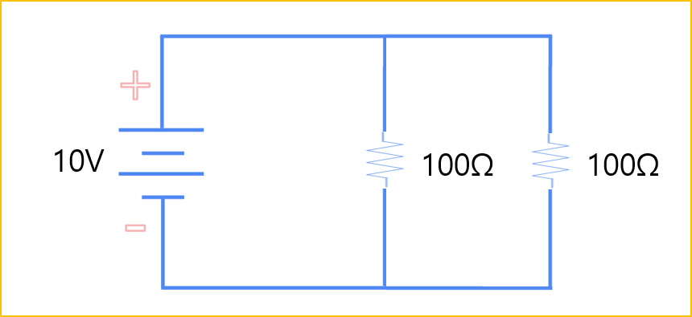
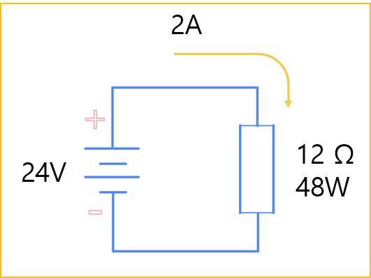
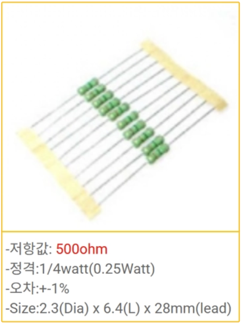

<!-- _class: title-slide -->

# 1-3. 전압 분배와 전력

전기·전자 실무 기초

---

## 합성저항

- 여러 개의 저항을 연결하면 연결 방식에 따라 전체 저항값이 달라집니다.
- 저항의 연결 방식은 크게 직렬 연결과 병렬 연결로 구분됩니다.
- **저항의 직렬 연결** 저항을 직렬로 연결하면 각 저항의 값을 모두 더해 전체 저항을 계산합니다.
- 100Ω 저항 두 개를 직렬로 연결한 경우 전체 저항은 다음과 같습니다.
- R = 100Ω + 100Ω = 200Ω 따라서 전체 저항은 200Ω이 됩니다.

---

## 합성저항

---

## 전압 분배 법칙

- **직렬 회로에서의 전압** 직렬 회로에서는 전체 전압이 각 저항의 크기에 비례하여 분배됩니다.
- 예를 들어 100Ω 저항 두 개를 직렬로 연결하고 10V를 인가하면 전체 저항은 200Ω이 됩니다.
- 옴의 법칙에 따라 회로에 흐르는 전류는 다음과 같습니다.
- I = V ÷ R I = 10V ÷ 200Ω = 0.05A 따라서 회로에는 50mA의 전류가 흐릅니다.
- 각 저항에 걸리는 전압은 다음과 같습니다.

---

## 전압 분배 법칙

---

## 전력(電力, Electric Power)

- P : 전력(Power)
- V : 전압(Voltage)
- I : 전류(Current)
- 같은 전류에서는 전압이 높아질수록 전력이 커집니다.
- 같은 전압에서는 전류가 높아질수록 전력이 커집니다.

---

## 마력과 전력

- 기계 마력(Mechanical Horsepower) : 745.7W
- 전기 마력(Electrical Horsepower) : 약 746W

---

## 전압, 전류, 저항, 전력 계산

- V = 2A × 12Ω = 24V
- I = 24V ÷ 12Ω = 2A
- R = 24V ÷ 2A = 12Ω
- P = 24V × 2A = 48W

---

## 전압, 전류, 저항, 전력 계산

---

## 단위 변환

- m(Milli) : 1/1,000
- k(Kilo) : 1,000
- 2A = 2,000mA = 0.002kA
- 24V = 24,000mV = 0.024kV
- 12Ω = 12,000mΩ = 0.012kΩ

---

## 부하의 전력

- 부하에서 전력을 계산하는 이유는 해당 부하가 소비하거나 처리하는 전기 에너지의 크기를 확인하기 위해서입니다.
- 전력은 부하가 사용할 수 있는 에너지의 크기를 나타냅니다.
- 모터에서는 출력과 소비 전력을 확인하는 기준이 되며, 히터에서는 발생하는 열의 크기를 판단하는 기준이 됩니다.
- 저항과 같은 부품은 허용 전력을 초과하면 과도한 열이 발생합니다.
- 이 상태가 계속되면 저항이 변색되거나 손상되고, 심한 경우에는 파손될 수도 있습니다.

---

## 부하의 전력

---

## 저항의 선택

- 저항을 선택할 때에는 저항값과 허용 전력을 함께 고려해야 합니다.
- 저항값은 옴의 법칙으로 계산합니다.
- R = V ÷ I 예를 들어 5V 전원에서 10mA의 전류를 사용하려면 먼저 전류를 A 단위로 변환합니다.
- 10mA = 0.01A 필요한 저항은 다음과 같습니다.
- R = 5V ÷ 0.01A = 500Ω 저항에서 소비되는 전력은 다음과 같습니다.

---

## 저항의 선택

