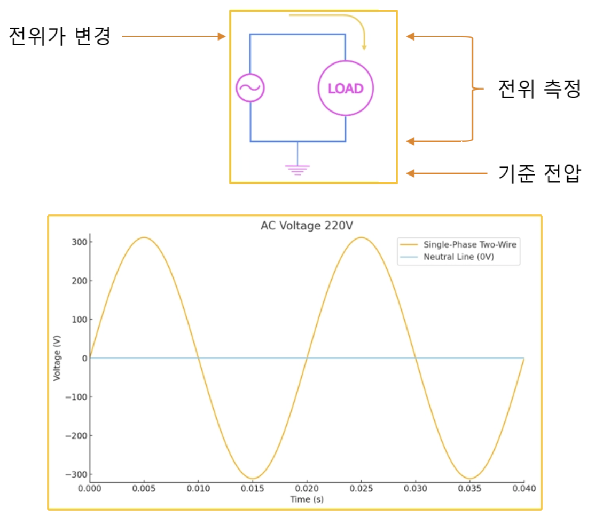
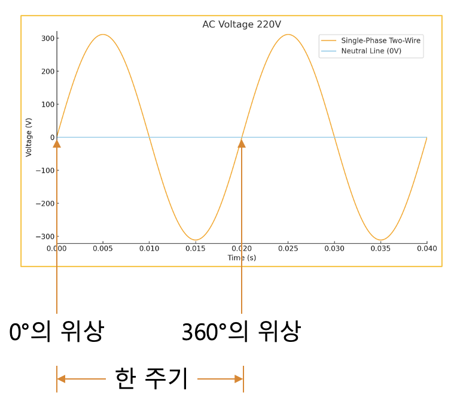
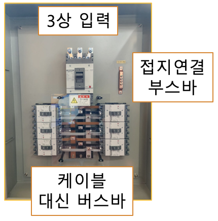
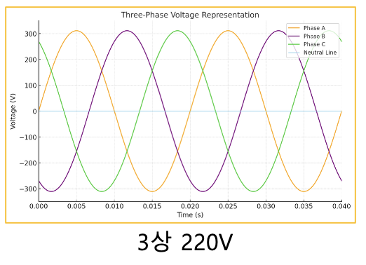

<!-- _class: title-slide -->

# 1-4. 직류와 교류 (60Hz 주파수를 사용하는 이유와 110V/220V 전압 체계를 사용하는 이유)

전기·전자 실무 기초

---

## 직류(直流, Direct Current)

- 직류(DC)는 전류의 방향이 일정하게 유지되는 전원입니다.
- 직류는 전압이 안정적이고 저장이 쉽기 때문에 배터리와 같은 전원에서 주로 사용합니다.
- 또한 전압의 변동이 적어 디지털 회로와 전자기기에서 가장 많이 사용하는 전원입니다.
- 다만 직류는 전압을 변경하기 위한 장치의 비용이 상대적으로 높기 때문에 장거리 송전에는 적합하지 않습니다.

---

## 직류(直流, Direct Current)

---

## 교류(交流, Alternate Current)

- 교류(AC)는 전류의 방향이 일정한 주기로 계속 바뀌는 전원입니다.
- 교류는 변압기를 이용하여 전압을 쉽게 높이거나 낮출 수 있으므로 장거리 송전에 매우 유리합니다.
- 또한 발전소에서 생산되는 전기를 그대로 사용할 수 있다는 장점이 있습니다.
- 반면 전기를 저장하기 어렵기 때문에 배터리와 같은 저장 장치에는 사용할 수 없습니다.
- 또한 대부분의 디지털 회로는 안정적인 직류 전원을 필요로 하므로 교류를 직접 사용하지 않고 직류로 변환하여 사용합니다.

---

## 교류(交流, Alternate Current)

---

## 직류 VS 교류

- 핵심 개념을 그림과 함께 확인했습니다.

---

## 교류의 전압 측정

- 교류 전압은 일반적으로 실효값(RMS, Root Mean Square)으로 표시합니다.
- 예를 들어 가정용 220V 전원은 최대 전압이 220V가 아니라 실효값이 220V라는 의미입니다.
- 실제 최대 전압(Peak Voltage)은 다음과 같습니다.
- Vpeak = Vrms × √2 따라서 Vpeak = 220V × 1.414 = 약 311V 가 됩니다.
- 일반적인 테스터기로 측정하는 값 역시 실효값입니다.

---

## 교류의 전압 측정

---

## 단상 2선식

- 활선(L, Live Wire) : 전압이 인가되는 전선으로 부하에 전류를 공급합니다.
- 중성선(N, Neutral Line) : 회로를 완성하여 전류가 되돌아오는 경로를 제공합니다.

---

## 단상 2선식

---

## 단상의 위상

- 한 주기 = 360°
- 한 주기 = 2π(rad)

---

## 단상의 위상

---

## 단상 3선식

- Hot A - Neutral : 220V
- Hot B - Neutral : 220V
- Hot A - Hot B : 440V

---

## 단상 3선식

---

## 3상 3선식

- A - B : 380V
- B - C : 380V
- A - C : 380V

---

## 3상 3선식

---

## 3상 3선식 분전함

- 380V 단상 × 3 (RS, ST, TR)
- 380V 삼상 × 1 (RST)

---

## 3상 3선식 분전함

---

## 버스바 VS 케이블

- 전류가 작은 경우에는 케이블을 많이 사용합니다.
- 그러나 대전류에서는 케이블의 굵기가 매우 커지고 작업성이 떨어지므로 버스바(Bus Bar)를 사용하는 경우가 많습니다.
- 버스바는 저항이 작고 방열 성능이 우수하여 대용량 전력 설비에서 널리 사용합니다.

---

## 버스바 VS 케이블

---

## 3상 4선식

- R - S : 380V
- S - T : 380V
- T - R : 380V
- R - N : 220V
- S - N : 220V

---

## 3상 4선식

---

## 3상 4선식 분전함

- 380V 단상 × 3 (RS, ST, TR)
- 220V 단상 × 3 (RN, SN, TN)
- 380V 3상 3선식
- 380V 3상 4선식

---

## 3상 4선식 분전함

---

## 단상과 3상

- 활선 1가닥과 중성선 1가닥을 사용합니다.
- 일반 가정과 소규모 전기 설비에서 많이 사용합니다.
- 활선 3가닥을 사용합니다.
- 대용량 모터와 산업용 설비에서 주로 사용합니다.
- 하나의 전원으로 3상 전원과 단상 전원을 모두 공급할 수 있습니다.

---

## 단상과 3상

---

## 단상과 3상 도면표기

- L(Live)
- N(Neutral)

---

## 단상과 3상 도면표기

---

## 110V 사용 이유

- 초기의 백열전구는 약 100V에서 사용할 수 있도록 개발되었습니다.
- 송전 과정에서 발생하는 전압 강하를 고려하여 약 110V를 표준 전압으로 사용하기 시작했습니다.
- 이후에는 같은 전력을 더 적은 전류로 전달할 수 있는 220V와 230V가 보급되면서 송전 효율이 크게 향상되었습니다.
- 미국과 일본은 이미 110V 기반의 전력 인프라가 널리 구축되어 있었기 때문에 현재까지도 100V 또는 110V 계통을 유지하고 있습니다.
- 220V는 송전 효율과 안전성을 모두 고려했을 때 적절한 전압으로 평가되어 많은 국가에서 표준 전압으로 채택했습니다.

---

## 50Hz, 60Hz 사용 이유

- 전원의 주파수는 발전기와 모터의 효율, 그리고 조명의 깜박임 등을 고려하여 결정되었습니다.
- 주파수가 너무 낮으면 백열전구의 깜박임이 심해지고, 모터의 효율도 떨어집니다.
- 반대로 주파수가 너무 높으면 철손과 발열이 증가하여 효율이 낮아집니다.
- 이러한 이유로 약 50~60Hz가 가장 효율적인 영역으로 알려져 있으며, 현재 대부분의 국가는 50Hz 또는 60Hz를 표준 주파수로 사용하고 있습니다.

---

## 교류 비교

- 핵심 개념을 그림과 함께 확인했습니다.

---

## 핵심 정리

- 단상 2선식 : 가정에서 가장 많이 사용하는 전원입니다.
- 단상 3선식 : 220V와 440V를 함께 사용할 수 있지만 현재는 많이 사용하지 않습니다.
- 3상 3선식 : 산업용 모터와 같은 3상 부하에 주로 사용합니다.
- 3상 4선식 : 공장에서 가장 많이 사용하는 방식으로, 220V 단상과 380V 3상을 동시에 사용할 수 있습니다.
