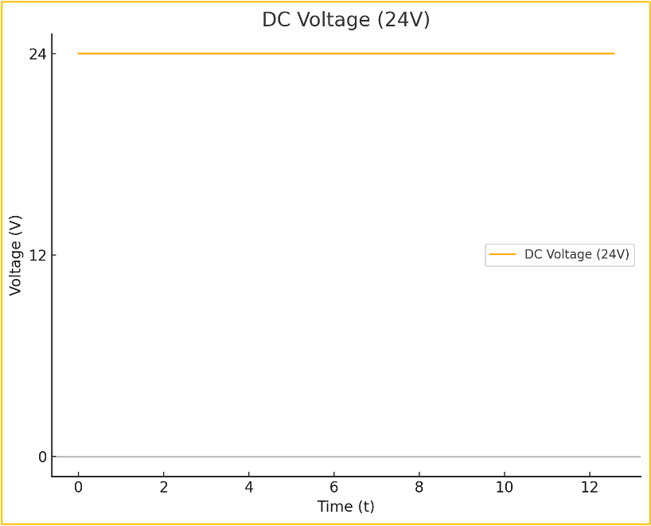
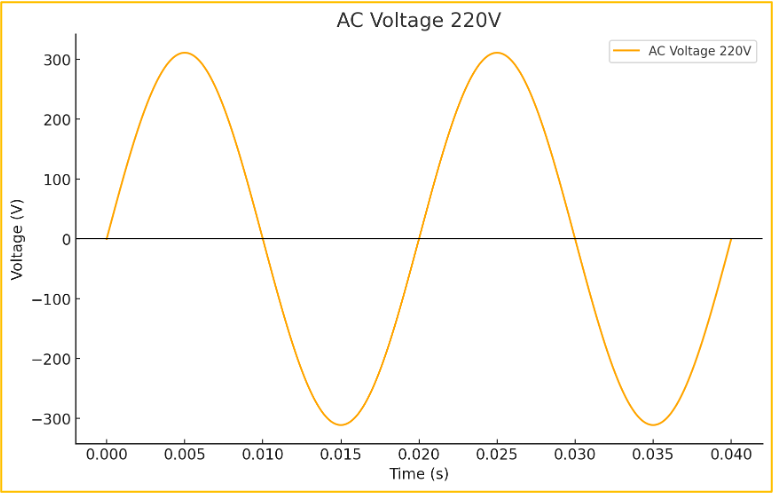
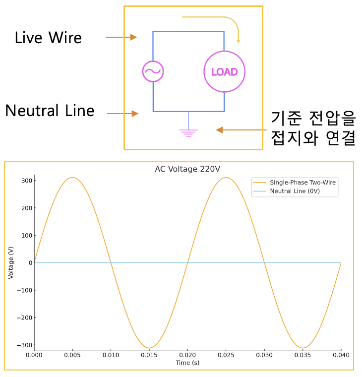
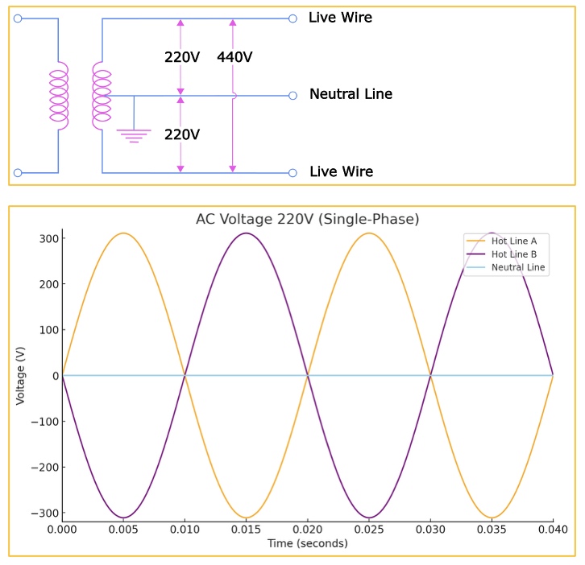
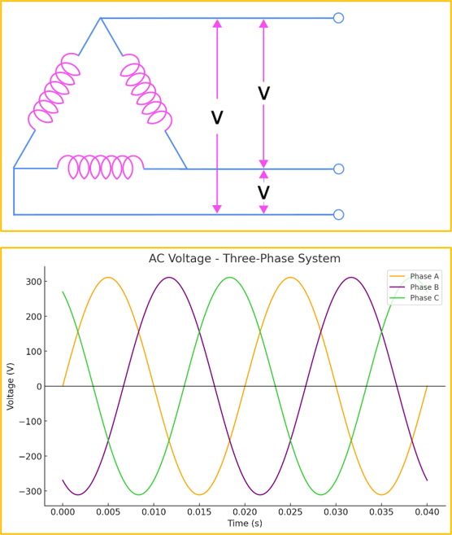
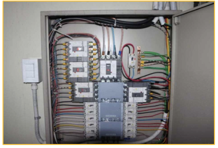
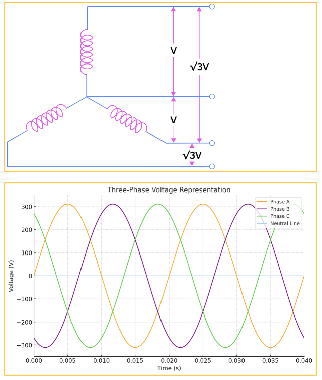

<!-- _class: title -->

# 1-05. 직류와 교류 (60Hz 주파수를 사용하는 이유와 110V/220V 전압 체계를 사용하는 이유)

전기·전자 기초

---

## 직류(直流, Direct Current)

- 직류(直流, Direct Current) 직류(DC)는 전류의 방향이 일정하게 유지되는 전원입니다.
- 직류는 전압이 안정적이고 저장이 쉽기 때문에 배터리와 같은 전원에서 주로 사용합니다.
- 또한 전압의 변동이 적어 디지털 회로와 전자기기에서 가장 많이 사용하는 전원입니다.
- 다만 직류는 전압을 변경하기 위한 장치의 비용이 상대적으로 높기 때문에 장거리 송전에는 적합하지 않습니다.

<!--
발표자 노트 · 원문

#### 직류(直流, Direct Current)

직류(DC)는 전류의 방향이 일정하게 유지되는 전원입니다.

직류는 전압이 안정적이고 저장이 쉽기 때문에 배터리와 같은 전원에서 주로 사용합니다. 또한 전압의 변동이 적어 디지털 회로와 전자기기에서 가장 많이 사용하는 전원입니다.

다만 직류는 전압을 변경하기 위한 장치의 비용이 상대적으로 높기 때문에 장거리 송전에는 적합하지 않습니다.
-->

---

## 교류(交流, Alternate Current)

- 교류(交流, Alternate Current) 교류(AC)는 전류의 방향이 일정한 주기로 계속 바뀌는 전원입니다.
- 교류는 변압기를 이용하여 전압을 쉽게 높이거나 낮출 수 있으므로 장거리 송전에 매우 유리합니다.
- 또한 발전소에서 생산되는 전기를 그대로 사용할 수 있다는 장점이 있습니다.
- 반면 전기를 저장하기 어렵기 때문에 배터리와 같은 저장 장치에는 사용할 수 없습니다.

<!--
발표자 노트 · 원문

#### 교류(交流, Alternate Current)

교류(AC)는 전류의 방향이 일정한 주기로 계속 바뀌는 전원입니다.

교류는 변압기를 이용하여 전압을 쉽게 높이거나 낮출 수 있으므로 장거리 송전에 매우 유리합니다. 또한 발전소에서 생산되는 전기를 그대로 사용할 수 있다는 장점이 있습니다.

반면 전기를 저장하기 어렵기 때문에 배터리와 같은 저장 장치에는 사용할 수 없습니다. 또한 대부분의 디지털 회로는 안정적인 직류 전원을 필요로 하므로 교류를 직접 사용하지 않고 직류로 변환하여 사용합니다.
-->

---

## 직류 VS 교류

- 직류 VS 교류

<!--
발표자 노트 · 원문

#### 직류 VS 교류

| 구분 | 직류(DC) | 교류(AC) |
| --- | --- | --- |
| 전류 방향 | 일정 | 주기적으로 변화 |
| 전압 | 안정적 | 주기적으로 변화 |
| 저장 | 가능(배터리) | 어려움 |
| 전압 변환 | 비교적 어려움 | 매우 쉬움 |
| 장거리 송전 | 부적합 | 적합 |
| 주요 사용처 | 전자기기, 디지털 회로 | 송전, 산업 설비, 모터 |
-->

---

## 교류의 전압 측정

- 교류의 전압 측정 교류 전압은 일반적으로 실효값(RMS, Root Mean Square)으로 표시합니다.
- 예를 들어 가정용 220V 전원은 최대 전압이 220V가 아니라 실효값이 220V라는 의미입니다.
- 실제 최대 전압(Peak Voltage)은 다음과 같습니다.
- Vpeak = Vrms × √2 따라서 Vpeak = 220V × 1.414 = 약 311V 가 됩니다.

<!--
발표자 노트 · 원문

#### 교류의 전압 측정

교류 전압은 일반적으로 실효값(RMS, Root Mean Square)으로 표시합니다.

예를 들어 가정용 220V 전원은 최대 전압이 220V가 아니라 실효값이 220V라는 의미입니다.

실제 최대 전압(Peak Voltage)은 다음과 같습니다.

Vpeak = Vrms × √2

따라서

Vpeak = 220V × 1.414 = 약 311V

가 됩니다.

일반적인 테스터기로 측정하는 값 역시 실효값입니다.
-->

---

## 단상 2선식

- 활선(L, Live Wire) : 전압이 인가되는 전선으로 부하에 전류를 공급합니다.
- 중성선(N, Neutral Line) : 회로를 완성하여 전류가 되돌아오는 경로를 제공합니다.

<!--
발표자 노트 · 원문

#### 단상 2선식

단상 2선식은 활선(Live Wire) 1가닥과 중성선(Neutral Line) 1가닥으로 구성됩니다.

- 활선(L, Live Wire) : 전압이 인가되는 전선으로 부하에 전류를 공급합니다.
- 중성선(N, Neutral Line) : 회로를 완성하여 전류가 되돌아오는 경로를 제공합니다.

국내 가정에서 사용하는 일반적인 전원은 단상 2선식 220V입니다.

중성선은 일반적으로 접지와 연결되어 0V 기준 전위를 유지하지만, 설비 환경에 따라 항상 완전한 0V가 되는 것은 아닙니다.
-->

---

## 단상의 위상

- 한 주기 = 360°
- 한 주기 = 2π(rad)

<!--
발표자 노트 · 원문

#### 단상의 위상

교류는 사인파 형태로 반복되며, 한 주기 안에서 신호의 위치를 **위상(Phase)**이라고 합니다.

위상차는 각도 또는 시간으로 표현합니다.

- 한 주기 = 360°
- 한 주기 = 2π(rad)

주파수가 60Hz라면 1초 동안 60번 반복하며, 한 주기의 시간은 약 16.7ms입니다.

50Hz에서는 한 주기가 20ms가 됩니다.

우리나라는 60Hz를 사용하며, 유럽을 비롯한 많은 국가에서는 50Hz를 사용합니다.
-->

---

## 단상 3선식

- Hot A - Neutral : 220V
- Hot B - Neutral : 220V
- Hot A - Hot B : 440V

<!--
발표자 노트 · 원문

#### 단상 3선식

단상 3선식은 활선 2가닥과 중성선 1가닥으로 구성됩니다.

중성선을 기준으로 각각 220V를 사용할 수 있으며, 두 활선 사이에서는 440V를 사용할 수 있습니다.

사용 가능한 전압은 다음과 같습니다.

- Hot A - Neutral : 220V
- Hot B - Neutral : 220V
- Hot A - Hot B : 440V

다만 국내에서는 일반적으로 사용하는 방식은 아닙니다.
-->

---

## 3상 3선식

- A - B : 380V
- B - C : 380V
- A - C : 380V

<!--
발표자 노트 · 원문

#### 3상 3선식

3상 3선식은 세 개의 활선(A, B, C 또는 R, S, T)으로 구성됩니다.

세 상은 서로 120°의 위상차를 가지며, 산업용 모터와 같은 대용량 부하에서 많이 사용합니다.

각 상 사이의 전압은 다음과 같습니다.

- A - B : 380V
- B - C : 380V
- A - C : 380V

3상 전원을 사용할 수 있으며, 상과 상 사이를 이용하면 단상 전원으로도 사용할 수 있습니다.
-->

---

## 3상 3선식 분전함

- 380V 단상 × 3 (RS, ST, TR)
- 380V 삼상 × 1 (RST)

<!--
발표자 노트 · 원문

#### 3상 3선식 분전함

분전함에서는 3상의 전원을 각각의 차단기로 분배하여 사용합니다.

380V 3상 3선식에서는 다음과 같은 전원을 사용할 수 있습니다.

- 380V 단상 × 3 (RS, ST, TR)
- 380V 삼상 × 1 (RST)
-->

---

## 버스바 VS 케이블

- 버스바 VS 케이블 전류가 작은 경우에는 케이블을 많이 사용합니다.
- 그러나 대전류에서는 케이블의 굵기가 매우 커지고 작업성이 떨어지므로 버스바(Bus Bar)를 사용하는 경우가 많습…
- 버스바는 저항이 작고 방열 성능이 우수하여 대용량 전력 설비에서 널리 사용합니다.

<!--
발표자 노트 · 원문

#### 버스바 VS 케이블

전류가 작은 경우에는 케이블을 많이 사용합니다.

그러나 대전류에서는 케이블의 굵기가 매우 커지고 작업성이 떨어지므로 버스바(Bus Bar)를 사용하는 경우가 많습니다.

버스바는 저항이 작고 방열 성능이 우수하여 대용량 전력 설비에서 널리 사용합니다.
-->

---

## 3상 4선식

- R - S : 380V
- S - T : 380V
- T - R : 380V
- R - N : 220V

<!--
발표자 노트 · 원문

#### 3상 4선식

3상 4선식은 활선 3가닥(R, S, T)과 중성선(N)으로 구성됩니다.

산업 현장에서 가장 많이 사용하는 전원 방식이며, 3상 전원과 단상 전원을 동시에 사용할 수 있습니다.

사용 가능한 전압은 다음과 같습니다.

- R - S : 380V
- S - T : 380V
- T - R : 380V
- R - N : 220V
- S - N : 220V
- T - N : 220V
-->

---

## 3상 4선식 분전함

- 380V 단상 × 3 (RS, ST, TR)
- 220V 단상 × 3 (RN, SN, TN)
- 380V 3상 3선식
- 380V 3상 4선식

<!--
발표자 노트 · 원문

#### 3상 4선식 분전함

3상 4선식에서는 산업용 장비에는 3상을 공급하고, 조명이나 콘센트와 같은 일반 부하에는 단상을 공급합니다.

사용 가능한 전원은 다음과 같습니다.

- 380V 단상 × 3 (RS, ST, TR)
- 220V 단상 × 3 (RN, SN, TN)
- 380V 3상 3선식
- 380V 3상 4선식
-->

---

## 단상과 3상

- 활선 1가닥과 중성선 1가닥을 사용합니다.
- 일반 가정과 소규모 전기 설비에서 많이 사용합니다.

<!--
발표자 노트 · 원문

#### 단상과 3상

**단상**

- 활선 1가닥과 중성선 1가닥을 사용합니다.
- 일반 가정과 소규모 전기 설비에서 많이 사용합니다.
-->

---

## 핵심 개념 14

- 활선 3가닥을 사용합니다.
- 대용량 모터와 산업용 설비에서 주로 사용합니다.
- 하나의 전원으로 3상 전원과 단상 전원을 모두 공급할 수 있습니다.

<!--
발표자 노트 · 원문

**3상**

- 활선 3가닥을 사용합니다.
- 대용량 모터와 산업용 설비에서 주로 사용합니다.
- 하나의 전원으로 3상 전원과 단상 전원을 모두 공급할 수 있습니다.
-->

---

## 단상과 3상 도면표기

- L(Live)
- N(Neutral)
- L1
- L2

<!--
발표자 노트 · 원문

#### 단상과 3상 도면표기

**단상 전원의 표기**

단상 전원은 일반적으로 다음과 같이 표기합니다.

- L(Live)
- N(Neutral)

예)

- L1
- L2
- N
-->

---

## 핵심 개념 16

- 3상 전원의 표기 국가에 따라 표기 방법이 다릅니다.
- 미국에서는 A, B, C, N 을 사용하며, 유럽과 국내에서는 R, S, T, N 을 많이 사용합니다.

<!--
발표자 노트 · 원문

**3상 전원의 표기**

국가에 따라 표기 방법이 다릅니다.

미국에서는 A, B, C, N 을 사용하며,

유럽과 국내에서는 R, S, T, N 을 많이 사용합니다.
-->

---

## 110V 사용 이유

- 110V 사용 이유 초기의 백열전구는 약 100V에서 사용할 수 있도록 개발되었습니다.
- 송전 과정에서 발생하는 전압 강하를 고려하여 약 110V를 표준 전압으로 사용하기 시작했습니다.
- 이후에는 같은 전력을 더 적은 전류로 전달할 수 있는 220V와 230V가 보급되면서 송전 효율이 크게 향상되었습…
- 미국과 일본은 이미 110V 기반의 전력 인프라가 널리 구축되어 있었기 때문에 현재까지도 100V 또는 110V…

<!--
발표자 노트 · 원문

#### 110V 사용 이유

초기의 백열전구는 약 100V에서 사용할 수 있도록 개발되었습니다.

송전 과정에서 발생하는 전압 강하를 고려하여 약 110V를 표준 전압으로 사용하기 시작했습니다.

이후에는 같은 전력을 더 적은 전류로 전달할 수 있는 220V와 230V가 보급되면서 송전 효율이 크게 향상되었습니다.

미국과 일본은 이미 110V 기반의 전력 인프라가 널리 구축되어 있었기 때문에 현재까지도 100V 또는 110V 계통을 유지하고 있습니다.

220V는 송전 효율과 안전성을 모두 고려했을 때 적절한 전압으로 평가되어 많은 국가에서 표준 전압으로 채택했습니다.
-->

---

## 50Hz, 60Hz 사용 이유

- 50Hz, 60Hz 사용 이유 전원의 주파수는 발전기와 모터의 효율, 그리고 조명의 깜박임 등을 고려하여 결정되었…
- 주파수가 너무 낮으면 백열전구의 깜박임이 심해지고, 모터의 효율도 떨어집니다.
- 반대로 주파수가 너무 높으면 철손과 발열이 증가하여 효율이 낮아집니다.
- 이러한 이유로 약 50~60Hz가 가장 효율적인 영역으로 알려져 있으며, 현재 대부분의 국가는 50Hz 또는 60…

<!--
발표자 노트 · 원문

#### 50Hz, 60Hz 사용 이유

전원의 주파수는 발전기와 모터의 효율, 그리고 조명의 깜박임 등을 고려하여 결정되었습니다.

주파수가 너무 낮으면 백열전구의 깜박임이 심해지고, 모터의 효율도 떨어집니다.

반대로 주파수가 너무 높으면 철손과 발열이 증가하여 효율이 낮아집니다.

이러한 이유로 약 50~60Hz가 가장 효율적인 영역으로 알려져 있으며, 현재 대부분의 국가는 50Hz 또는 60Hz를 표준 주파수로 사용하고 있습니다.
-->

---

## 교류 비교

- 교류 비교

<!--
발표자 노트 · 원문

#### 교류 비교

| 구분 | 전선 구성 | 사용 가능한 전압 | 특징 | 주요 사용처 |
| --- | --- | --- | --- | --- |
| **단상 2선식** | 2선
L + N | 220V | 가장 기본적인 단상 전원 | 가정용 콘센트, 조명, 소형 전기기기 |
| **단상 3선식** | 3선
L1 + L2 + N | 220V, 440V | 두 개의 단상 전원을 동시에 사용할 수 있음 | 특수 설비, 일부 산업 설비 |
| **3상 3선식** | 3선
R + S + T | 380V(상간) | 중성선 없이 3상 전원을 공급 | 산업용 모터, 대용량 설비 |
| **3상 4선식** | 4선
R + S + T + N | 380V(상간), 220V(상-중성선) | 3상과 단상을 동시에 사용할 수 있음 | 공장, 빌딩, 산업용 분전반 |
-->

---

## 핵심 정리

- 단상 2선식 : 가정에서 가장 많이 사용하는 전원입니다.
- 단상 3선식 : 220V와 440V를 함께 사용할 수 있지만 현재는 많이 사용하지 않습니다.
- 3상 3선식 : 산업용 모터와 같은 3상 부하에 주로 사용합니다.
- 3상 4선식 : 공장에서 가장 많이 사용하는 방식으로, 220V 단상과 380V 3상을 동시에 사용할 수 있습니다.

<!--
발표자 노트 · 원문

#### 핵심 정리

- 단상 2선식 : 가정에서 가장 많이 사용하는 전원입니다.
- 단상 3선식 : 220V와 440V를 함께 사용할 수 있지만 현재는 많이 사용하지 않습니다.
- 3상 3선식 : 산업용 모터와 같은 3상 부하에 주로 사용합니다.
- 3상 4선식 : 공장에서 가장 많이 사용하는 방식으로, 220V 단상과 380V 3상을 동시에 사용할 수 있습니다.
-->

---

## 핵심 내용 정리

- 핵심 용어의 의미를 설명할 수 있습니다.
- 구성 요소의 역할과 연결 관계를 구분할 수 있습니다.
- 실제 회로나 장치에 기본 원리를 적용할 수 있습니다.
