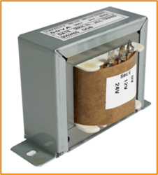
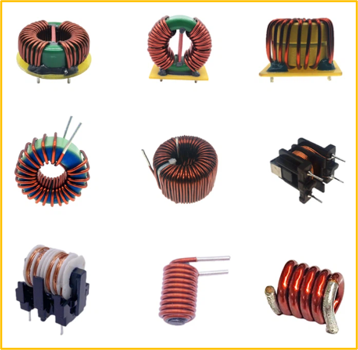
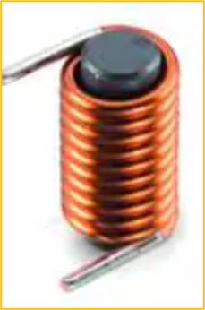
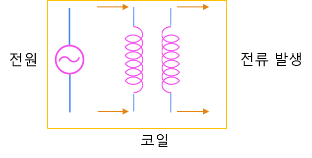
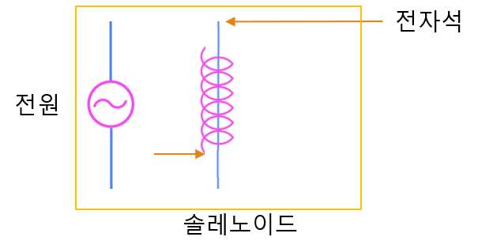
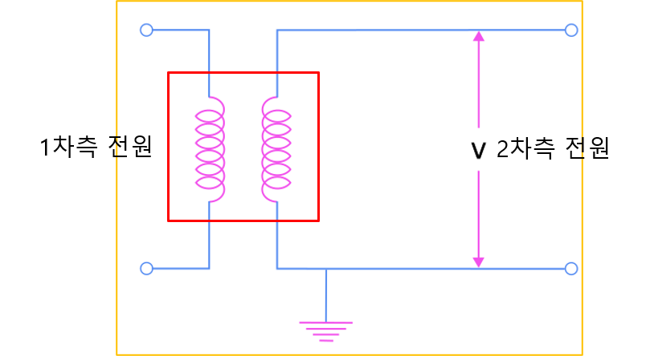
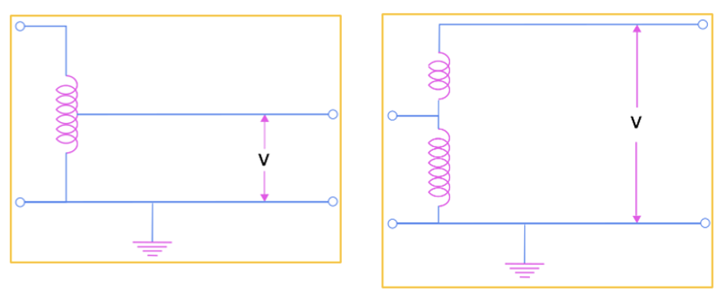

<!-- _class: title-slide -->

# 1-6. 변압기, 코일, 인덕터, 솔레노이드

전기·전자 실무 기초

---

## 변압기와 코일

- 앞에서는 직류와 교류의 차이, 그리고 교류가 장거리 송전에 적합한 이유를 살펴보았습니다.
- 이번에는 교류를 이해하기 위해 반드시 알아야 하는 **코일**과 **변압기**에 대해 알아보겠습니다.
- 코일은 변압기뿐만 아니라 모터, 릴레이, 솔레노이드 등 다양한 전기·전자 장치에서 사용되는 가장 기본적인 부품입니다.
- 먼저 코일의 원리를 이해한 후, 이를 응용한 다양한 장치들을 살펴보겠습니다.

---

## 변압기와 코일

---

## 코일

- 코일은 전선을 여러 번 나선형으로 감아 만든 도체입니다.
- 코일에 전류가 흐르면 강한 자기장이 형성되며, 전류의 방향과 코일의 감긴 방향에 따라 자기장의 방향도 달라집니다.
- 코일은 자기장을 이용하는 거의 모든 전기 장치의 기본 요소이며, 변압기, 모터, 릴레이, 솔레노이드 등에서 널리 사용됩니다.

---

## 코일

---

## 인덕터(Inductor)

- 전류가 갑자기 증가하는 것을 방해합니다.
- 전압이 인가되는 순간 돌입전류(Inrush Current)가 발생할 수 있습니다.
- 전류가 변화하면 역기전력(Back EMF)이 발생합니다.
- 전원이 차단되면 저장되어 있던 자기 에너지가 방출됩니다.

---

## 인덕터(Inductor)

---

## 솔레노이드

- 솔레노이드는 코일의 한 종류로, 원통형으로 길게 감은 구조를 가지고 있습니다.
- 코일에 전류가 흐르면 내부에 강한 자기장이 형성되며, 철심을 넣으면 자기력이 더욱 강해집니다.
- 이 자기력을 이용하여 직선 운동을 만들어 낼 수 있습니다.

---

## 솔레노이드

---

## 솔레노이드 응용

- 솔레노이드 밸브(Solenoid Valve)
- 솔레노이드 액추에이터(Solenoid Actuator)
- 솔레노이드 릴레이(Solenoid Relay)

---

## 솔레노이드 응용

---

## 변압기 (Transformer)

- 변압기는 코일 두 개를 이용하여 교류 전압의 크기를 변경하는 장치입니다.
- 변압기는 철심(Core)에 감긴 두 개의 코일로 구성됩니다.
- 전원에 연결된 코일을 1차측, 전압을 출력하는 코일을 2차측이라고 합니다.
- 1차측 코일에 교류 전류가 흐르면 자기장이 형성되고, 변화하는 자기장이 코어를 통해 2차측 코일에 전달되면서 전압이 유도됩니다.
- 이러한 원리를 전자기 유도(Electromagnetic Induction)라고 합니다.

---

## 변압기 (Transformer)

---

## 복권 변압기

- 앞에서 살펴본 일반적인 변압기를 **복권 변압기(Isolation Transformer)**라고 합니다.
- 복권 변압기는 1차측과 2차측이 서로 다른 코일로 완전히 분리되어 있습니다.
- 따라서 제작 비용이 비교적 높고 크기와 무게도 큰 편입니다.
- 하지만 1차측과 2차측이 전기적으로 절연되어 있으므로 노이즈가 전달되지 않는 장점이 있습니다.
- '절연(絕緣)'이란 전기적으로 연결되지 않은 상태를 의미합니다.

---

## 복권 변압기

---

## 단권 변압기

- 단권 변압기(Auto Transformer)는 하나의 코일을 1차측과 2차측이 함께 사용하는 변압기입니다.
- 복권 변압기보다
- 구조가 단순하여 가격이 저렴하고 크기와 무게도 작습니다.
- 하지만 1차측과 2차측이 전기적으로 연결되어 있기 때문에 절연 기능이 없습니다.
- 따라서 외부의 노이즈가 그대로 전달될 수 있으며, 감전 보호 측면에서도 복권 변압기보다

---

## 단권 변압기

---

## 전류의 손실

- 도선의 저항(R)을 줄입니다.
- 흐르는 전류(I)를 줄입니다.
