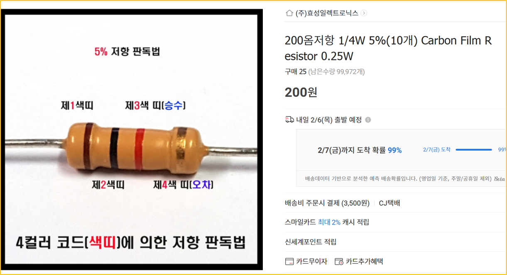
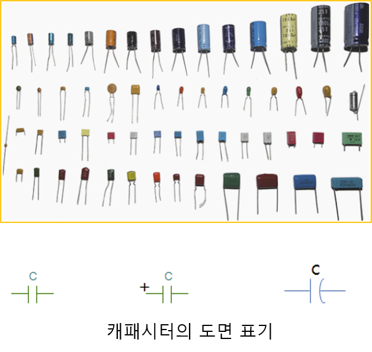

<!-- _class: title-slide -->

# 1-7. 수동 소자의 이해

전기·전자 실무 기초

---

## 저항 (R)

- LED를 구동할 때는 반드시 전류를 제한하기 위한 저항이 필요합니다.
- 예를 들어 전원 전압이 5V이고, LED의 순방향 전압이 1.8V, 동작 전류가 20mA라면 필요한 저항은 다음과 같이 계산합니다.
- R = (5V - 1.8V) ÷ 0.02A 계산 결과는 약 160Ω이 됩니다.
- 실제 회로에서는 계산값보다
- 큰 표준 저항을 선택하므로 200Ω 저항을 사용합니다.

---

## 저항 (R)

---

## 저항의 전력 계산

- 저항을 선택할 때에는 저항값뿐만 아니라 허용 전력도 함께 확인해야 합니다.
- 저항에서 소비되는 전력은 다음과 같습니다.
- P = V × I P = 3.2V × 16mA = 51mW 따라서 최소 51mW 이상의 전력을 견딜 수 있는 저항을 선택해야 합니다.

---

## 저항의 전력 계산

---

## 캐패시터(C)

- 캐패시터는 전하를 저장하는 부품입니다.
- 배터리처럼 전기를 저장하는 역할을 하지만, 저장 용량은 매우 작고 충전과 방전이 매우 빠르다는 특징이 있습니다.
- 이러한 특성 때문에 순간적인 전압 변화를 완화하거나 전원을 안정시키는 용도로 많이 사용됩니다.

---

## 캐패시터(C)

---

## 캐패시터 선정

- 캐패시터는 대부분 전원 회로에서 사용됩니다.
- 마이크로컨트롤러나 CPU와 같은 디지털 소자는 안정적인 전원을 필요로 하며, 이를 위해 제조사에서 권장하는 캐패시터 값을 제공합니다.
- 실무에서는 대부분 제조사의 권장 회로를 그대로 사용하는 경우가 많으며, 직접 계산하여 선정하는 경우는 많지 않습니다.

---

## 인덕터(L)

- 인덕터는 전류가 흐를 때 자기장을 형성하여 에너지를 저장하는 부품입니다.
- 캐패시터가 **전압의 변화**를 완화하는 역할을 한다면, 인덕터는 **전류의 변화**를 완화하는 역할을 합니다.
- 따라서 전류가 갑자기 증가하거나 감소하려고 하면 이를 방해하는 특성을 가지고 있습니다.

---

## 인덕터(L)

---

## 인덕터의 특징

- 자기장에 에너지를 저장합니다.
- 코일 구조를 이용하여 동작합니다.
- 전류의 급격한 변화를 방해합니다.
- 전원 회로와 DC-DC 컨버터에서 많이 사용됩니다.

---

## 인덕터의 특징

---

## RLC 회로

- R (Resistor) : 전류를 제한합니다.
- L (Inductor) : 자기장에 에너지를 저장하며 전류의 변화를 완화합니다.
- C (Capacitor) : 전기장에 에너지를 저장하며 전압의 변화를 완화합니다.
- D (Diode) : 전류가 한 방향으로만 흐르도록 제어합니다.
