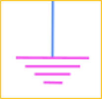
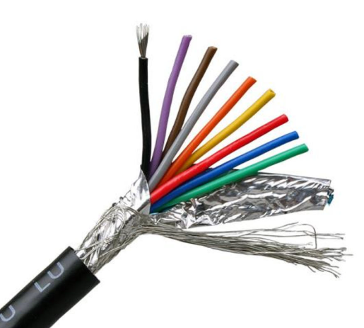

<!-- _class: title-slide -->

# 1-8. 접지와 중성선 그리고 노이즈

전기·전자 실무 기초

---

## 접지 (接地, Ground)

- 접지는 전기 회로나 전기 장치를 대지(Earth)와 전기적으로 연결하는 것을 의미합니다.
- 대지는 매우 큰 전기 용량을 가지고 있으므로 일반적으로 0V의 기준 전위로 사용합니다.
- 접지는 모든 전류를 흘려 보내기 위한 것이 아니라, 이상 상황이 발생했을 때 안전하게 전류를 방전하기 위한 기준점의 역할을 합니다.

---

## 접지 (接地, Ground)

---

## 접지의 목적

- 예기치 않은 고전압이나 과전류가 발생했을 때 전류를 안전하게 대지로 흘려보내 사람과 장비를 보호합니다.
- 전기 장치의 기준 전위를 일정하게 유지하여 안정적인 동작을 돕습니다.

---

## 접지의 중요성

- 접지는 안전을 위해 매우 중요합니다.
- 사람이 접촉할 수 있는 부위 (Frame, Body, Cover, 문 손잡이 등) 에는 반드시 접지와 연결되어 있어야 합니다.
- 접지는 안전뿐만 아니라 장비의 안정적인 동작에도 매우 중요한 역할을 합니다.
- 특히 자동화 장비에서는 여러 장치가 하나의 시스템으로 연결되어 있기 때문에 기준 전위가 일정하지 않으면 통신 오류나 센서 오동작이 발생할 수 있습니다.
- 따라서 산업 현장에서는 접지를 안전 설계의 기본 요소로 고려합니다.

---

## 접지의 중요성

---

## 접지 설계 시 주의사항

- 접지를 설계할 때 가장 중요한 것은 **접지 루프(Ground Loop)**가 발생하지 않도록 하는 것입니다.
- 모든 접지는 하나의 기준점으로 모여 대지로 연결되어야 합니다.
- !image.png 만약 접지끼리 서로 연결되어 폐루프를 형성하면 노이즈 전류가 루프 내부를 계속 순환하게 됩니다.
- 이러한 현상을 **Ground Loop**라고 합니다.
- Ground Loop가 발생하면 노이즈가 증가하고 장비의 오동작이나 통신 장애가 발생할 수 있습니다.

---

## 노이즈의 발생

- 전류가 도선을 따라 흐르면 도선 주변에는 자기장이 형성됩니다.
- 이 자기장이 다른 도선에 영향을 주면 전류가 유도되며, 이를 전자기 유도라고 합니다.
- 원하지 않는 유도 전류가 발생하면 회로에는 노이즈가 발생합니다.
- 이러한 노이즈는 센서 신호나 통신 신호를 왜곡하여 다양한 오동작의 원인이 됩니다.

---

## 쉴드(Shield)

- 노이즈를 줄이는 가장 대표적인 방법 중 하나가 쉴드입니다.
- 쉴드는 도선을 금속층으로 감싸 외부에서 발생하는 전자기장이 내부 도선에 영향을 주지 못하도록 차단하는 역할을 합니다.

---

## 쉴드 케이블

- 쉴드 케이블은 신호선을 금속 쉴드로 감싼 케이블입니다.
- 외부에서 발생하는 자기장이 내부 도선에 유도되는 것을 줄여 통신 신호나 센서 신호를 안정적으로 전달할 수 있습니다.
- 쉴드를 사용할 때 가장 중요한 점은 쉴드를 반드시 접지와 연결해야 한다는 것입니다.
- 접지되지 않은 쉴드는 외부 노이즈를 흡수한 후 내부에 전하가 축적될 수 있습니다.
- 이렇게 전위가 높아지면 다른 장치로 방전되면서 오히려 새로운 노이즈나 정전기의 원인이 될 수 있습니다.

---

## 쉴드 케이블

---

## 노이즈

- 자동화 장비를 설계하면서 가장 많이 접하게 되는 문제 중 하나가 노이즈입니다.
- 노이즈는 센서 오동작, PLC 입력 오류, 통신 장애 등 다양한 문제를 발생시킬 수 있습니다.
- 노이즈를 줄이는 가장 기본적인 방법은 올바른 접지를 설계하는 것입니다.
- 또한 통신선이나 미세한 신호를 사용하는 회로에서는 쉴드 케이블을 사용하는 것이 매우 중요합니다.
- 이 외에도 통신선에서는 서로 두 가닥의 선을 꼬아 사용하는 트위스트 페어(Twisted Pair) 방식이 많이 사용됩니다.
