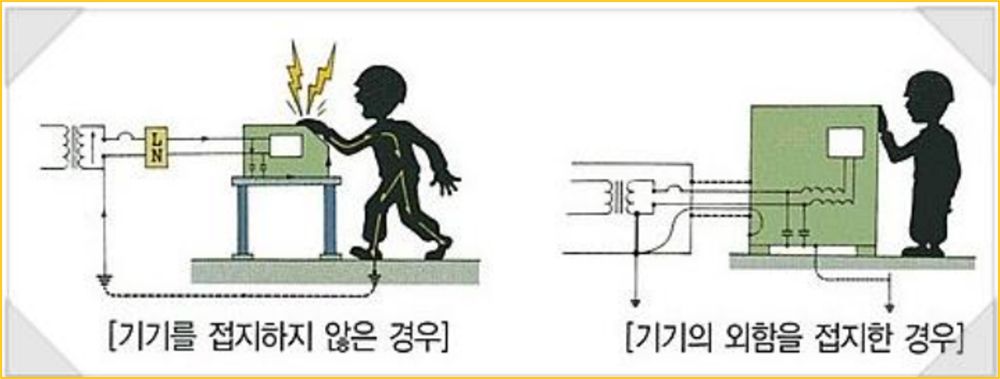

<!-- _class: title-slide -->

# 1-8. 접지와 중성선 그리고 노이즈

전기·전자 실무 기초

---

## 학습 목표

- 접지와 중성선의 역할을 구분할 수 있습니다.
- 접지 루프가 노이즈 문제를 만드는 이유를 설명할 수 있습니다.
- 쉴드 케이블의 올바른 접속 원칙을 이해할 수 있습니다.

---

## 접지 (接地, Ground)

- 접지란 전기 회로나 전기 장치가 대지와 전기적으로 연결되는 것을 의미
- 대지(Ground)의 전위는 매우 낮으므로 0V로 간주
- 예기치 않은 고전압, 과전류가 발생했을 때 전류를 안전하게 지면으로 흐르게 하여 사람과 장치를 보호
- 기계 장치의 전압을 일정하게 유지

---

## 접지 (接地, Ground)

---

## 접지의 중요성

---

## 접지 설계에서 조심해야 할 점

- 접지 배선은 불필요한 폐루프가 생기지 않도록 구성해야 합니다.
- 접지 사이에 폐루프가 형성되면 발생한 노이즈가 내부에 갇히는 문제가 생깁니다.
- 만약 이러한 문제가 발생하게 된다면 해결하기가 매우 어렵습니다.
- 접지 도체의 저항은 매우 작아 접지 루프의 위치를 찾기 어려울 수 있습니다.
- 이러한 문제를 줄이기 위해 기준 접지점을 중심으로 방사형 또는 스타형 배선을 구성했습니다.

---

## 쉴드

- 도선 내 전류가 흐르게 되면 도선 주위에는 자기장이 형성됩니다.
- 자기장 근처에 있는 다른 도선에는 자기장으로 인해 전류가 유도됩니다.
- → 노이즈의 원인

---

## 쉴드 케이블

- 외부에서 발생한 자기장으로 인해 도선 내에 전류가 유도되지 않도록 쉴드를 사용하는 방법이 있습니다.
- 이때, 중요한 것은 쉴드가 반드시 접지에 직접 닿아 있어야 한다는 것입니다.
- 만약, 쉴드가 접지에 닿아 있지 않다면 쉴드 내에 차징효과가 발생해 전위를 갖게 되며, 전위가 높아지면 다른 곳으로 전류를 방출하게 됩니다.
- (정전기 발생) 전원선 일경우에는 열 발생 위험으로 인해 쉴드 보다는 거리를 두는 것이 좋습니다.
- (쉴드로 인한 온도 상승 위험)

---

## 쉴드 케이블

---

## 노이즈

- 자동화 장비의 전기분야에서 가장 어려운건 단연 노이즈입니다.
- 가장 손쉬운 해결 방법은 접지를 활용하는 것이며, 통신선 혹은 노이즈에 대비해야 하는 경우라면 쉴드 케이블이 상당히 중요합니다.
- (쉴드 케이블 외에 케이블을 꼬임선으로 사용하는 트위스트 페어 방식은 추후 통신선에서 다시 설명합니다.)

---

## 핵심 정리

- 접지는 고장 전류를 안전하게 흘려 보호장치가 동작하도록 했습니다.
- 중성선은 정상 운전 중 전류가 흐를 수 있는 회로의 일부였습니다.
- 여러 지점에 무분별하게 접지하면 접지 루프와 전위차로 노이즈가 생길 수 있습니다.
- 쉴드의 접속 방식은 신호 종류와 주파수, 설비의 접지 정책에 맞춰 결정해야 합니다.
