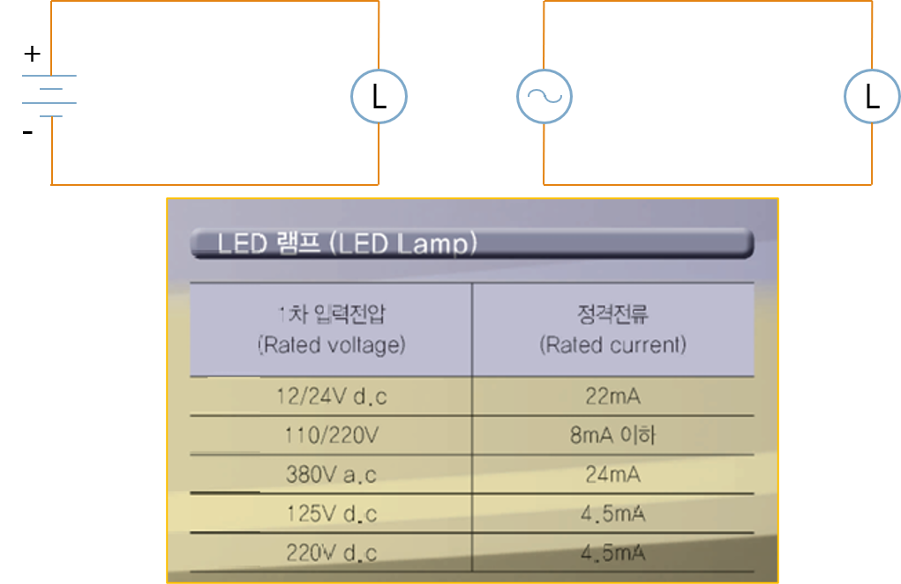
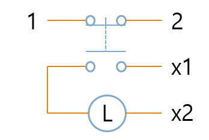
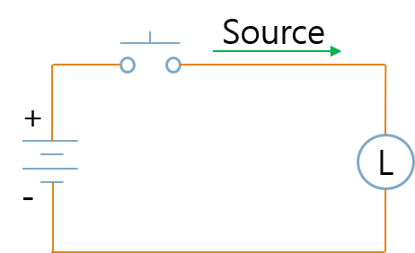
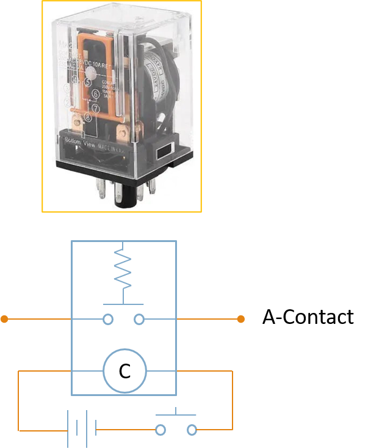
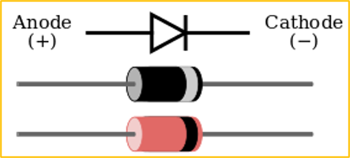
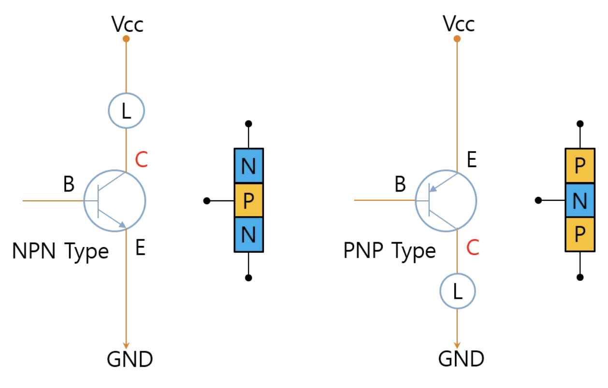
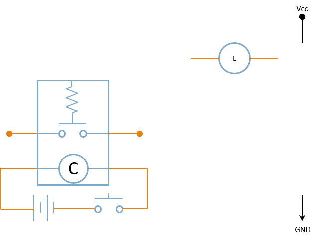
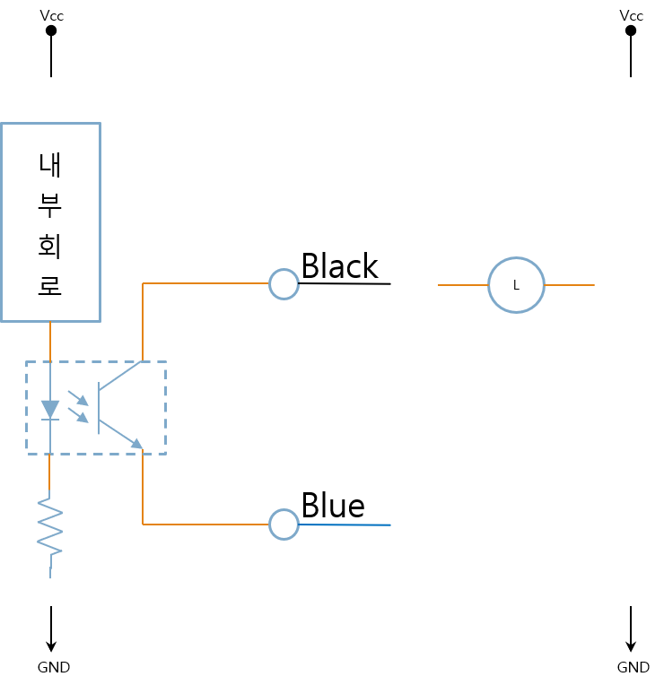
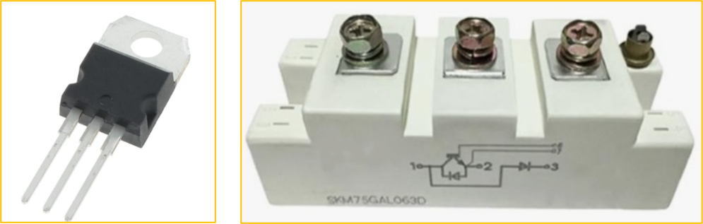

<!-- _class: title-slide -->

# 1-9. 스위칭 소자와 제어 장치

전기·전자 실무 기초

---

## 스위치

- 표시등
- 누름 버튼 스위치
- 조광형 누름 버튼 스위치
- 셀렉터 스위치
- 조광형 셀렉터 스위치

---

## 스위치

---

## 누름버튼 스위치 모델

- 스위치 제조사 메뉴얼 또는 자료를 참조하면 다양한 옵션을 선택할 수 있습니다.
- 타공 사이즈(홀치수) 와 버튼 크기, 색상과 접점 구성등을 확인해서 사용하면 됩니다.

---

## 누름버튼 스위치 모델

---

## 표시등

- 표시등은 장비의 현재 상태를 사용자에게 알려주는 역할을 합니다.
- 제품의 정격 전압에 맞는 전원을 공급하면 점등되며, 장비의 동작 상태나 이상 여부를 직관적으로 확인할 수 있습니다.

---

## 표시등

---

## 스위치의 접점

- NC (Normally Closed): 평상시에 연결되어 있으며 버튼을 누르면 회로가 열립니다.
- B접점(=B Contact)
- NO (Normally Open) : 평상시에는 열려 있으며 버튼을 누르면 연결됩니다.
- A접점(=A Contact)
- Lamp : 표시등 전원 단자

---

## 스위치의 접점

---

## 스위치 배선

- 버튼을 누를 때 램프에 불이 들어오게 하는 배선도

---

## 스위치 배선

---

## 소자 설명

- 솔레노이드 밸브

---

## 소자 설명

---

## 시퀀스 회로

- 자동화 장비에서는 스위치의 접점을 이용하여 다양한 논리 회로를 구성합니다.
- **A접점(NO)을 이용한 램프 ON** 버튼을 누르면 접점이 연결되어 램프가 켜집니다.
- **B접점(NC)을 이용한 램프 OFF** 버튼을 누르면 접점이 끊어져 램프가 꺼집니다.
- 이와 같은 회로를 기본으로 다양한 시퀀스 회로를 구성할 수 있습니다.

---

## 시퀀스 회로

---

## 스위치 종류

- 누르면 ON, 떼면 OFF
- 누르면 OFF, 떼면 ON
- 왼쪽 OFF, 오른쪽 ON
- 왼쪽 ON, 오른쪽 OFF
- 왼쪽 ON, 오른쪽 OFF

---

## 스위치 종류

---

## 접점 추가

- 하나의 스위치에는 여러 개의 접점을 추가할 수 있습니다.
- (추가접점 : 우측 이미지) 이를 이용하면 하나의 버튼으로 여러 회로를 동시에 제어 할 수 있습니다.

---

## 접점 추가

---

## 디지털 출력(Digital Output)

- 자동화 장비의 출력은 크게 Source 방식과 Sink 방식으로 구분합니다.
- **Source 출력** 출력에서 (+) 전원을 공급하는 방식입니다.
- **Sink 출력** 출력이 GND(0V)를 연결하는 방식입니다.
- 부하를 기준으로 보면 Source와 Sink는 극성만 서로 반대입니다.
- **Source 출력과 Sink 출력** PLC와 센서를 연결할 때는 반드시 Source 방식과 Sink 방식을 확인해야 합니다.

---

## 디지털 출력(Digital Output) · 그림 1

---

## 디지털 출력(Digital Output) · 그림 2

---

## 릴레이와 반도체 스위치

- 기계적인 접점을 사용하는 릴레이와 달리, 현대의 전자회로에서는 반도체를 이용한 다양한 스위칭 소자가 사용됩니다.
- 각 소자는 장단점이 다르므로 용도에 따라 적절한 부품을 선택해야 합니다.

---

## 릴레이(Relay)

- 기계식 접점을 사용합니다.
- 점점이 마모되므로 소모성 부품입니다.
- 동작 속도가 비교적 느립니다.
- 코일을 구동하기 위한 전력이 필요합니다.
- 높은 전류를 안전하게 개폐할 수 있습니다.

---

## 릴레이(Relay)

---

## 반도체 Package

- 크기가 큽니다.
- 납땜과 교체가 쉽습니다.
- 크기가 작습니다.
- 자동 생산에 적합합니다.

---

## 반도체 Package

---

## 다이오드

- 다이오드는 P형 반도체와 N형 반도체를 접합한 가장 기본적인 반도체입니다.
- 전류는 Anode(+)에서 Cathode(-) 방향으로만 흐를 수 있습니다.

---

## 다이오드

---

## 다이오드의 동작 원리

- **순방향 바이어스** 다이오드는 P형 반도체와 N형 반도체를 접합한 가장 기본적인 반도체입니다.
- 전류는 Anode(+)에서 Cathode(-) 방향으로만 흐를 수 있습니다.

---

## 다이오드의 동작 원리

---

## 다이오드의 동작 원리

- 다이오드의 P극은 전원의 P극에 의해 공핍층 쪽으로 이동
- 다이오드의 N극은 전원의 N극에 의해 공핍층 쪽으로 이동
- 공핍층이 사라져 전류가 통하게 됩니다.]
- 다이오드의 P극은 전원의 N극에 의해 전원 쪽으로 이동
- 다이오드의 N극은 전원의 P극에 의해 전원쪽으로 이동

---

## 다이오드의 동작 원리

---

## 트랜지스터 (=Bipolar Junction Transistor)

- 가격이 저렵합니다.
- 기계적인 접점이 없어 반영구적으로 사용할 수 있습니다.
- 릴레이보다 동작 속도가 빠릅니다.
- 스위칭에 필요한 소비 전력이 작습니다.
- 트랜지스터는 NPN 타입과 PNP 타입이 있습니다.

---

## 트랜지스터 (=Bipolar Junction Transistor)

---

## 절연 (=Isolation)

- 제어 회로와 부하 회로를 완전히 절연할 수 있습니다.
- 노이즈 차단에 유리합니다.
- 제어 회로와 부하 회로가 전기적으로 연결 됩니다.
- 절연이 불가능합니다.
- Ground를 통해 노이즈가 전달될 수 있습니다.

---

## 절연 (=Isolation)

---

## 포토 커플러 (=Optocoupler)비교적 비싼 비용

- 릴레이보다 빠릅니다.
- 기계적인 접점이 없습니다.
- 반영구적으로 사용할 수 있습니다.
- 소비 전력이 작습니다.
- 제어 회로와 부하 회로를 절연할 수 있습니다.

---

## 포토 커플러 (=Optocoupler)비교적 비싼 비용

---

## Optocoupler vs Transistor

- **Optocoupler** 빛으로 신호를 전달하므로 전기적으로 절연됩니다.
- **Transistor** 전기적으로 직접 연결되어 절연되지 않습니다.

---

## Optocoupler vs Transistor

---

## MOSFET

- MOSFET(Metal-Oxide-Semiconductor Field-Effect Transistor)은 전압으로 제어하는 반도체 스위치입니다.
- BJT보다
- 가격은 다소 높지만 매우 빠른 스위칭 속도와 높은 효율을 제공합니다.
- SMPS와 같은 전원 회로나 DC 모터 제어에서 가장 많이 사용되는 소자입니다.

---

## MOSFET

---

## IGBT

- 인버터
- 서보 드라이브
- 모터 드라이브
- 산업용 전력 제어 장치

---

## IGBT

---

## SSR (=Solid State Relay)

- 기계식 접점이 없습니다.
- 수명이 매우 깁니다.
- 스위칭 속도가 빠릅니다.
- 소음이 없습니다.
- 반복 동작이 많은 자동화 장비에서 많이 사용됩니다.

---

## SSR (=Solid State Relay)

