<!-- _class: title-slide -->

# 1-9. 스위치, 트랜지스터, 릴레이, SSR, 포토커플러, MC, MOSFET의 동작 원리와 적용

전기·전자 실무 기초

---

## 학습 목표

- 접점과 시퀀스 회로의 기본 동작을 설명할 수 있습니다.
- 릴레이와 반도체 스위칭 소자의 장단점을 비교할 수 있습니다.
- 부하 종류에 따라 적절한 스위칭 소자를 선택하는 기준을 이해할 수 있습니다.

---

## 스위치

- 표시등
- 누름버튼 스위치
- 조광형 누름버튼 스위치
- 셀렉터 스위치
- 조광형 셀렉터 스위치

---

## 스위치 · 그림 1

---

## 스위치 · 그림 2

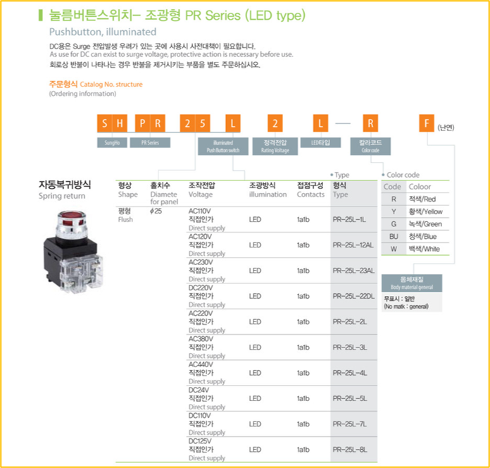

---

## 표시등 (=LAMP)

- 사양에 따른 전압을 공급하면 표시등을 ON 할 수 있습니다.

---

## 표시등 (=LAMP)

---

## 스위치 회로

- Normal Closed (NC) : 1 → 2
- B접점 또는 B-Contact
- Normal Open (NO) : 4 → 3
- A접점 또는 A-Contact
- Lamp : x1 → x2

---

## 스위치 회로 · 그림 1

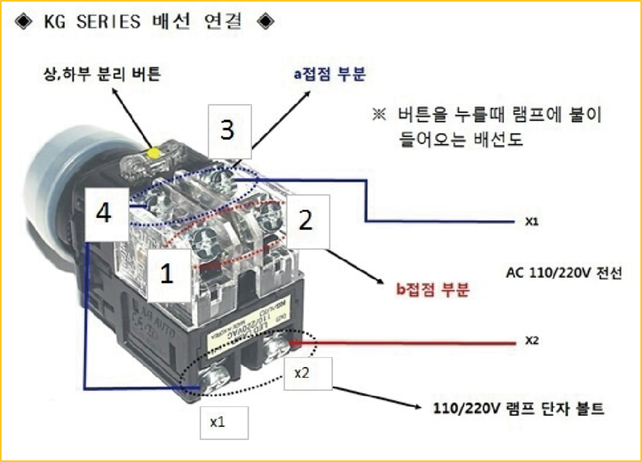
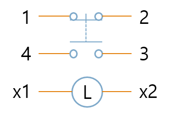

---

## 스위치 회로 · 그림 2

---

## 소자 설명

- 스위치 장치 DC 배터리 장치 부하 (Lamp, Motor 등)

---

## 소자 설명 · 그림 1

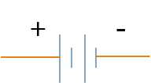

---

## 소자 설명 · 그림 2

---

## 시퀀스 회로

- A 접점을 사용해서 Lamp On
- B 접점을 사용해서 Lamp Off

---

## 시퀀스 회로

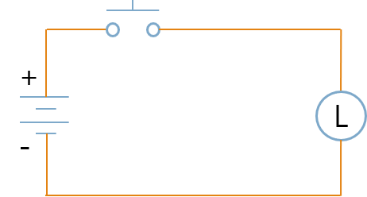
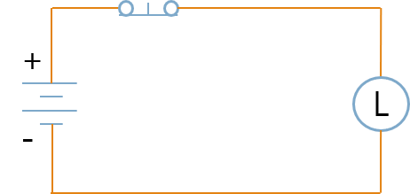

---

## 스위치 종류

- 누르면 ON, 떼면 OFF
- 누르면 OFF, 떼면 ON
- 왼쪽 OFF, 오른쪽 ON
- 왼쪽 ON, 오른쪽 OFF
- 왼쪽 ON, 오른쪽 OFF

---

## 스위치 종류

---

## 접점 추가

---

## DO (=Digital Output)

- Source (원천, 근원, 출처, 얻다)
- Sink (빠지다, 가라앉다)
- 부하를 기준으로 극성이 변경

---

## DO (=Digital Output) · 그림 1

---

## DO (=Digital Output) · 그림 2

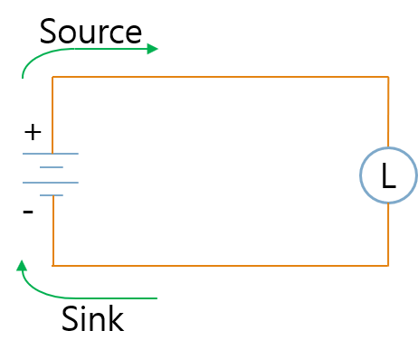

---

## 릴레이

- 자동제어에서 가장 많이 사용됨 기계적인 접점이 존재하기 때문에 소모성 제품 기계적인 접점 동작으로 속도가 느림 솔레노이드를 통한 제어로 소모 전류가 높음 접점을…

---

## 릴레이

---

## 반도체 Package

- DIP (=Dual In-line Package) PCB를 관통해 바닥면에서 납땜하는 방식 크기 ↑ SMD (=Surface Mount Device) PCB 표…

---

## 반도체 Package · 그림 1

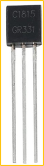
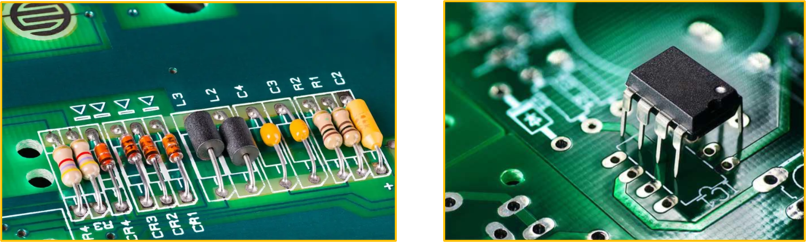

---

## 반도체 Package · 그림 2

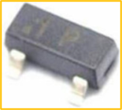
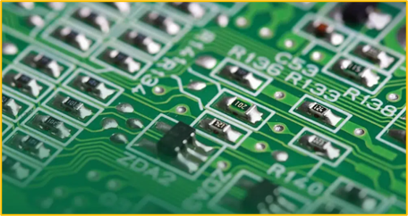

---

## 다이오드

- PN 다이오드는 P형 반도체와 N형 반도체로 이루어진 소자 Anode(+)에서 Cathode(-)로 전류가 흐릅니다.

---

## 다이오드

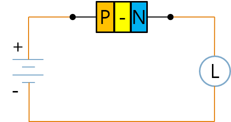

---

## 원리

- 순방향 전압
- 역방향 전압

---

## 원리

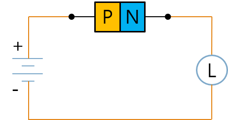

---

## 트랜지스터 (=Bipolar Junction Transistor)

- 비교적 저렴한 비용 기계적 접점이 없는 반도체로 반영구적인 사용 기계적 접점이 없는 반도체로 속도가 릴레이 대비 빠름 반도체로 스위칭에 필요한 소모 전류 낮음 …

---

## 트랜지스터 (=Bipolar Junction Transistor)

---

## 절연 (=Isolation)

- Control Line - Load Line 절연 가능
- 노이즈 차단
- Control Line - Load Line 절연 불가능
- 노이즈 유입

---

## 절연 (=Isolation)

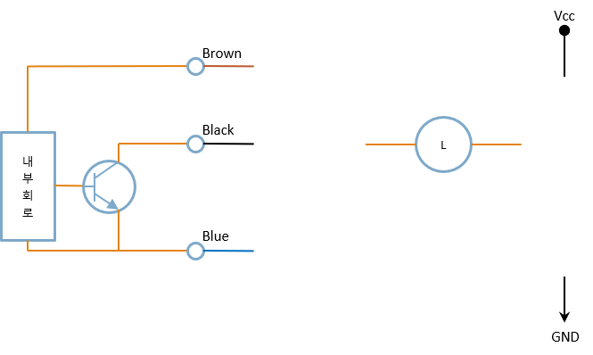

---

## 포토커플러 (=Optocoupler)

- 비교적 비싼 비용 기계적 접점이 없는 반도체로 반영구적인 사용 기계적 접점이 없는 반도체로 속도가 릴레이 대비 빠름 반도체로 스위칭에 필요한 소모 전류 낮음 고…

---

## 포토커플러 (=Optocoupler)

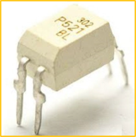
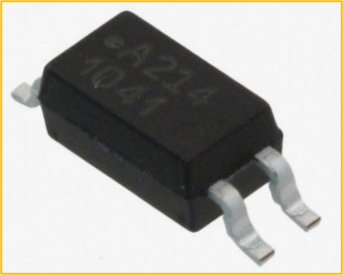

---

## Optocoupler vs Transistor

- Optocoupler
- 트랜지스터

---

## Optocoupler vs Transistor

---

## MOSFET (=Metal-Oxide-Semiconductor Field-Effect Transistor)

- 트랜지스터 (=BJT) 대비 비쌈 빠른 스위칭 속도와 높은 효율 제공 전력소자 스위칭 용도로 많이 사용 (예: SMPS)

---

## MOSFET (=Metal-Oxide-Semiconductor Field-Effect Transistor) · 그림 1

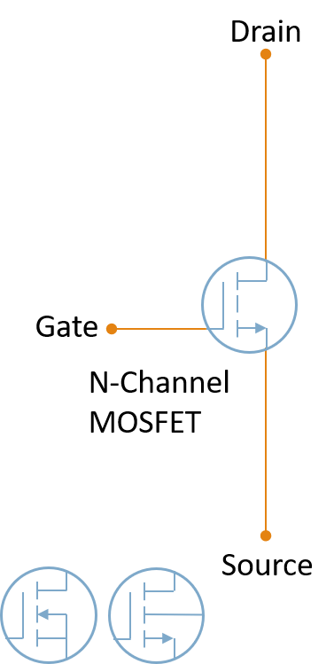

---

## MOSFET (=Metal-Oxide-Semiconductor Field-Effect Transistor) · 그림 2

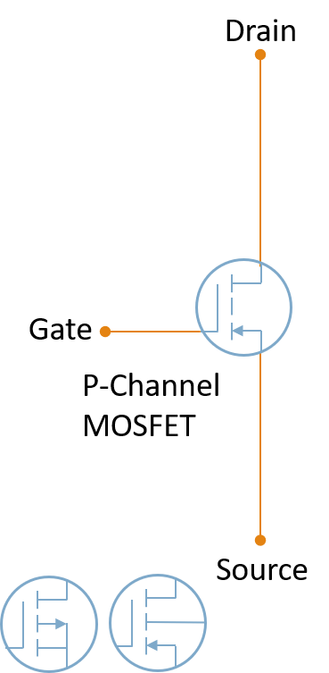

---

## IGBT (=Insulated Gate Bipolar Transistor)

- 고전력 고속 스위칭 소자 모터 구동 스위치로 많이 사용됨 (예: 인버터, 모터 드라이브)

---

## IGBT (=Insulated Gate Bipolar Transistor) · 그림 1

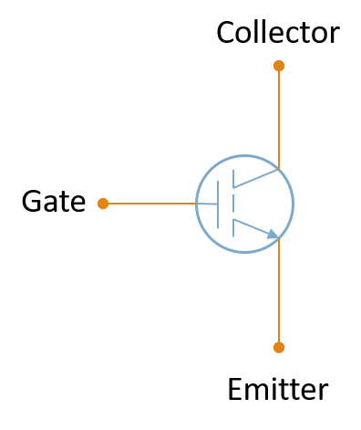
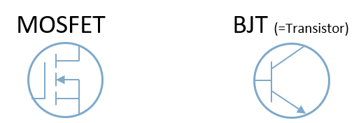

---

## IGBT (=Insulated Gate Bipolar Transistor) · 그림 2

---

## SSR (=Solid State Relay)

- 반도체로 만든 릴레이 SSR은 릴레이처럼 부하 전원을 제어하지만 기계적 접점이 없습니다.
- 반영구적으로 사용 할 수 있습니다.

---

## SSR (=Solid State Relay)

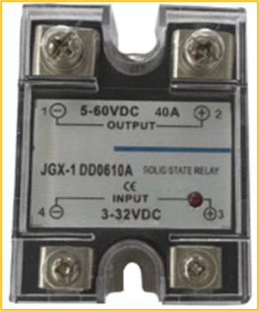
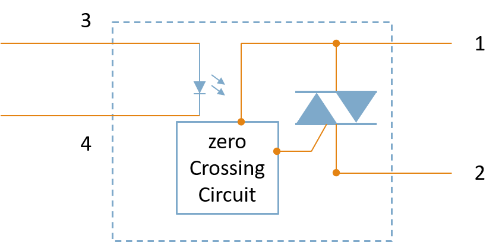

---

## 핵심 정리

- 스위치와 릴레이는 물리적 접점으로 회로를 연결하거나 차단했습니다.
- 트랜지스터와 MOSFET은 전기 신호로 빠르게 스위칭하는 반도체 소자였습니다.
- 포토커플러는 빛을 이용해 입력과 출력을 전기적으로 절연했습니다.
- SSR은 반도체로 부하를 스위칭하므로 빠르고 수명이 길지만 발열과 누설 전류를 고려해야 합니다.
