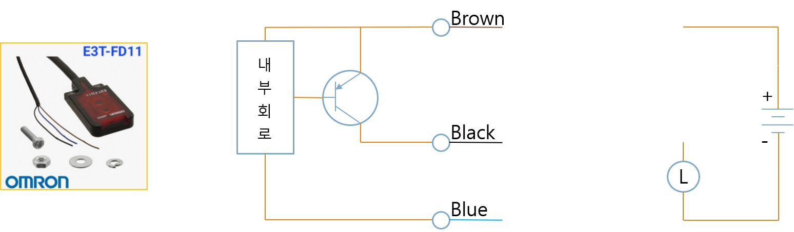
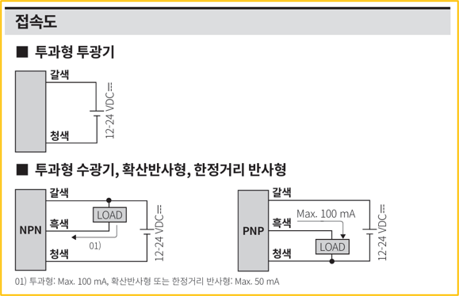
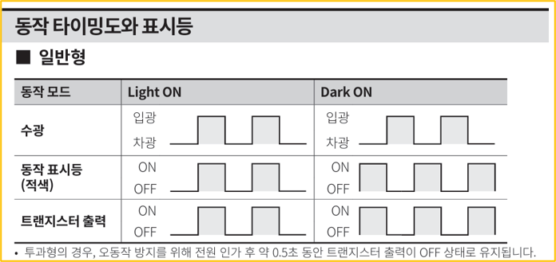
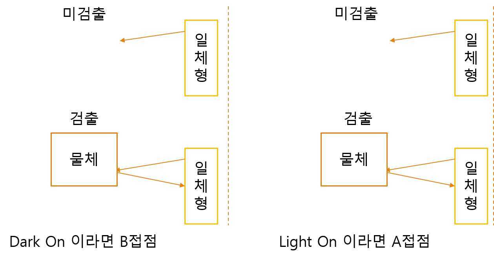
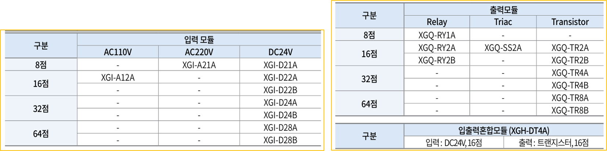
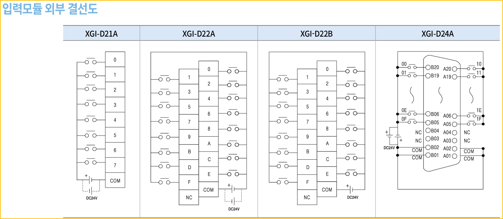
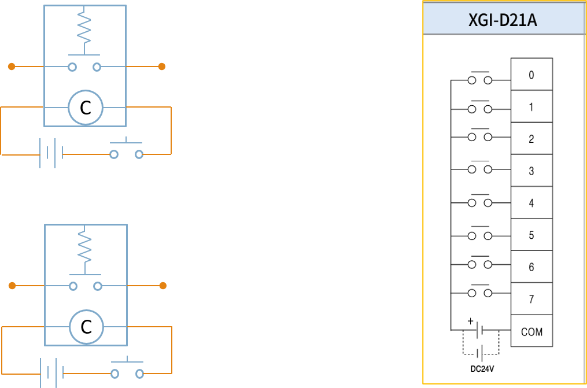
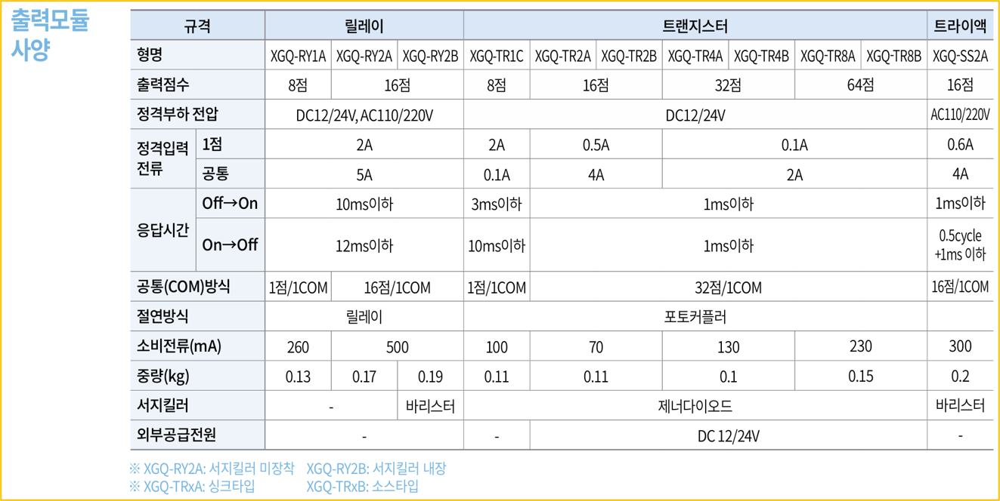
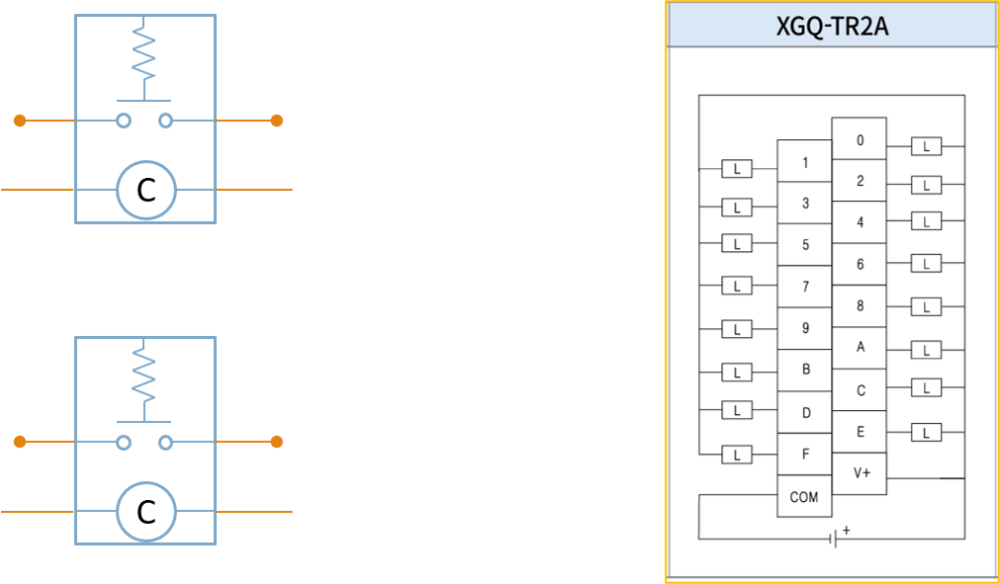

<!-- _class: title-slide -->

# 1-10. NPN/PNP 센서와 PLC 입출력

전기·전자 실무 기초

---

## NPN 트랜지스터

- NPN 트랜지스터는 가장 많이 사용되는 스위칭 소자 중 하나 입니다.
- 자동화 분야에서는 일반적으로 Open Collector 출력 방식으로 사용됩니다.
- 출력이 ON되면 출력 단자가 0V (GND)와 연결되어 전류가 흐르게 됩니다.

---

## NPN 트랜지스터

---

## PNP 트랜지스터

- PNP 트랜지스터 역시 Open Collector 방식으로 많이 사용됩니다.
- 출력이 ON되면 출력 단자가 +전원(P24)과 연결되어 전류가 흐르게 됩니다.

---

## PNP 트랜지스터

---

## NPN 타입 센서

- NPN 센서는 출력이 ON되면 신호선을 0V(GND)로 연결합니다.
- 이를 Sink 출력이라고도 합니다.

---

## NPN 타입 센서

---

## PNP 타입 센서

- PNP 센서는 출력이 ON되면 신호선에 +24V를 출력합니다.
- 이를 Source 출력이라고도 합니다.

---

## PNP 타입 센서

---

## Source 입력

- Source 입력은 입력 공통 (Common) 이 +24V에 연결되어 있으며, 입력 단자에 -전압이 들어오면 ON으로 인식합니다.
- 따라서 일반적으로 NPN 센서와 함께 사용합니다.

---

## Source 입력

---

## Sink Type Input

- Sink 입력은 입력 공통(Common)이 0V에 연결되어 있으며, 입력 단자에 **전압이 들어오면 ON으로 인식합니다.** 따라서 일반적으로 PNP 센서와 함…

---

## Sink Type Input

---

## PLC Source 입력 (Common)

- Source 입력 모듈은 Common 단자를 +24V에 연결하여 사용합니다.
- 이 경우 NPN 센서를 연결해야 정상적으로 동작합니다.

---

## PLC Source 입력 (Common)

---

## PLC Sink 입력 (Common)

- Sink 입력 모듈은 Common 단자를 0V에 연결하여 사용합니다.
- 이 경우 NPN 센서를 연결해야 정상적으로 동작합니다.

---

## PLC Sink 입력 (Common)

---

## PLC Source 출력 (Common)

- Source 출력 모듈은 출력시 +24V 를 공급하는 방식입니다.
- 따라서 Sink 입력 장치와 연결하여 사용합니다.

---

## PLC Source 출력 (Common)

---

## PLC Sink 출력 (Common)

- Sink 출력 모듈은 출력시 0V를 연결하는 방식입니다.
- 따라서 Source 입력 장치와 연결하여 사용합니다.

---

## PLC Sink 출력 (Common)

---

## Summury

- Sink 출력 ↔ Source 입력
- Source 출력 ↔ Sink 입력
- Sink Type Common → +24V
- Source Type Common → 0V

---

## 릴레이 출력 모듈

- 릴레이 출력 모듈은 반도체 출력과 달리 내부에 실제 릴레이 접점이 있습니다.
- 따라서 AC와 DC 모두 사용할 수 있으며, NPN과 PNP를 구분하지 않습니다.
- 다만 기계식 접점을 사용하므로 반도체 출력보다
- 속도가 느리고 수명이 존재합니다.

---

## 릴레이 출력 모듈

---

## 센서 출력 방식 해석

- NPN 출력
- PNP 출력

---

## 센서 출력 방식 해석

---

## 센서 동작 모드 해석

- Light ON
- Dark ON

---

## 센서 동작 모드 해석

---

## 투과형 센서

- 투과형 센서는 발광부와 수광부가 서로 마주보는 구조입니다.
- 물체가 광선을 차단하는지 여부에 따라 출력이 결정 됩니다.
- Light ON과 Dark ON은 출력 조건만 서로 반대입니다.

---

## 투과형 센서

---

## 반사형 센서

- 반사형 센서는 발광부와 수광부가 하나의 센서 안에 있습니다.
- 물체에서 반사된 빛을 감지하여 출력합니다.
- 역시 Light ON과 Dark ON 두가지 동작 방식을 사용할 수 있습니다.

---

## 반사형 센서

---

## 센서 배선

- +24V (P24)
- 0V (N24)
- Signal 출력
- NPN : Signal -
- PNP : Signal +

---

## 센서 배선

---

## PLC 입출력 모듈

- 입력 모듈
- 출력 모듈
- 입출력 혼합 모듈

---

## PLC 입출력 모듈

---

## 입력 모듈 사양

- 입력 모듈은 스위치나 센서의 신호를 PLC로 전달하는 역할을 합니다.
- 입력 전압과 입력 방식(Source/Sink)을 반드시 확인해야 합니다.

---

## 입력 모듈 사양

---

## 입력 모듈 외부 결선도

- 입력 모듈은 Common 단자와 센서를 올바르게 연결해야 정상적으로 동작합니다.
- 배선 전에 Source 타입인지 Sink 타입인지 반드시 확인해야 합니다.

---

## 입력 모듈 외부 결선도

---

## 센서 연결

- 센서는 전원선과 신호선을 각각 연결하여 PLC 입력으로 전달합니다.
- 배선 색상과 출력 방식을 함께 확인하는 것이 중요합니다.

---

## 센서 연결

---

## 입력 연결

- 센서의 출력 신호는 PLC 입력 단자로 연결되며, PLC는 이를 ON/OFF 신호로 인식합니다.

---

## 입력 연결

---

## 출력 모듈

- 출력 모듈은 PLC 내부의 제어 신호를 외부 장치로 전달합니다.
- 램프, 릴레이, 솔레노이드 밸브, 모터 드라이버 등이 대표적인 출력 대상입니다.
- 출력 방식은 릴레이 출력, 트랜지스터 출력, SSR 출력 등으로 구분됩니다.

---

## 출력 모듈

---

## 출력모듈 외부 결선도

- 출력 모듈의 Common 단자를 올바르게 연결한 후 부하를 연결합니다.
- 트랜지스터 출력은 Source 타입과 Sink 타입을 반드시 구분해야 합니다.

---

## 출력모듈 외부 결선도

---

## 출력 연결

- PLC 출력이 ON되면 부하에 전원이 공급되어 장치가 동작합니다.
- 부하의 전압과 소비 전류가 출력 모듈의 허용 범위를 초과하지 않는지 반드시 확인해야 합니다.

---

## 출력 연결

---

## 핵심 정리

- NPN 출력 = Sink 출력
- PNP 출력 = Source 출력
- NPN 센서 (Sink 출력) → Source 입력 PLC
- PNP 센서 (Source 출력) → Sink 입력 PLC
- Sink 출력은 Source 입력과 연결합니다.
