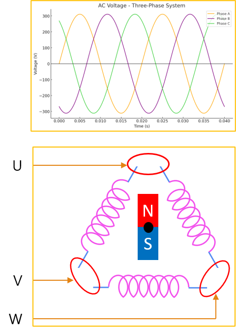
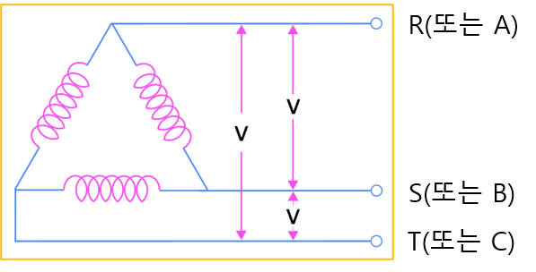

<!-- _class: title-slide -->

# 1-11. 회전기기와 발전기

전기·전자 실무 기초

---

## 단상과 회전체

- 자석을 가운데 축에 고정하고, 주변의 코일에 단상 교류 전원을 인가하면 코일 주위에 자기장이 형성됩니다.
- 하지만 단상 전원은 자기장의 방향이 앞뒤로만 반복해서 변하기 때문에 자석을 어느 방향으로 회전시켜야 하는지를 결정하지 못합니다.
- 따라서 일반적인 단상 AC 모터는 스스로 회전하지 못하거나, 회전 방향을 결정하기 위한 보조 권선이나 콘덴서 등의 추가 회로가 필요합니다.

---

## 단상과 회전체

---

## 3상과 회전체

- 3개의 코일에 각각 120°의 위상차를 갖는 3상 전원을 공급하면 시간에 따라 자기장이 연속적으로 회전하게 됩니다.
- 이 회전 자기장에 의해 자석은 일정한 방향으로 회전하게 되며, 별도의 보조 회로 없이도 안정적으로 회전할 수 있습니다.
- 이것이 산업용 모터에서 3상 전원을 사용하는 가장 큰 이유입니다.

---

## 3상과 회전체

---

## 3상 3선식의 결선

- 3상 3선식은 회전체에 3개의 상(R, S, T)을 연결하여 전원을 공급하는 방식입니다.
- 3개의 코일에 각각 3상 교류를 공급하면 회전 자기장이 형성되고, 회전체는 일정한 방향으로 회전합니다.
- 이 방식은 구조가 단순하고 효율이 높아 산업용 모터에서 가장 많이 사용됩니다.

---

## 3상 3선식의 결선

---

## 3상 3선식과 발전기

- 이번에는 반대로 회전체를 외부의 힘으로 회전시켜 보겠습니다.
- 회전하는 자석이 코일 주변의 자기장을 변화시키면 코일에는 전압이 유도됩니다.
- 이 원리를 전자기 유도라고 하며, 모터와 반대의 동작이 이루어집니다.
- 즉, 모터는 전기를 이용해 회전력을 만들고, 발전기는 회전력을 이용해 전기를 만들어 냅니다.
- 풍력 발전기, 수력 발전기, 화력 발전기의 발전기 역시 모두 같은 원리를 이용합니다.

---

## 3상 3선식과 발전기

---

## 3상 3선식의 일반적인 결선

- 산업 현장에서는 3상 3선식을 그림과 같은 형태로 많이 표현합니다.
- 3개의 상(R, S, T)이 각각 코일에 연결되어 회전 자기장을 형성합니다.

---

## 3상 3선식의 일반적인 결선

---

## 3상 4선식과 발전기

- 회전체에 3상의 전원을 4개의 선으로 입력하는 방식으로 3개의 코일에 3상 4선식으로 결선하여 안정적인 전압원을 공급 3상 3선식과 마찬가지로 회전체에서 전력을…

---

## 3상 4선식과 발전기

---

## 3상 4선식의 일반적인 결선

- 3상 4선식은 산업용 분전반에서 가장 많이 사용하는 전원 방식입니다.
- 3상 전원과 단상 전원을 동시에 사용할 수 있기 때문에 공장과 대형 건물에서 널리 사용됩니다.

---

## 3상 4선식의 일반적인 결선

---

## 3상 3선식 (△ 델타 결선)

- 380V 3상 전원
- 380V 단상 전원 × 3 (RS, ST, TR)

---

## 3상 3선식 (△ 델타 결선)

---

## 3상 4선식 (Y 스타 결선)

- 380V 3상 전원
- 380V 단상 전원 × 3 (RS, ST, TR)
- 220V 단상 전원 × 3 (RN, SN, TN)
- RS, ST, TR은 선간전압(Line Voltage)
- RN, SN, TN은 상전압(Phase Voltage)

---

## 3상 4선식 (Y 스타 결선)

