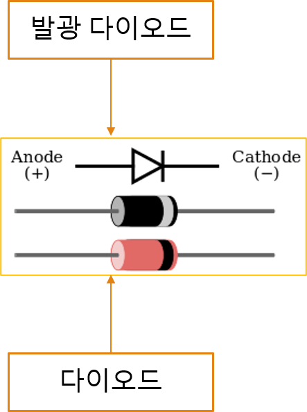
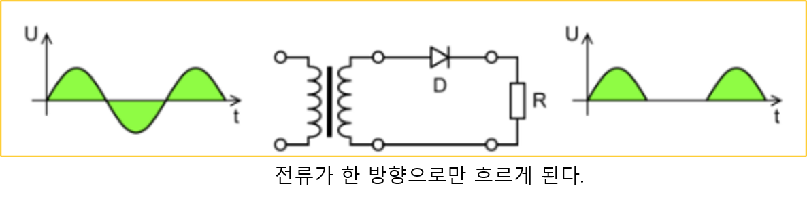
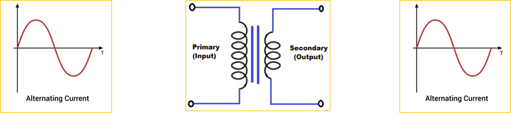
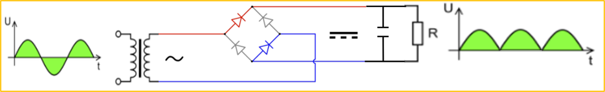
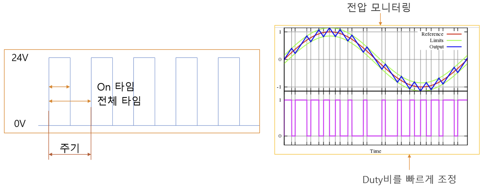

<!-- _class: title-slide -->

# 1-12. 다이오드와 전력 변환

전기·전자 실무 기초

---

## 다이오드

- 애노드(Anode): 전류가 들어오는 쪽
- 캐소드(Cathode): 전류가 나가는 쪽

---

## 다이오드

---

## 다이오드의 동작

- 다이오드의 순방향으로만 전류를 흐르게 하는 특성을 이용하면 교류 전압의 극성을 일정한 방향으로 정류하거나, 잘못된 극성의 전압이 회로에 인가되는 것을 방지할 수…

---

## 다이오드의 동작

---

## 다이오드 선정

- 허용 순방향 전류
- 순방향 전압 강하
- 최대 역전압
- Maximum average forward retified current 1.0 Amp
- 다이오드가 연속적으로 흘릴 수 있는 평균 순방향 전류가 최대 1A라는 의미입니다.

---

## 다이오드 선정

---

## 순방향 전압 강하

- 순방향 전압: 1.8V
- 정격 전류: 20mA
- 공급 전압: 5V

---

## 순방향 전압 강하

---

## 저항 선정

- LED에 연결할 저항은 다음 공식으로 계산합니다.
- R = (공급 전압 - LED 순방향 전압) ÷ LED 전류 예제에 적용하면 다음과 같습니다.
- R = (5V - 1.8V) ÷ 0.02A R = 160Ω 계산값은 160Ω이지만, 실제 부품은 표준 저항값 중에서 계산값 이상을 선택하는 것이 일반적입니다.
- 따라서 이 회로에서는 200Ω 저항을 선택할 수 있습니다.
- 저항값을 더 크게 선택해도 LED는 손상되지 않지만, 흐르는 전류가 줄어들기 때문에 밝기가 낮아집니다.

---

## 저항 선정

---

## 전력 변환 방식

- DC → DC: DC-DC 컨버터
- AC → DC: 정류기 또는 AC-DC 컨버터
- DC → AC: 인버터 또는 DC-AC 컨버터
- AC → AC: 변압기 또는 AC-AC 컨버터

---

## AC-AC 변환

- AC 전압의 크기만 변경할 때에는 변압기를 사용합니다.
- 변압기는 1차측과 2차측 코일의 권선수비에 따라 출력 전압을 변경합니다.
- 교류는 변압기를 이용하면 비교적 간단한 구조와 낮은 비용으로 전압을 높이거나 낮출 수 있습니다.
- 다만 일반적인 변압기는 전압의 크기는 변경할 수 있지만 주파수는 변경하지 못합니다.

---

## AC-AC 변환

---

## AC-DC 변환

- AC 전원을 DC 전원으로 변환하려면 일반적으로 다음 과정을 거칩니다.
- **변압** 필요한 경우 변압기를 이용하여 입력 AC 전압을 원하는 크기로 낮추거나 높입니다.
- 예를 들어 AC 220V를 저전압 전자회로에 사용하려면 먼저 변압기를 이용해 AC 12V 또는 AC 24V 등으로 낮출 수 있습니다.
- **정류** 교류는 전압의 극성이 주기적으로 바뀌므로 그대로는 일반적인 DC 회로에서 사용할 수 없습니다.
- 브리지 다이오드 회로를 사용하면 교류의 음의 반주기를 뒤집어 한쪽 방향의 전압으로 변환할 수 있습니다.

---

## AC-DC 변환

---

## DC-AC 변환

- DC 전원을 AC 전원으로 변환하는 장치를 **인버터(Inverter)**라고 합니다.
- DC는 전류의 방향이 일정하므로 그대로는 교류를 만들 수 없습니다.
- 따라서 반도체 스위치를 매우 빠르게 ON/OFF하여 전압의 극성을 주기적으로 바꾸어 AC 전압을 생성합니다.
- 일반적으로 스위칭 주파수는 일정하게 유지하면서 펄스의 ON 시간과 OFF 시간의 비율인 듀티비(Duty Ratio)를 조절합니다.
- 이러한 방식을 PWM(Pulse Width Modulation)이라고 합니다.

---

## DC-AC 변환

---

## DC-DC 변환

- Buck Converter: DC 전압 강하(Step-Down)
- Boost Converter: DC 전압 상승(Step-Up)
- Buck-Boost Converter: 전압 상승 또는 강하

---

## 주파수를 변경하는 AC-AC 변환

- VFD(Variable Frequency Drive)
- 모터 드라이브(Motor Drive)
- 인버터 드라이브(Inverter Drive)
