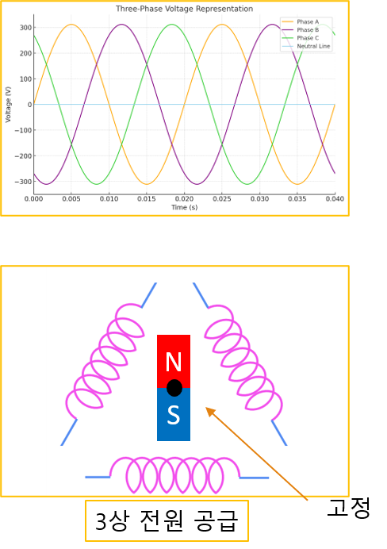
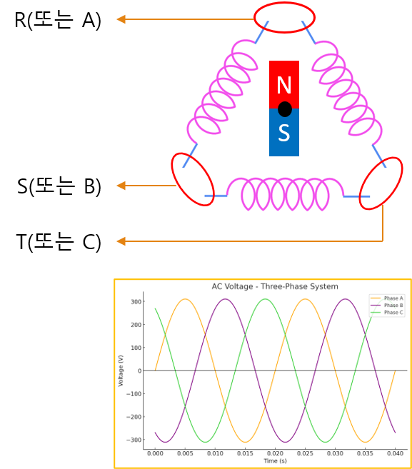
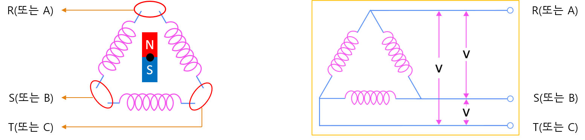
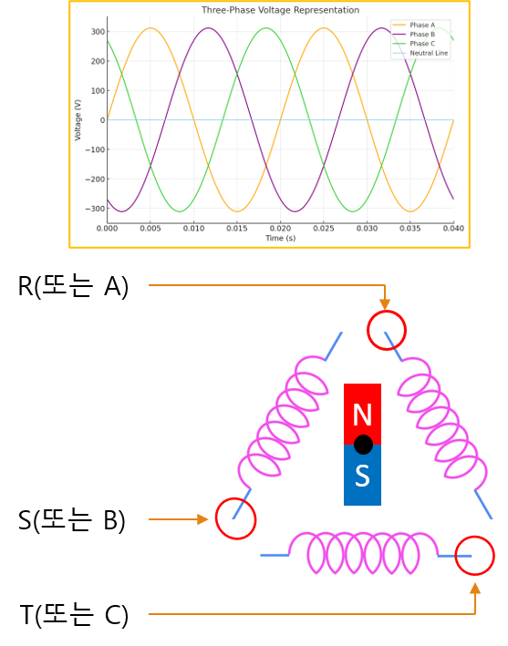
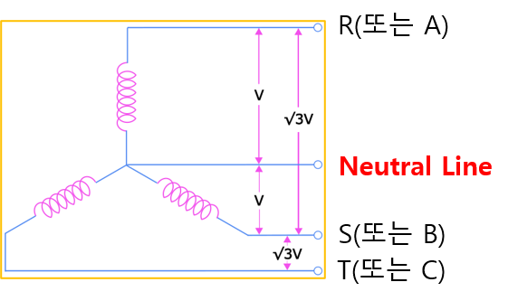

<!-- _class: title -->

# 1-12. 회전기기와 발전기

전기·전자 기초

---

## 학습 개요

- 앞에서 단상과 3상의 전원 구성에 대해 살펴보았습니다.
- 이번에는 왜 산업용 모터에서 대부분 3상 전원을 사용하는지 알아보겠습니다.
- 단상과 3상의 가장 큰 차이는 회전 자이장을 만들 수 있는지 여부입니다.
- 회전 자기장은 모터를 회전시키는 가장 중요한 원리이며, 반대로 모터를 회전시키면 발전기가 되어 전기를 생산할 수도…

<!--
발표자 노트 · 원문

앞에서 단상과 3상의 전원 구성에 대해 살펴보았습니다.

이번에는 왜 산업용 모터에서 대부분 3상 전원을 사용하는지 알아보겠습니다.

단상과 3상의 가장 큰 차이는 회전 자이장을 만들 수 있는지 여부입니다. 회전 자기장은 모터를 회전시키는 가장 중요한 원리이며, 반대로 모터를 회전시키면 발전기가 되어 전기를 생산할 수도 있습니다.
-->

---

## 단상과 회전체

- 단상과 회전체 자석을 가운데 축에 고정하고, 주변의 코일에 단상 교류 전원을 인가하면 코일 주위에 자기장이 형성됩…
- 하지만 단상 전원은 자기장의 방향이 앞뒤로만 반복해서 변하기 때문에 자석을 어느 방향으로 회전시켜야 하는지를 결정…
- 따라서 일반적인 단상 AC 모터는 스스로 회전하지 못하거나, 회전 방향을 결정하기 위한 보조 권선이나 콘덴서 등의…

<!--
발표자 노트 · 원문

#### 단상과 회전체

자석을 가운데 축에 고정하고, 주변의 코일에 단상 교류 전원을 인가하면 코일 주위에 자기장이 형성됩니다.

하지만 단상 전원은 자기장의 방향이 앞뒤로만 반복해서 변하기 때문에 자석을 어느 방향으로 회전시켜야 하는지를 결정하지 못합니다.

따라서 일반적인 단상 AC 모터는 스스로 회전하지 못하거나, 회전 방향을 결정하기 위한 보조 권선이나 콘덴서 등의 추가 회로가 필요합니다.
-->

---

## 3상과 회전체

- 3상과 회전체 3개의 코일에 각각 120°의 위상차를 갖는 3상 전원을 공급하면 시간에 따라 자기장이 연속적으로…
- 이 회전 자기장에 의해 자석은 일정한 방향으로 회전하게 되며, 별도의 보조 회로 없이도 안정적으로 회전할 수 있습…
- 이것이 산업용 모터에서 3상 전원을 사용하는 가장 큰 이유입니다.

<!--
발표자 노트 · 원문

#### 3상과 회전체

3개의 코일에 각각 120°의 위상차를 갖는 3상 전원을 공급하면 시간에 따라 자기장이 연속적으로 회전하게 됩니다.

이 회전 자기장에 의해 자석은 일정한 방향으로 회전하게 되며, 별도의 보조 회로 없이도 안정적으로 회전할 수 있습니다.

이것이 산업용 모터에서 3상 전원을 사용하는 가장 큰 이유입니다.
-->

---

## 3상 3선식의 결선

- 3상 3선식의 결선 3상 3선식은 회전체에 3개의 상(R, S, T)을 연결하여 전원을 공급하는 방식입니다.
- 3개의 코일에 각각 3상 교류를 공급하면 회전 자기장이 형성되고, 회전체는 일정한 방향으로 회전합니다.
- 이 방식은 구조가 단순하고 효율이 높아 산업용 모터에서 가장 많이 사용됩니다.

<!--
발표자 노트 · 원문

#### 3상 3선식의 결선

3상 3선식은 회전체에 3개의 상(R, S, T)을 연결하여 전원을 공급하는 방식입니다.

3개의 코일에 각각 3상 교류를 공급하면 회전 자기장이 형성되고, 회전체는 일정한 방향으로 회전합니다.

이 방식은 구조가 단순하고 효율이 높아 산업용 모터에서 가장 많이 사용됩니다.
-->

---

## 3상 3선식과 발전기

- 3상 3선식과 발전기 이번에는 반대로 회전체를 외부의 힘으로 회전시켜 보겠습니다.
- 회전하는 자석이 코일 주변의 자기장을 변화시키면 코일에는 전압이 유도됩니다.
- 이 원리를 전자기 유도라고 하며, 모터와 반대의 동작이 이루어집니다.
- 즉, 모터는 전기를 이용해 회전력을 만들고, 발전기는 회전력을 이용해 전기를 만들어 냅니다.

<!--
발표자 노트 · 원문

#### 3상 3선식과 발전기

이번에는 반대로 회전체를 외부의 힘으로 회전시켜 보겠습니다.

회전하는 자석이 코일 주변의 자기장을 변화시키면 코일에는 전압이 유도됩니다.

이 원리를 전자기 유도라고 하며, 모터와 반대의 동작이 이루어집니다.

즉, 모터는 전기를 이용해 회전력을 만들고, 발전기는 회전력을 이용해 전기를 만들어 냅니다.

풍력 발전기, 수력 발전기, 화력 발전기의 발전기 역시 모두 같은 원리를 이용합니다.
-->

---

## 3상 3선식의 일반적인 결선

- 3상 3선식의 일반적인 결선 산업 현장에서는 3상 3선식을 그림과 같은 형태로 많이 표현합니다.
- 3개의 상(R, S, T)이 각각 코일에 연결되어 회전 자기장을 형성합니다.

<!--
발표자 노트 · 원문

#### 3상 3선식의 일반적인 결선

산업 현장에서는 3상 3선식을 그림과 같은 형태로 많이 표현합니다.

3개의 상(R, S, T)이 각각 코일에 연결되어 회전 자기장을 형성합니다.
-->

---

## 3상 4선식과 발전기

- 3상 4선식과 발전기 회전체에 3상의 전원을 4개의 선으로 입력하는 방식으로 3개의 코일에 3상 4선식으로 결선하…

<!--
발표자 노트 · 원문

#### 3상 4선식과 발전기

회전체에 3상의 전원을 4개의 선으로 입력하는 방식으로

3개의 코일에 3상 4선식으로 결선하여 안정적인 전압원을 공급

3상 3선식과 마찬가지로 회전체에서 전력을 얻을 수 있다.
-->

---

## 3상 4선식의 일반적인 결선

- 3상 4선식의 일반적인 결선 3상 4선식은 산업용 분전반에서 가장 많이 사용하는 전원 방식입니다.
- 3상 전원과 단상 전원을 동시에 사용할 수 있기 때문에 공장과 대형 건물에서 널리 사용됩니다.

<!--
발표자 노트 · 원문

#### 3상 4선식의 일반적인 결선

3상 4선식은 산업용 분전반에서 가장 많이 사용하는 전원 방식입니다.

3상 전원과 단상 전원을 동시에 사용할 수 있기 때문에 공장과 대형 건물에서 널리 사용됩니다.
-->

---

## 3상 3선식 (△ 델타 결선)

- 380V 3상 전원
- 380V 단상 전원 × 3 (RS, ST, TR)

<!--
발표자 노트 · 원문

#### 3상 3선식 (△ 델타 결선)

사용 가능한 전압은 다음과 같습니다.

- 380V 3상 전원
- 380V 단상 전원 × 3 (RS, ST, TR)

이때 사용할 수 있는 단상 전압은 모두 선간전압(Line Voltage)입니다.
-->

---

## 3상 4선식 (Y 스타 결선)

- 380V 3상 전원
- 380V 단상 전원 × 3 (RS, ST, TR)
- 220V 단상 전원 × 3 (RN, SN, TN)
- RS, ST, TR은 선간전압(Line Voltage)

<!--
발표자 노트 · 원문

#### 3상 4선식 (Y 스타 결선)

사용 가능한 전압은 다음과 같습니다.

- 380V 3상 전원
- 380V 단상 전원 × 3 (RS, ST, TR)
- 220V 단상 전원 × 3 (RN, SN, TN)

여기서

- RS, ST, TR은 선간전압(Line Voltage)
- RN, SN, TN은 상전압(Phase Voltage)

이라고 합니다.

선간전압과 상전압은 다음과 같은 관계를 가집니다.

선간전압 = √3 × 상전압 이 되고, 따라서 220V × √3 ≒ 380V 가 됩니다.
-->

---

## 핵심 내용 정리

- 핵심 용어의 의미를 설명할 수 있습니다.
- 구성 요소의 역할과 연결 관계를 구분할 수 있습니다.
- 실제 회로나 장치에 기본 원리를 적용할 수 있습니다.
