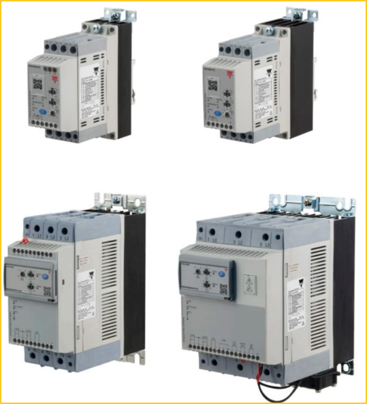

<!-- _class: title-slide -->

# 1-13. 모터 기동 기술

전기·전자 실무 기초

---

## AC 모터의 기동 문제

- 전원 전압이 순간적으로 떨어집니다.
- 차단기가 동작할 수 있습니다.
- 케이블과 전기 부품에 부담이 증가합니다.
- 기어, 벨트, 축과 같은 기계 부품에 충격이 발생합니다.
- 모터의 수명이 단축될 수 있습니다.

---

## AC 모터의 기동 문제

---

## Y-△ 기동

- 기동 전류를 크게 줄일 수 있습니다.
- 구조가 비교적 단순합니다.
- 다른 전자식 기동 장치보다 비용이 저렴합니다.
- Y 결선 상태에서는 기동 토크도 함께 감소합니다.
- 결선 전환 순간에 전류와 토크의 충격이 발생할 수 있습니다.

---

## Y-△ 기동

---

## 리액터 기동

- 기동 전류를 줄일 수 있습니다.
- 단계적으로 전압을 낮출 수 있습니다.
- 비교적 단순한 회로로 구성할 수 있습니다.
- 별도의 리액터와 설치 공간이 필요합니다.
- 리액터에서 열과 전력 손실이 발생합니다.

---

## 리액터 기동

---

## 전자식 소프트 스타터

- 기동 전류의 급격한 증가를 줄일 수 있습니다.
- 모터를 부드럽게 가속할 수 있습니다.
- 기어, 벨트, 커플링과 같은 기계 부품의 충격을 줄일 수 있습니다.
- 펌프에서 발생하는 수격 현상을 완화할 수 있습니다.
- Y-△ 기동보다 배선과 제어가 간단한 경우가 많습니다.

---

## 전자식 소프트 스타터

---

## 인버터 기동

- VFD(Variable Frequency Drive)
- Variable Speed Drive
- AC Drive
- Motor Drive
- 기동 전류를 매우 낮게 제한할 수 있습니다.

---

## 인버터 기동

---

## 서보 모터

- 서보 모터
- 서보 드라이브
- 엔코더 또는 리졸버
- 상위 제어기 (PLC, Motion Controller 등)
- 전류 또는 토크 제어 루프

---

## 서보 모터의 장점

- 위치 제어가 매우 정확합니다.
- 속도와 토크를 정밀하게 제어할 수 있습니다.
- 가속과 감속 응답이 빠릅니다.
- 정지 상태에서도 위치를 유지할 수 있습니다.
- 반복 위치 정밀도가 높습니다.

---

## 서보 모터의 단점

- 일반 인버터 모터보다 비용이 높습니다.
- 모터와 드라이브를 서로 호환되는 제품으로 사용해야 합니다.
- 엔코더 케이블과 모터 케이블이 필요합니다.
- 게인과 필터 등의 파라미터 설정이 필요합니다.
- 기구의 강성과 관성에 따라 진동이나 헌팅이 발생할 수 있습니다.

---

## 서보 모터의 적용 분야

- 산업용 로봇
- 협동 로봇
- CNC 공작기계
- 반도체 장비
- 포장 장비
