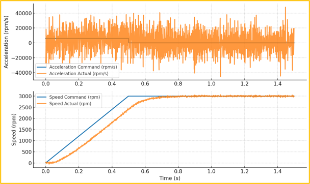
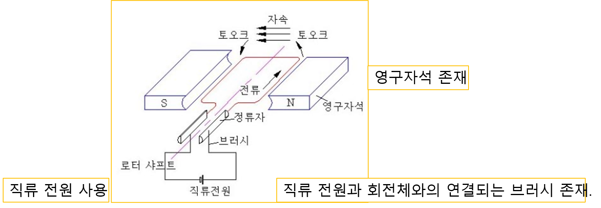
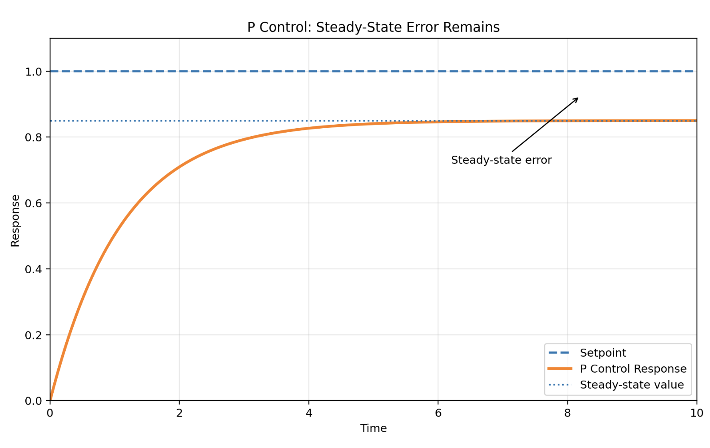
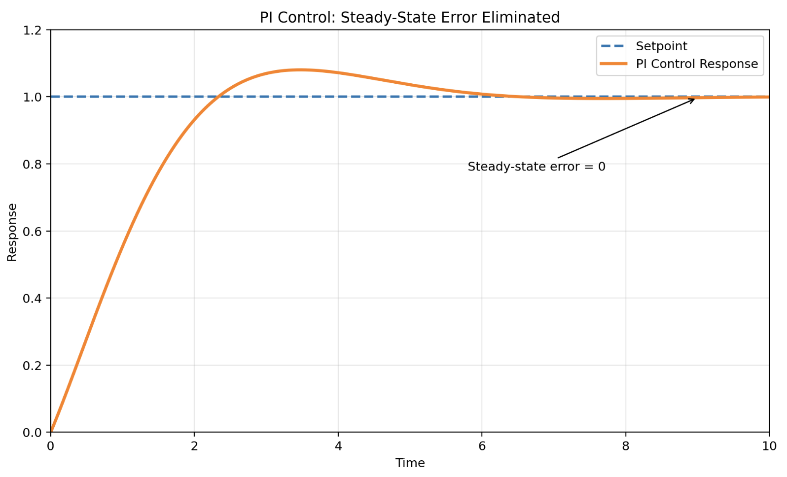

<!-- _class: title-slide -->

# 1-14. AC, DC, BLDC, 스테핑 모터와 서보 제어

전기·전자 실무 기초

---

## AC 모터 제어 방식

- $N_s$: 동기속도(rpm)
- $f$: 전원 주파수(Hz)
- $P$: 모터 극수

---

## V/F

- 구조와 제어 원리가 단순합니다.
- 비용이 비교적 저렴합니다.
- 설정이 쉽습니다.
- 팬, 펌프, 단순 컨베이어에 적합합니다.
- 저속에서 토크가 감소할 수 있습니다.

---

## V/F

---

## FOC (=Field Oriented Control)

- d축 전류: 모터의 자속을 제어합니다.
- q축 전류: 모터의 토크를 제어합니다.
- 엔코더
- 리졸버
- 홀 센서

---

## FOC (=Field Oriented Control)

---

## V/F 제어와 FOC 비교

- 핵심 개념을 그림과 함께 확인했습니다.

---

## DC 모터 제어 방식

- 전압 증가 → 회전속도 증가
- 전압 감소 → 회전속도 감소
- 극성 변경 → 회전 방향 변경
- $V$: 공급 전압
- $E$: 역기전력

---

## DC 모터 제어 방식

---

## PWM (=Pulse Width Modulation)

- Duty 100% → 최대 출력
- Duty 50% → 약 절반의 평균 출력
- Duty 0% → 출력 없음

---

## PWM (=Pulse Width Modulation)

---

## BLDC 모터

- BLDC 모터
- 모터 드라이버
- 홀 센서 또는 엔코더
- 마이크로컨트롤러 또는 제어기

---

## BLDC 모터

---

## DC 모터와 BLDC 모터 비교

- 핵심 개념을 그림과 함께 확인했습니다.

---

## 스테핑 모터

- 펄스 개수 → 이동 위치
- 펄스 주파수 → 회전속도
- 방향 신호 → 회전 방향

---

## 스테핑 모터

---

## 모터 비교

- 핵심 개념을 그림과 함께 확인했습니다.

---

## 서보 시스템

- 엔코더 또는 리졸버
- 서보 드라이브
- 상위 제어기
- DC 모터
- AC 동기 모터

---

## 폐루프 제어기

- Setpoint: 목표값
- Process Value: 실제 측정값
- Error: 목표값과 실제값의 차이

---

## 폐루프 제어기

---

## PID 제어기

- $MV(t)$: 제어 출력
- $e(t)$: 오차
- $K_p$: 비례 게인
- $K_i$: 적분 게인
- $K_d$: 미분 게인

---

## P 제어

- 응답이 빠릅니다.
- 구조가 단순합니다.
- 정상상태 오차가 남을 수 있습니다.
- 게인이 지나치게 크면 진동이 발생할 수 있습니다.

---

## P 제어

---

## I 제어

- 정상상태 오차를 제거하는 데 유리합니다.
- 응답이 느려질 수 있습니다.
- 적분값이 과도하게 누적되는 Integral Windup이 발생할 수 있습니다.

---

## I 제어

---

## D 제어

- 급격한 변화에 빠르게 대응합니다.
- 오버슈트와 진동을 줄이는 데 도움을 줍니다.
- 센서 노이즈에 민감합니다.

---

## PID 제어 예제

- 코드의 동작 순서는 다음과 같습니다.
- 목표값과 실제값의 차이인 오차를 계산합니다.
- 오차를 시간에 따라 누적하여 적분값을 계산합니다.
- 이전 오차와 현재 오차의 차이로 미분값을 계산합니다.
- P, I, D 값을 합산하여 제어 출력을 만듭니다.
