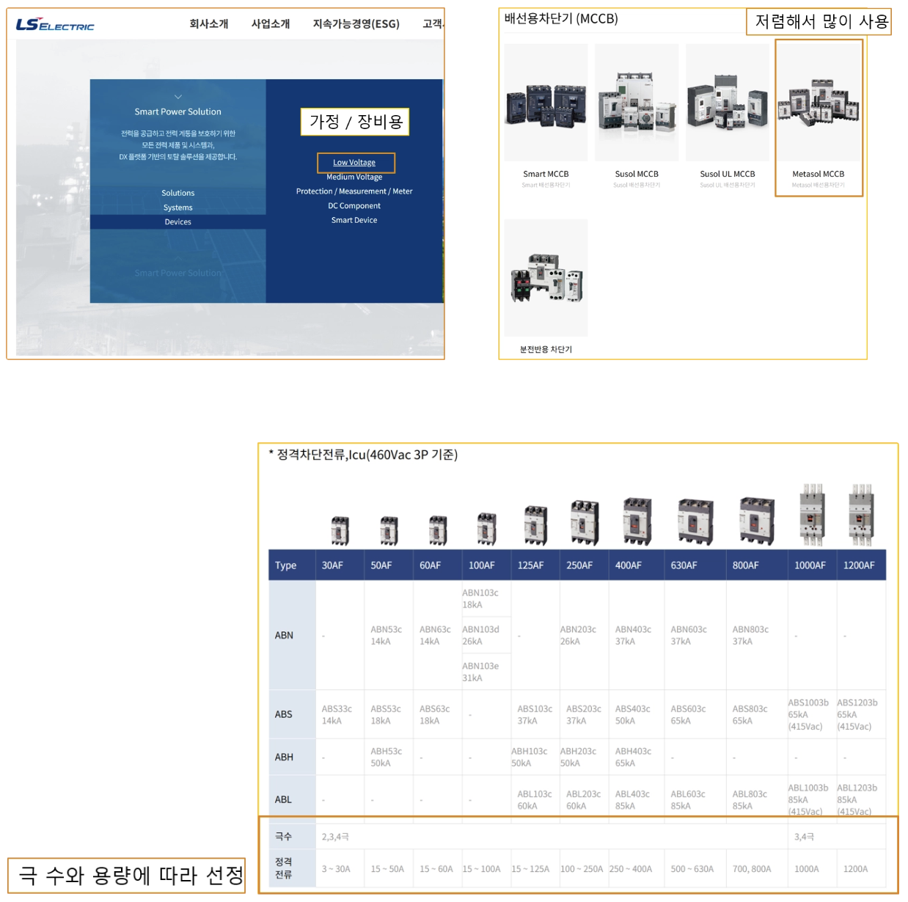
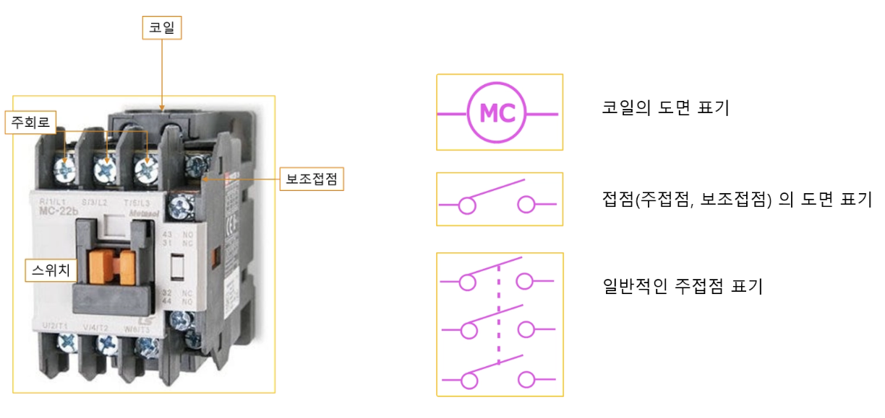
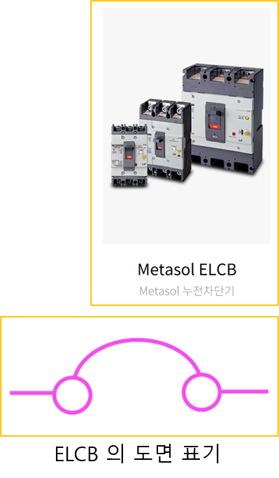
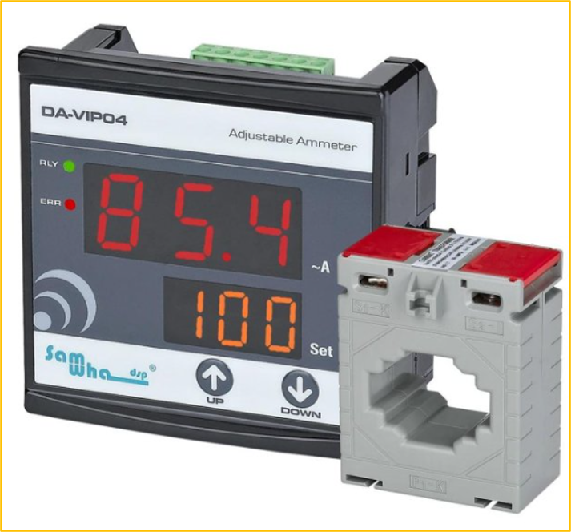
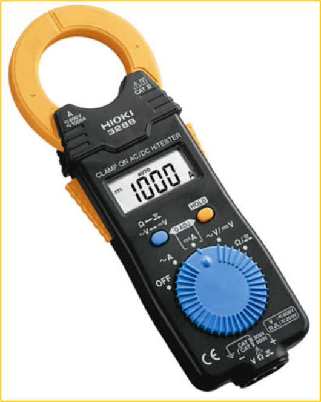
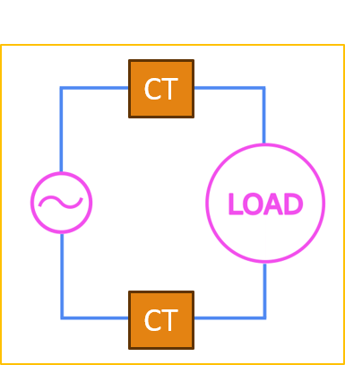
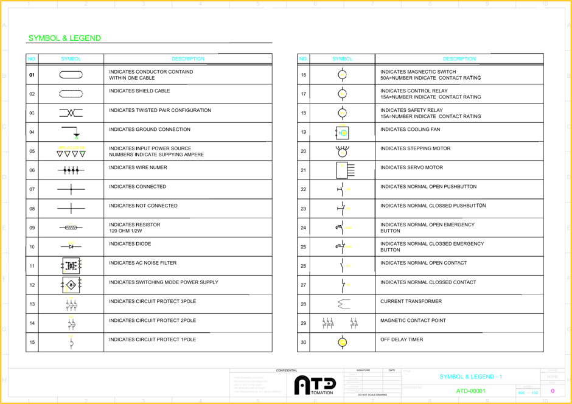
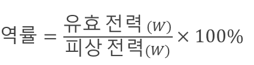
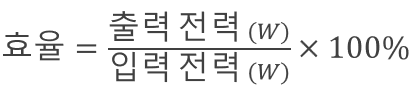
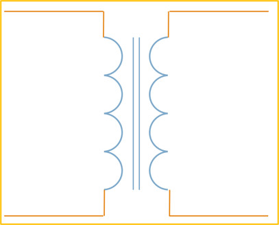

<!-- _class: title-slide -->

# 1-15. 전기회로의 보호와 모터 보호 장치

전기·전자 실무 기초

---

## Fuse

- 구조가 단순합니다.
- 가격이 비교적 저렴합니다.
- 차단 용량과 종류에 따라 매우 빠르게 회로를 차단할 수 있습니다.
- 별도의 기계적 동작 장치가 필요하지 않습니다.
- 한 번 차단되면 다시 사용할 수 없습니다.

---

## Fuse

---

## 배선용 차단기 MCCB (=Molded Case Circuit Breaker)

- 과부하 전류: 바이메탈의 열 변형을 이용하여 차단합니다.
- 단락 전류: 전자석의 자기력을 이용하여 빠르게 차단합니다.

---

## 배선용 차단기 MCCB (=Molded Case Circuit Breaker)

---

## 배선용 차단기의 선정

- 정격전압
- 정격전류
- 차단 용량
- 연결되는 케이블의 허용전류
- 부하의 기동전류

---

## 배선용 차단기의 선정

---

## 소형 차단기 MCB (=Miniature Circuit Breaker)

- 조명 회로
- 콘센트 회로
- 소형 제어 회로
- 제어반 내부의 분기 회로

---

## 소형 차단기 MCB (=Miniature Circuit Breaker)

---

## 회로 보호기 CP (=Circuit Protector)

- 순시형
- 고속형
- 중속형
- 저속형

---

## 회로 보호기 CP (=Circuit Protector)

---

## MCB·MCCB와 CP의 차이

- MCCB와 MCB는 주로 배선과 전력 회로를 과전류 및 단락으로부터 보호합니다.
- CP는 비교적 작은 제어회로나 전자부품이 연결된 분기 회로를 보호하는 용도로 많이 사용합니다.

---

## 전자접촉기 (Magnetic Contactor)

- 전자접촉기(MC)는 모터나 히터와 같은 대용량 부하의 전원을 반복적으로 연결하고 차단하는 전자식 스위치입니다.
- 전자접촉기는 다음과 같이 동작합니다.
- 코일에 제어 전원을 공급합니다.
- 코일에서 자기장이 발생합니다.
- 전자석의 힘으로 주접점이 연결됩니다.

---

## 전자접촉기 (Magnetic Contactor)

---

## 누전 차단기 ELCB

- 누전 차단기는 회로에서 누설전류를 검출하면 전원을 차단하여 감전과 누전화재를 방지하는 장치입니다.
- ELB, ELCB 등의 명칭을 사용합니다.

---

## 누전 차단기 ELCB

---

## 변류기 CT (=Current Transformer)

- 1차측 전류: 100A
- 2차측 전류: 5A
- 변류비: 20:1

---

## 변류기 CT (=Current Transformer)

---

## 변류기 + 전류계

- 큰 전류를 직접 전류계에 연결하기 어려운 경우 CT를 사용하여 전류를 축소한 후 전류계에 입력합니다.
- 전류계는 CT의 변류비를 기준으로 실제 1차측 전류를 표시합니다.

---

## 변류기 + 전류계

---

## 전류 측정 테스터기

- 전류 측정기는 케이블을 분리하지 않고도 전류를 측정할 수 있는 장비입니다.
- 교류용 전류 측정기는 CT와 유사하게 도선 주변의 자기장을 검출하여 전류를 측정합니다.
- DC 전류까지 측정할 수 있는 전류 측정기는 일반적으로 홀 효과 센서를 사용합니다.
- 측정할 때에는 여러 가닥을 한 번에 물리지 않고 측정하려는 한 가닥의 케이블만 클램프 내부에 넣어야 합니다.

---

## 전류 측정 테스터기

---

## 영상 변류기 ZCT (=Zero Current Transformer)

- 영상 변류기(ZCT)는 회로를 통해 나가는 전류와 되돌아오는 전류의 차이를 측정합니다.
- 정상적인 단상 회로에서는 다음 관계가 성립합니다.
- L선을 통해 나간 전류 = N선을 통해 되돌아온 전류 따라서 두 전류의 벡터 합은 0이 됩니다.
- 그러나 일부 전류가 사람이나 장비 외함, 접지선을 통해 대지로 누설되면 L선과 N선의 전류가 서로 달라집니다.
- ZCT는 이 차이인 잔류전류를 검출합니다.

---

## 영상 변류기 ZCT (=Zero Current Transformer)

---

## 누전 (누설 전류)

- 누설전류가 설정값을 초과하면 누전 보호 장치가 차단 신호를 발생시켜 회로의 전원을 차단합니다.
- 기존의 일반적인 AC형 누전 검출 장치는 순수한 교류 누설전류에 적합합니다.
- 그러나 인버터, SMPS, 전기자동차 충전기처럼 전력 반도체를 사용하는 장비에서는 맥동 DC나 평활 DC 성분이 포함된 누설전류가 발생할 수 있습니다.
- 이러한 회로에는 누설전류의 파형에 맞는 RCD 타입을 선택해야 합니다.

---

## 누전 (누설 전류)

---

## RCD의 종류

- Type AC: 정현파 AC 잔류전류를 검출합니다.
- Type A: AC와 맥동 DC 잔류전류를 검출합니다.
- Type F: 단상 인버터 부하에서 발생할 수 있는 복합 주파수 잔류전류에 대응합니다.
- Type B: AC, 맥동 DC 및 평활 DC 잔류전류를 검출할 수 있습니다.

---

## 다양한 차단기의 종류

- MCB: 소형 차단기
- MCCB: 배선용 차단기
- ACB: 기중 차단기
- OCB: 유입 차단기
- VCB: 진공 차단기

---

## 잘못된 도면 표기

- 현장 도면에서는 잘못된 도면 표기법이 많습니다.
- IEC 규격에 따르면 전부 다르게 표현 되어야 하지만 동일하게 표기된 도면도 많고 잘못된 표기 방법도 많습니다.

---

## 잘못된 도면 표기

---

## 도면 제작과 해석 방법

- 도면을 그리는 사람은 정확한 규격대로 설계를 하면 좋겠지만 잘 되지 않는것이 현실입니다.
- 규격을 정확하게 지키는 것도 중요하지만, 더 중요한 것은 도면을 해석하는 사람이 불편을 겪지 않도록 표기 방법보다는 이름을 정확하게 정의하고, 제품의 모델명과 …
- 그러면, 해석하는 사람도 도면의 모델명을 보고 정확하게 해석할 수 있게 됩니다.

---

## 도면 제작과 해석 방법

---

## SYMBOL LIST

- 설계자는 전기 도면에 사용한 심벌과 약어를 정리한 Symbol List를 작성해야 합니다.
- Symbol List 에 의도한 사양을 정확하게 정의 하는 것입니다.
- 그렇게 되면 추후에 잘못된 심벌을 관리하기에도 좋고, 또 잘못되었더라도 다른 사람이 설계자의 의도를 정확하게 이해할 수 있습니다.

---

## SYMBOL LIST

---

## 모터 보호 회로

- 단락 보호
- 배선 보호
- 과부하 보호
- 전원 개폐
- 필요 시 결상 및 지락 보호

---

## 전자식 과부하 계전기 (EOCR)

- LOAD 또는 Current: 모터 정격전류 설정
- D-TIME: 기동 중 큰 전류를 허용하는 지연 시간
- O-TIME: 운전 중 과전류가 지속될 때 차단하기까지의 지연 시간

---

## 전자식 과부하 계전기 (EOCR)

---

## EOCR 설정 방법

- EOCR의 정확한 설정 방법은 반드시 제조사 매뉴얼과 모터 명판 정보를 기준으로 해야 합니다.
- 일반적인 설정 순서는 다음과 같습니다.
- 모터 명판의 정격전류를 확인합니다.
- LOAD 값을 모터 정격전류에 맞게 설정합니다.
- 실제 기동 시간을 측정합니다.

---

## 일반적인 모터 구동 회로

- 일반적인 모터 주회로는 다음 순서로 구성할 수 있습니다.
- R, S, T 전원이 인가됩니다.
- MCCB 또는 모터 보호 차단기를 통과합니다.
- MC의 주접점을 통과합니다.
- 과부하 계전기 또는 EOCR의 전류 검출부를 통과합니다.

---

## 일반적인 모터 구동 회로

---

## AC-3와 AC-4 사용 범주

- AC-3: 일반적인 모터 부하
- AC-4: 빈번한 기동/정지 부하
- 일반 컨베이어
- 압축기
- 빈번한 정·역회전

---

## 역률

- 역률은 피상전력 중 실제로 일을 하는 유효전력의 비율입니다.
- 코일과 캐패시터가 포함된 교류 회로에서는 전압과 전류 사이에 위상차가 발생하여 무효전력이 생깁니다.

---

## 역률

---

## 효율

- 효율은 입력 전력 중 기계적인 출력으로 변환되는 비율입니다
- 모터에서는 손실이 발생하므로 입력 전력이 모두 출력으로 변환되지는 않습니다.
- 정확한 역률과 효율은 모터 명판 또는 제조사 데이터시트를 확인해야 합니다.
- 명판 또는 제조사 데이터시트를 확인할 수 없는 경우에는 역률 0.9, 효율 0.9 와 같은 가정값을 사용하기도 하지만, 해당 모터의 사양을 적용하는 것이 가장 …

---

## 효율

---

## 3상 모터의 정격전류 계산

- $P_{out}$: 모터 출력
- $V_L$: 선간전압
- $I_L$: 선전류
- $PF$: 역률
- $\eta$: 효율

---

## 모터 전류 계산 예제

- 출력: 1,000W
- 선간전압: 380V
- 역률: 0.9
- 효율: 0.9

---

## 차단기 선정 예제

- AC-3: 정격전류의 2.5 ~ 3배수
- AC-4: 정격전류의 3 ~ 3.5배수
- AC-3: 정격전류의 1.5 ~ 2배수
- AC-4: 정격전류의 2 ~ 2.5배수

---

## 여러 모터가 연결된 메인 차단기

- 동시에 운전하는 모터의 수
- 동시에 기동할 가능성
- 가장 큰 모터의 기동 전류

---

## 여러 모터가 연결된 메인 차단기

---

## 계전기가 포함된 모터 구동 회로

- 계전기가 포함된 모터 구동 회로에서는 EOCR 또는 과부하 계전기의 정상닫힘 접점을 MC 코일 회로에 직렬로 연결합니다.
- 모터 과부하가 검출되면 계전기의 접점이 열리고 MC 코일의 전원이 차단됩니다.
- MC 코일이 OFF되면 주접점이 열리면서 모터의 전원이 차단됩니다.
- 시퀀스 회로의 구체적인 동작과 자기유지 회로는 이후 시퀀스 회로 장에서 자세히 살펴보겠습니다.

---

## 계전기가 포함된 모터 구동 회로

---

## N/F (=Noise Filter)

- 인버터
- 서보 드라이브
- SMPS
- 산업용 제어 장비
- 정밀 측정 장비

---

## N/F (=Noise Filter)

---

## 차단기 선정

- 가장 정확한 것은 해당하는 차단기 특성과 부하의 돌입 전류 특성 그래프를 확인해야 하지만 현실적으로 어렵다.
- 변압기의 경우 130% 선에서 선정
- 모터의 경우 200% ~ 300% 선에서 선정
- MCCB 의 경우 차단 속도가 느리기 때문에 2.5배 정도 사용
- CP의 경우 차단 속도가 빠르기 때문에 3배 정도 사용 (일반적으로 모터에 CP는 부적절 하기는 하다.)
