<!-- _class: title-slide -->

# 1-15. 차단기와 올바른 차단기 선정

전기·전자 실무 기초

---

## 학습 목표

- 퓨즈, MCCB, MCB, CP, ELCB의 역할을 구분할 수 있습니다.
- 과전류·단락·누전·모터 과부하를 서로 구분할 수 있습니다.
- 부하 특성, 돌입전류, 차단 특성을 고려한 선정 절차를 이해할 수 있습니다.

---

## 퓨즈

- 비교적 저렴한 가격으로 과전류로부터 보호
- 과전류로 한 번 차단된 퓨즈는 재사용할 수 없습니다.

---

## 퓨즈

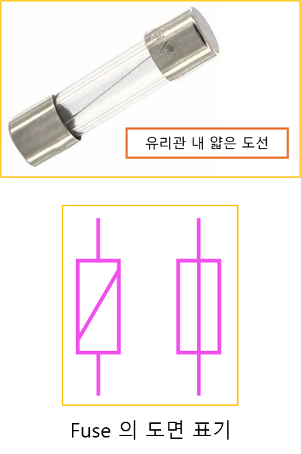
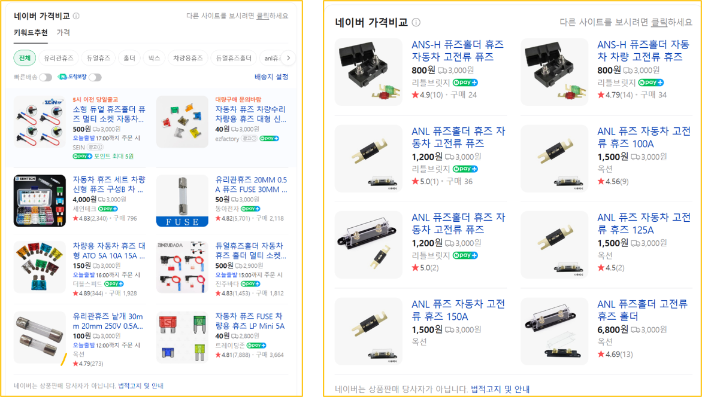

---

## 배선용 차단기 MCCB (=Molded Case Circuit Breaker)

- 예: 2극, 3극, 4극

---

## 배선용 차단기 MCCB (=Molded Case Circuit Breaker)

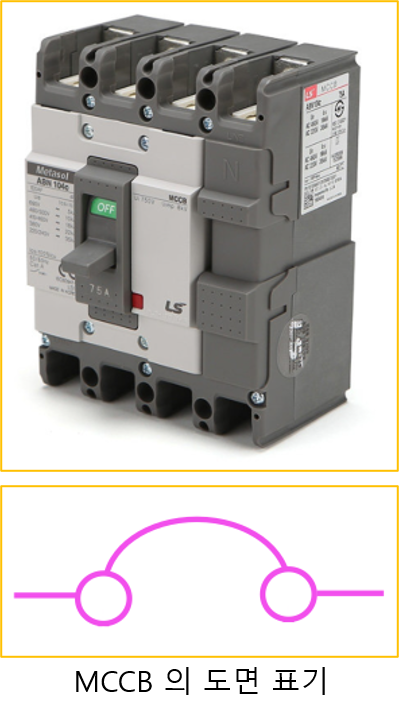

---

## 배선용 차단기 선택

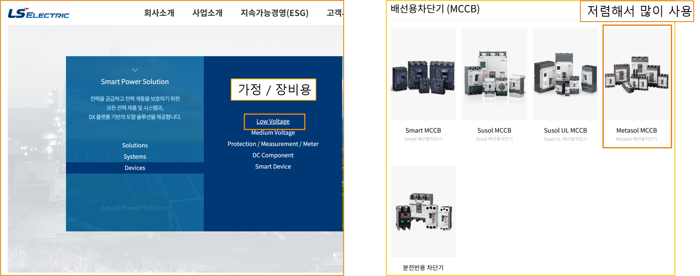
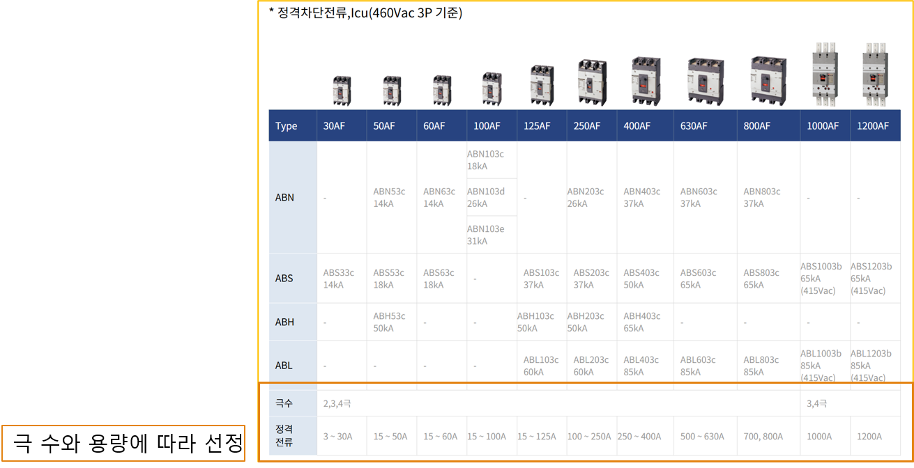

---

## 소형 차단기 MCB (=Miniature Circuit Breaker)

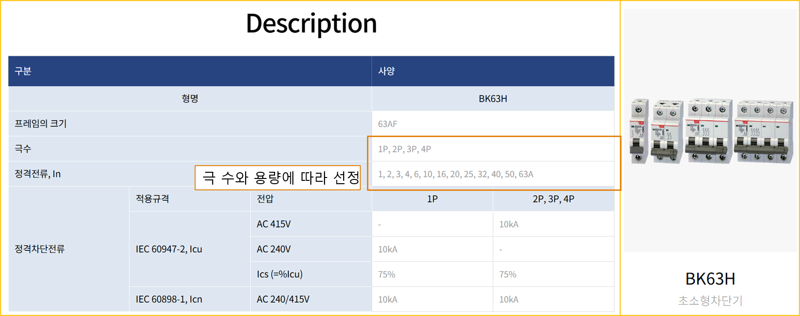

---

## 회로 보호기 CP (=Circuit Protector)

- 순시형 - 즉시 (MCCB, MCB보다 빠르다.)
- 고속형 - 10초 이내
- 중속형 - 120초 이내
- 저속형 - 300초 이내

---

## 회로 보호기 CP (=Circuit Protector)

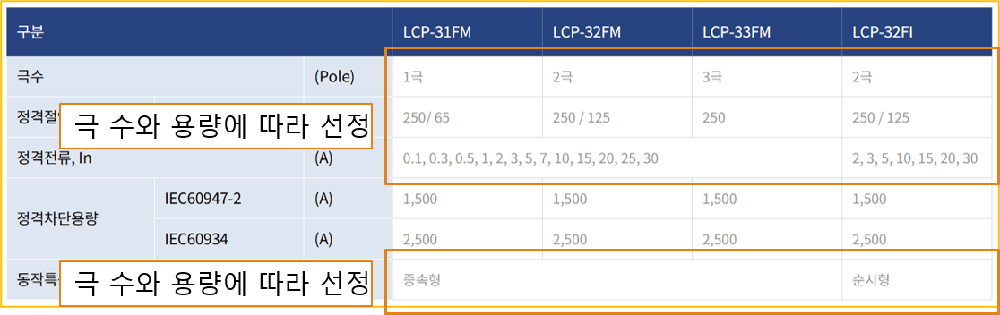
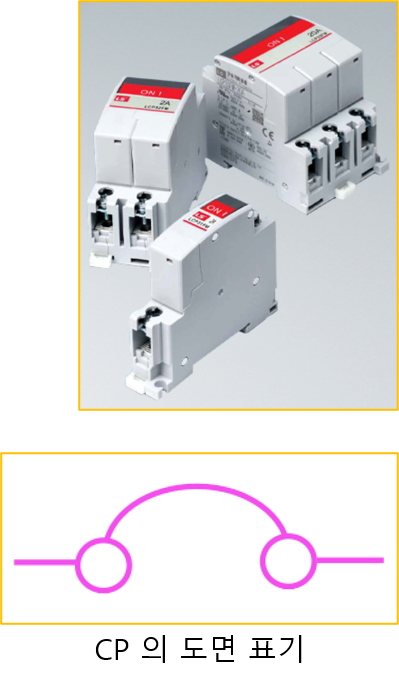

---

## MCB vs CP

- MCCB, MCB는 배선용 차단기 CP는 회로 보호기 MCB 나 MCCB는 과전류가 흘러 열이 발생한 이후에 차단하는 특성으로 반응 속도가 느립니다.
- 과전류 이후에 발생하는 선로에 발생하는 화재로 부터 보호 (부품 보호 목적이 아님) CP는 과전류가 흐르는 것을 감지하여 차단하기 때문에 반응 속도가 빨라 회로…
- (부품 보호 목적) CP는 비싸며 큰 용량이 없습니다.

---

## 전자개폐기 MC (=Magnetic Contactor)

- “코일”에 전원을 투입하면 “스위치”가 ON 됩니다.
- “스위치”가 ON되면 주회로를 통해 전력 공급이 가능해집니다.
- “스위치”가 ON되면 보조 접점을 통해 스위치 상태를 피드백받을 수 있습니다.

---

## 전자개폐기 MC (=Magnetic Contactor)

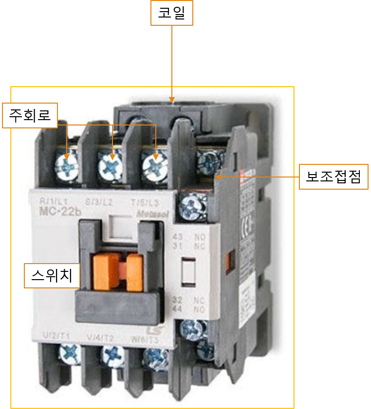

---

## 누전 차단기 ELCB (=Earth Leakage Circuit Breaker, 또는 ELB)

- MCCB에 누전 차단 기능이 추가된 차단기

---

## 누전 차단기 ELCB (=Earth Leakage Circuit Breaker, 또는 ELB)

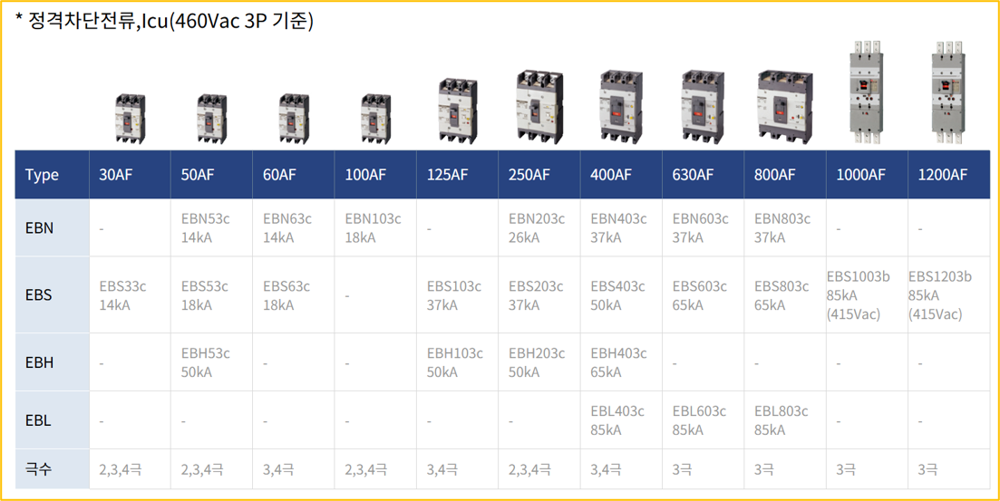

---

## 변류기 CT (=Current Transformer)

- 도선 내 전류가 흐르면 자기장이 형성
- 자기장으로 인해 변류기에 전류가 생성
- 전류의 크기를 일정한 비율로 변환 (변류비)

---

## 변류기 CT (=Current Transformer)

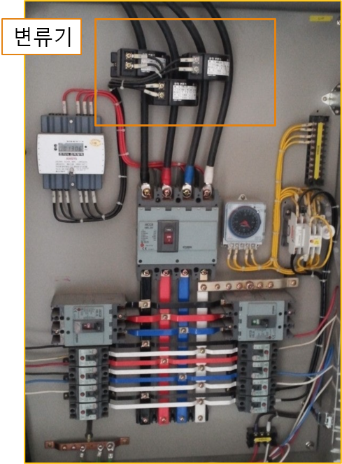

---

## 변류기 + 전류계

- 전류 모니터링

---

## 변류기 + 전류계

---

## 전류 측정 테스터기

- 변류기와 같은 원리

---

## 전류 측정 테스터기

---

## 영상 변류기 ZCT (=Zero Current Transformer)

- 누전 차단기의 원리

---

## 영상 변류기 ZCT (=Zero Current Transformer)

---

## 누전 (누설 전류)

- MCCB에 ZCT를 넣고 누설 전류를 감지 누전이 감지되면 전원을 차단하는 누전 보호 목적이 있습니다.
- 단, ZCT의 원리는 교류에서만 적용할 수 있습니다.
- (DC는 누설 전류 판단 불가)

---

## 누전 (누설 전류)

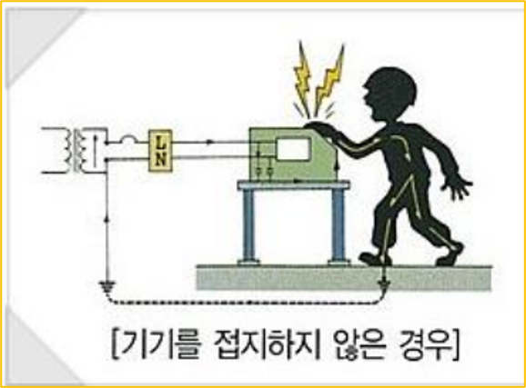

---

## 다양한 차단기 종류

- MBB: 자기 차단기
- ACB: 기중 차단기
- ABCB: 공기 차단기
- OCB: 유입 차단기
- VCB: 진공 차단기

---

## 도면 표기에서 주의할 점

- → IEC 규격에 따르면 전부 다르게 표현 되어야 함 도면을 그리는 사람은 정확하게 모델명을 기입 도면을 보는 사람은 모델명을 보고 정확히 확인할 수 있어야 합니다.

---

## 도면 표기에서 주의할 점

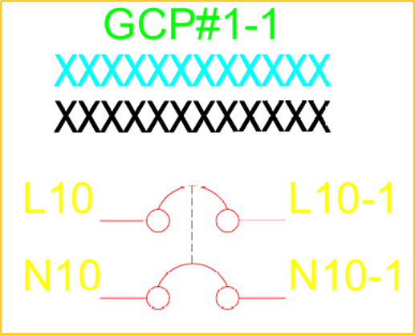

---

## SYMBOL LIST

- 설계자는 도면 내 SYMBOL LIST를 작성해야 하고, 정확히 확인할 수 있도록 해야 합니다.

---

## SYMBOL LIST

---

## RCD (=Residual Current Device)

- Type AC: 정현파 교류 누설 전류를 감지
- Type A: AC + 펄스 DC 감지
- Type B: AC + DC 누설 전류 감지
- Type F: 고주파 AC + 일부 DC 감지

---

## 차단기 선정

- 가장 정확한 방법은 차단기의 시간-전류 특성곡선과 부하의 돌입 전류 특성을 함께 확인하는 것입니다.
- 변압기의 경우 130% 선에서 선정
- 모터의 경우 200% ~ 300% 선에서 선정
- MCCB의 경우 차단 속도가 느리기 때문에 2.5배 정도 사용
- CP의 경우 차단 속도가 빠르기 때문에 3배 정도 사용 (일반적으로 모터에 CP는 부적절 하기는 하다.)

---

## 전자식 과전류 계전기 EOCR (=Electronic Over Current Relay)

- MC와 조합해서 모터 과부하 시 차단
- D-TIME (Delay Time): 기동부하를 무시하기 위한 설정
- LOAD (A): 모터의 정격 전류를 설정
- O-TIME (Over Current Operating Delay Time):
- LOAD에서 모터 부하를 설정

---

## 전자식 과전류 계전기 EOCR (=Electronic Over Current Relay)

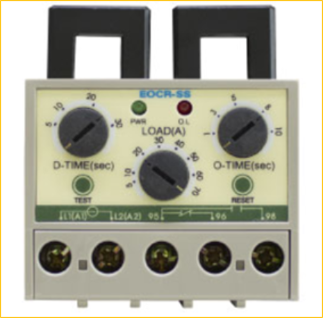

---

## 일반적인 모터 구동 회로

- 전원 RST가 인가되고 2.
- 배선 보호를 위한 배선용 차단기를 지납니다.
- MC의 코일이 ON되면 4.
- MC의 주접점을 통해 모터의 전원이 투입됩니다.
- 이 회로에서는 모터를 보호할 수 없습니다.

---

## 모터 차단기 선정

- AC-3: 일반적인 모터 부하
- AC-4: 빈번한 기동/정지 부하
- AC-3: 정격 전류의 2.5 ~ 3배수
- AC-4: 정격 전류의 3 ~ 3.5배수
- AC-3: 정격 전류의 1.5 ~ 2배수

---

## 모터 차단기 선정

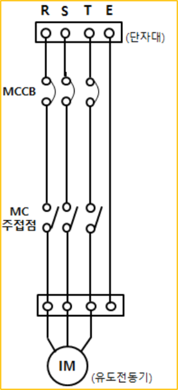

---

## 역률 vs 효율

- **역률** 공급된 전력을 얼마나 효과적으로 사용하는지에 대한 값으로 다음과 같이 계산됩니다.
- 커패시터(위상 선행), 코일(위상 후행) 등의 이유로 무효전력이 발생합니다.
- **효율** 효율은 입력 대비 출력 전력으로 다음과 같이 계산됩니다.
- 열 손실 같은 손실, 전기 에너지를 100% 전환할 수 없습니다.
- 정확한 값이 없을 때는 역률과 효율을 가정해 계산할 수 있지만, 최종 선정에는 제조사가 제공한 정격값을 사용해야 합니다.

---

## 역률 vs 효율

---

## 모터 차단기 선정의 예

- AC-3: 정격 전류의 2.5 ~ 3배수
- AC-4: 정격 전류의 3 ~ 3.5배수
- AC-3: 정격 전류의 1.5 ~ 2배수
- AC-4: 정격 전류의 2 ~ 2.5배수

---

## 모터 차단기 선정의 예

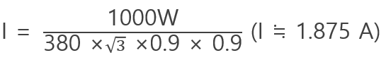

---

## 원가 절감의 딜레마

- 현장에서 가장 어려워 하는 모터 차단기 선정 공식은 있습니다.
- 하지만 싸게 만들어야 합니다.
- 이 예에서 모터는 각 1kW 모터를 사용합니다.
- (모터는 각 2A 정격으로 간주) MC는 각 3A 혹은 4A를 사용합니다.
- 메인 차단기는 몇A를 사용해야 할까?

---

## 원가 절감의 딜레마

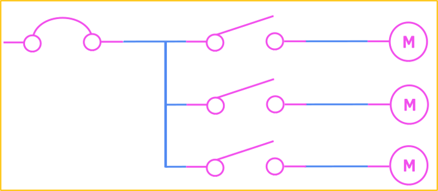

---

## 계전기가 포함된 모터 구동 회로

- 아직 시퀀스 회로를 배우지 않았습니다.
- 자세한 내용은 시퀀스 회로 이후에 설명

---

## 계전기가 포함된 모터 구동 회로

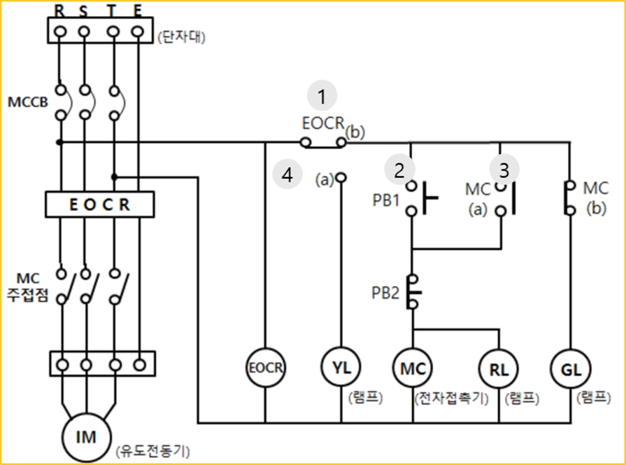

---

## N/F (=노이즈 필터)

- Noise를 차단할 수 있는 노이즈 필터 이다
- 용량에 맞게 선정하면 되기 때문에 큰 어려움은 없습니다.

---

## N/F (=노이즈 필터)

---

## 핵심 정리

- 배선용 차단기는 주로 과전류와 단락으로부터 배선을 보호했습니다.
- 누전 차단기는 정상 경로로 돌아오지 않는 전류를 감지해 감전과 누전 사고를 줄였습니다.
- 모터는 기동전류가 크므로 정격 전류만으로 차단기를 선정하면 오동작할 수 있습니다.
- 실제 선정에서는 제조사 데이터시트, 시간-전류 특성곡선, 차단용량, 관련 규격을 함께 확인해야 합니다.
