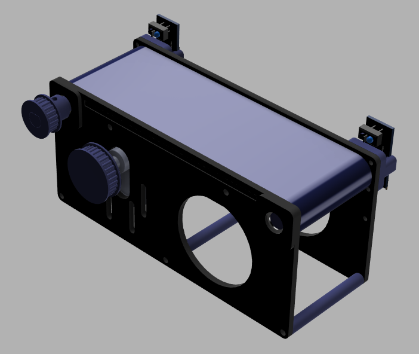
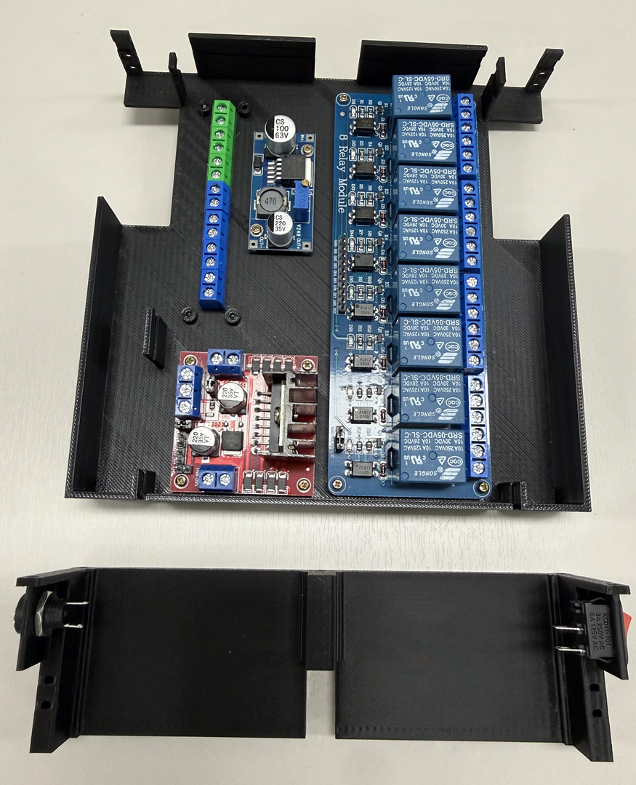

# 1-1. 전체 학습 주제 개요 및 기대 학습 성과 이해

이 책에서 무엇을 배우고, 각 기술이 공장 자동화 시스템 안에서 어떻게 연결되는지 먼저 살펴보았습니다. 전체 지도를 이해하면 뒤에서 새로운 용어를 만나더라도 학습 위치를 잃지 않을 수 있습니다.

---

#### 학습 목표

- 전기·전자·PLC·임베디드·소프트웨어의 관계를 설명할 수 있습니다.
- 컨베이어 실습이 전체 학습 과정에서 어떤 역할을 하는지 이해할 수 있습니다.
- 앞으로 학습할 기술의 순서와 최종 목표를 파악할 수 있습니다.

---
#### 학습을 시작하며

기계 설계 과목을 끝냈습니다.

기초적인 내용만 진행을 했고, 오늘부터 기계 관련해서는 프로젝트 단위로 추가적인 내용을 공유할 예정입니다.

과정은 기초와 고급으로 구분했습니다.

필자 역시도 조금 더 복잡한 프로젝트는 시간이 걸립니다.

회사에서 했던 프로젝트들은 보안 문제가 있습니다.

다른 프로젝트를 선정할 때 아쉬움이 남는 두 가지 포인트가 있습니다. 완성도가 높지만 쓸데없이 어렵거나, 쉽지만 완성도가 낮은 문제가 항상 아쉽습니다.

다른 사람이 만든 키트들 또한 아쉬운 것들이 생깁니다.

그래서 필자가 만든 내용들을 공유하고자 하는데, 이건 필자에게도 시간이 많이 필요로 하는 문제입니다.

이러한 배경을 설명한 이유가 있습니다.

필자에게 교육을 받으며 정성스럽게 만들어본 키트는 반나절의 교육만으로 충분했고, 다시 그린다고 하더라도 오래 걸리지 않을 만큼의 내용입니다.

앞으로 진행할 고급 프로젝트 또한 어렵지 않을 것으로 예상했습니다.

문제는 그 어렵지 않게 만들어 내는 과정은 정말 많은 고통을 감내해야 합니다.

모든 설계자가 그렇듯, 경험에 따라 시행착오를 겪는 횟수는 달라질 수 있겠지만 한 번에 되는 것은 없습니다.

필자가 여러 프로젝트를 완료할 수 있었던 것은 타고난 실력이 있어서도 아니고, 이과적인 감각이나 재능이 있어서는 더더욱 아닙니다.

실제로 필자는 길치에 운전도 잘 못하는데, 아무래도 3D 를 이해하는 공간 감각적인 사고가 상당히 부족한 것 같다는 개인적인 생각을 합니다.

필자가 무언가를 만들어 동작시키는 데 필요했던 것은 오로지 시간과 목표 의식이었던 것 같습니다. 지금 작성하는 글과 영상 또한 지루한 시간을 참고 견뎌 내고 있기에 가능하다고 생각합니다.

필자는 글 읽는 것을 매우 싫어했기 때문에 글 쓰는 방법도 잘 몰랐고, 말주변도 없어 유튜브를 시작하기도 어려웠습니다.

이제부터는 기계 설계 기초에서 만들었던 간단한 컨베이어를 활용해 프로젝트 단위의 고급 과정을 진행합니다.

*그림 1. 학습을 시작하며 관련 자료입니다.*

별것 아닌 것 같은 컨베이어였지만, 우리는 이 키트를 통해 센서와 모터를 사용했고, 모터의 회전수를 맞추기 위한 기계 기어비를 사용했습니다.

또, 동력을 전달하기 위한 타이밍 벨트를 사용했는데, 타이밍 벨트의 장력을 조절하기 위해 텐션 조절 장치도 넣었습니다.

다양한 실습을 위해 오랫동안 준비한 내용이었습니다.

여기서 끝이 아니라 앞으로도 이 키트를 활용해 정말 다양한 내용들을 학습합니다.

---

#### 전체 학습 로드맵

우리는 이제 전기, 전자, 임베디드, PLC, Linux, Python, Web, ROS 2 를 위한 기초 과정을 시작하게 됩니다.

오늘은 그 이야기를 조금 더 상세히 해보고자 합니다.

1. 전기회로
2. PLC
3. 전자회로
4. 임베디드
5. OS
6. 프로그래밍
7. ROS 2
8. 인공지능

첫 번째 주제는 전기회로입니다.

---

#### 전기회로 학습

오로지 전기 내용만을 갖고 컨베이어 한 개를 왕복 구동하게 만들어 봅니다.

이 과정에서 얻을 수 있는 내용을 다음과 같이 정리했습니다.

모터 구동 회로를 구성하고 센서 입력과 메모리 기능을 추가했습니다. 조건에 따라 컨베이어를 정방향 또는 역방향으로 회전하도록 구성했습니다.

이게 전기에서 이야기하는 시퀀스 회로, 즉 전기적인 프로그램 회로를 만드는 첫 번째 단계입니다.

이 과정에서 전기를 용량에 맞게 인가하는 방법과 센서의 신호를 구분하고 사용하는 방법, 그리고 케이블 선정이나 커넥터 선정들을 경험할 수 있습니다.

또한 케이블과 커넥터를 연결하는 작업 방법과 공구 사용법을 학습할 수 있습니다.

그것을 회로도에 표현하는 방법들을 익힐 수 있습니다.

즉, 컨베이어를 왕복 구동 할 수 있게 도면을 그리고, 도면에 맞게 전기 패널과 케이블을 제작하고 설치할 수 있는 능력을 만듭니다.

*그림 2. 전기회로 학습 관련 자료입니다.*

이러한 전기 패널을 만들고 서로 연결이 되는 케이블들을 만들어 봅니다.

두 번째 주제는 PLC입니다.

컨베이어를 전기적으로 왕복 구동하려면 메모리 기능이 필요했습니다.

이것을 가능하게 하는 장치는 릴레이입니다.

---

#### PLC 학습

공장에서 자동화를 하기 위해서는 이 릴레이가 필수적이며, 복잡한 기능을 만들어내기 위해서는 이 릴레이를 많이 필요로 하게 되며, 많은 릴레이를 소형화 한 것이 PLC 입니다.

그래서 전기 이후에 PLC를 진행하게 되며, 전기 기초에서 만들었던 단순 동작 반복 시작으로 좀 더 복잡한 컨베이어와 로봇을 사용해 물류 라인을 제어해 봅니다.

*그림 3. PLC 학습 관련 자료입니다.*

단순히 컨베이어 한 개가 아니라 좀 더 복잡한 시나리오로 시퀀스 동작이 가능하도록 할 예정입니다.

다만, 개인이 가정에 이러한 환경을 구축하기에는 많은 비용이 소요됩니다.

그래서 이것을 가상환경 상에서 동일하게 연습할 수 있도록 디지털 트윈 환경을 구축했습니다.

세 번째 주제는 전자회로입니다.

---

#### 전자회로 학습

전기에는 릴레이가 있다면 전자회로에서는 트랜지스터가 있습니다.

우스갯 소리로, 앗따가워 하면 전자고, 으악 하면 전기라는 얘기가 있으며,

48V 가 넘어가면 전기, 48V 가 안되면 전자라는 이야기, 또 릴레이를 쓰면 전기, 트랜지스터를 쓰면 전자라는 이야기가 있는데,

그만큼 전기와 전자는 구분하기 어렵습니다.

다만, 하는 일에는 조금 차이가 있는데 전기는 주로 전기 패널과 케이블을 만들고, 전자는 PCB 와 케이블을 만듭니다.

전기회로에서 만들었던 전기 패널을 전자회로로 변경해 PCB 로 만들어 봅니다.

*그림 4. 전자회로 학습 관련 자료입니다.*

앞서 릴레이를 사용해 만들었던 패널을 트랜지스터를 사용해 PCB 로 만들어 보려고 합니다.

아주 작은 변화로 보이지만 이것이 주는 변화는 결코 작지 않습니다.

*그림 5. 전자회로 학습 관련 자료입니다.*

전기회로의 전기 패널

*그림 6. 전자회로 학습 관련 자료입니다.*

전자회로의 PCB

전기 패널과 PCB를 비교해 보았습니다.

같은 내용으로는 둘 다 전압을 변경해주는 컨버터가 있으며, 모터를 구동해주는 모터 드라이브가 있습니다.

다른 점은 좌측 전기회로는 전기 패널을 만들어 냈고, 우측 전자회로는 PCB를 설계했습니다.

---

#### 임베디드 학습

네 번째 주제에서는 임베디드 환경을 구축했습니다.

릴레이 회로를 소형화한 것이 PLC라면, 트랜지스터 회로를 소형화한 것은 마이크로컨트롤러입니다. 마이크로컨트롤러를 사용한 시스템을 주로 임베디드 시스템이라고 합니다.

임베디드 환경은 크게 두 가지로 구분했습니다.

OS가 있느냐 없느냐입니다.

이 과정에서는 OS가 없는 환경에서 C언어 또는 C++ 을 사용하고, 아두이노나 ESP32 와 같은 아주 저렴한 컨트롤러를 사용해 컨베이어와 로봇을 구동해 봅니다.

*그림 7. 임베디드 학습 관련 자료입니다.*

앞서 만들었던 컨베이어와 로봇 시스템을 재활용합니다.

다섯 번째 주제는 운영체제입니다.

앞에서는 컨베이어와 로봇 시스템을 운영체제가 없는 환경에서 구동했습니다.

---

#### Linux와 Python 학습

이번에는 OS가 있는 환경에서 구동을 해보기 위해 OS 중 하나인 Linux를 사용합니다.

가정용 PC에 Linux 환경을 구성할 수도 있습니다.

여기서는 라즈베리파이라고 하는 컨트롤러를 사용합니다.

라즈베리파이는 아두이노나 ESP32 와 다르게 마이크로컨트롤러라고 보기보다는 미니PC에 가깝습니다.

이 라즈베리파이와 파이썬을 사용해 컨베이어와 로봇을 구동합니다.

여섯 번째 주제는 소프트웨어입니다.

---

#### 웹 환경 학습

자바스크립트와 웹 환경을 학습합니다.

여태까지 만들었던 환경은 User Interface 를 구현하는 데 무리가 있었습니다.

PLC 나 아두이노, 또 라즈베리파이에서 구동되는 컨베이어를 외부에서 조작하는 가장 간단한 방법입니다.

최근에는 바이브 코딩과 자동 코딩 방식이 널리 활용되고 있습니다.

코딩 역시 인공지능으로 대체되므로 공부할 필요가 없다는 의견도 있었습니다.

필자 의견으로는 지금이 학습하기 가장 좋은 여건입니다.

왜냐하면 AI를 활용하면 정말 많은 것을 만들어 낼 수 있기 때문인데, 아주 조금만 공부하더라도 정말 많은 효과를 볼 수 있기 때문에 공부하는 것도 나쁘지 않다고 생각이 됩니다.

---

#### ROS 2 학습

마지막 주제는 ROS 2입니다.

이 컨베이어와 로봇을 Linux 환경에서도 ROS 2 를 사용합니다.

ROS 2 는 Robot Operating System 의 약자로 로봇을 구동하기 위한 OS입니다.

Linux와 운영체제 과정에서 더 자세히 다루었습니다.

한 명이 개발할 때는 비교적 자유롭게 구성할 수 있습니다.

프로젝트의 규모가 커지고 복잡해지면 여러 명이 진행하게 될 수도 있습니다.

여러 명이 협업할 때는 시스템 구성 방식에 관한 약속이 필요했습니다.

그 약속들을 중계해주는 것이 바로 OS 입니다.

우리가 사용하는 윈도우나 리눅스도 사실 대단히 복잡한 시스템은 아니고, 키보드가 눌리면 어떻게 처리합니다. 마우스가 움직이면 어떻게 처리합니다. 와 같은 약속들을 정해놓고, 마우스나 키보드 제조사가 약속을 지키게끔 만드는 역할을 합니다.

ROS 2 를 활용해 팀워크를 위한 로봇 시스템을 제어해 봅니다.

이것은 다양한 이점들을 제공하는데, ROS 2에서 제공하는 디버깅 환경이나 시뮬레이션 환경들을 사용할 수 있다는 점입니다.

그 첫 단계로 컨베이어에 전원을 공급하고 왕복 운전하기 위해 전기 기초 내용을 준비했습니다.

---

#### 핵심 정리

- 하나의 자동화 설비에는 기계, 전기, 전자, 제어, 소프트웨어 기술이 함께 사용되었습니다.
- 컨베이어는 센서 입력, 모터 출력, 제어 로직을 한 번에 경험하기 좋은 실습 장치였습니다.
- 기초 개념을 익힌 뒤 PLC, 임베디드, Linux, 웹, ROS 2 순으로 학습 범위를 확장했습니다.
