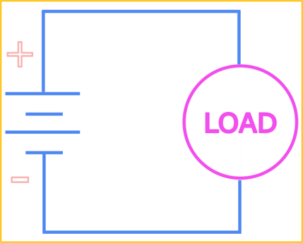
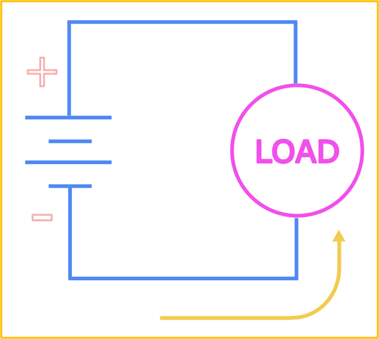
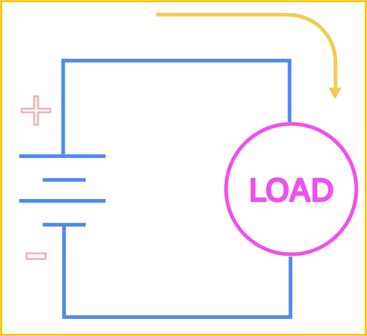
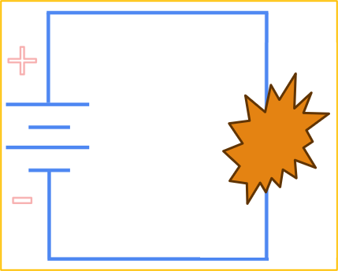
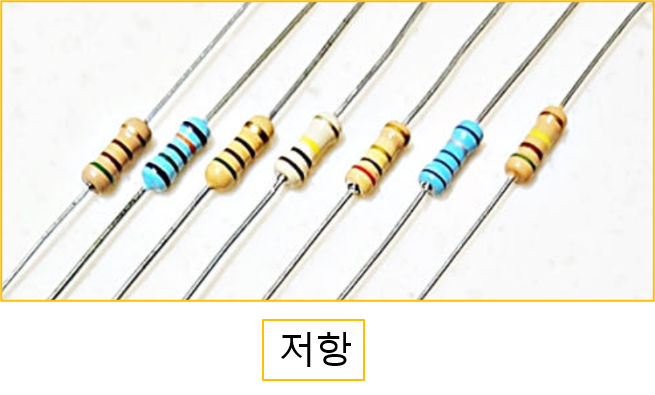
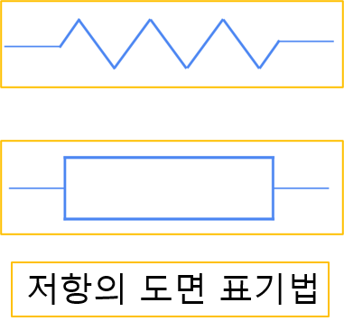

# 1-2. 전압, 전류, 저항의 개념

전압, 전류, 저항은 모든 전기회로를 설명하는 가장 기본적인 세 가지 물리량입니다. 물의 압력과 흐름을 떠올리면 세 개념의 관계를 비교적 쉽게 이해할 수 있습니다.

---

#### 학습 목표

- 전압, 전류, 저항의 의미와 단위를 구분할 수 있습니다.
- 폐회로와 개회로에서 전류가 흐르는 조건을 설명할 수 있습니다.
- 옴의 법칙을 사용해 전압·전류·저항을 계산할 수 있습니다.

---
#### 전기(電氣, Electricity)

전기를 조금 더 자세히 이해해보고자 잠시 화학 이야기를 시작합니다.

전체 교육 과정은 기계, 전기, 전자, PLC, 디지털 트윈, 소프트웨어, ROS 2, 비전, 피지컬 AI로 구성했습니다. 이 장에서는 그중 전기·전자 분야의 가장 기초적인 내용을 다루었습니다.

각 기술은 서로 독립되어 있지 않고 많은 부분에서 연결되었습니다. 전기와 전자, 전기와 PLC, PLC와 소프트웨어는 서로 겹치는 개념이 많았습니다. 전자와 재료의 원리를 깊이 이해하려면 화학 지식도 필요했으며, 화학은 기계·전기·전자·반도체를 연결하는 기초가 되었습니다.

이미 앞서 기계 재료에 대한 이야기를 할 때, 이온 결합과 금속 결합, 공유 결합에 대한 이야기를 한 적이 있습니다. 금속은 왜 가공성이 좋고 잘 깨지지 않는지, 또 왜 산화반응을 막기 위한 방법은 어떤 것들이 있는지를 이야기 하기 위해서 화학에 대한 기초 내용을 설명한 적이 있습니다.

지금 할 이야기들을 조금은 더 친밀하게 읽고 싶다면 기존 기계강의에서 했던 내용을 참고하면 더 좋겠지만 그렇지 않아도 좋습니다.

여기서는 전기가 잘 흐르는 이유를 이해하기 위해 금속 결합만 간단히 살펴보았습니다.

금속은 화학원소 주기율표에서 보면 왼쪽에 있는 원소, 즉 전자를 잃기 쉬운 원소로 금속 원소로 분류가 됩니다.

우리는 주기율표에서 알 수 있듯이 모든 원소는 원자핵의 개수로 분류를 하며, 전자는 원자핵의 개수와 같습니다. 하지만 이 전자는 최외각 전자가 항상 8개가 되어야 안정한 상태로 유지를 하게 되는데, 금속 원자는 최외각 전자가 주로 3개 이하입니다.

최외각 전자를 8개로 유지를 해야 안정한데, 금속 원소들은 최외각 전자가 3개 이하이니 안정상태가 되기 위해서는 전자를 얻어서 8개를 유지하기 보다는 전자를 잃어서 안정한 상태를 유지하기 좋은데, 이렇게 서로 전자를 잃은 금속 원소들은 + 극성을 유지하게 되고, - 극성인 전자들은 + 극성의 원소들 주위를 돌아다니며 자유전자 역할을 하게 됩니다.

자유전자들은 서로 +극성인 금속 원소들을 붙잡고 있게 되는데, 이것이 우리가 알고 있는 금속 결합이며, 금속이 됩니다.

금속의 특징은 이 자유전자들에 있으며, 전자들의 이동으로 전기를 만들어 냅니다.

전기를 정확하게 설명하기 위해서는 3가지 힘을 이해해야 하는데, 그것은 우리가 오랫동안 배워왔던 전류, 전압, 저항입니다.

---

#### 전압, 전류, 저항

전압은 두 지점 사이의 전위차이며 전하를 이동시키는 원인이 되었습니다. 도체의 양 끝에 전압을 가하면 도체 내부에 전기장이 형성되고 전하가 이동했습니다. 단위 시간 동안 흐르는 전하의 양을 전류라고 합니다.

실제 도체에서는 이동하는 전자가 원자 격자와 충돌했습니다. 이 과정에서 전기에너지의 일부가 열과 빛 등 다른 형태의 에너지로 변환되었습니다. 전류의 흐름을 방해하는 정도를 저항이라고 합니다.

물에 비유하면 전압은 압력 차이, 전류는 흐르는 물의 양, 저항은 물길의 좁고 넓은 정도에 해당했습니다. 이 비유는 직관적인 이해를 돕지만, 실제 전기 현상은 전기장과 전하의 움직임으로 설명했습니다.

이 전압과 전류, 저항은 특별한 수식을 만들어 내게 되는데 이 특별한 수식을 더 이야기 하기에 앞서 전압, 전류, 저항에 관한 내용들을 조금 더 자세히 수식으로 표현해 살펴보겠습니다.

---

#### 전압(電壓 : 전기의 압력, Voltage)

전압의 단위는 볼트(V)입니다. 영어 용어는 voltage이며, 물리량의 이름과 단위를 구분해야 합니다.

전압은 폐회로에서의 전위차에 의해 발생합니다.

그림과 같이 3V 전위를 갖는 낮은 전위와 27V 전위를 갖는 높은 전위가 있을 때, 이 둘의 전위차는 24V 가 됩니다. (즉, 전압은 24V 가 됩니다.)

*그림 1. 전압(電壓 : 전기의 압력, Voltage) 관련 자료입니다.*

도선에 전류가 흐르면 도선 주위에 자기장이 형성됩니다.

---

#### 폐회로와 개회로

폐회로 (Closed Circuit)

닫힌 회로: 전기가 흐릅니다.

*그림 2. 폐회로와 개회로 관련 자료입니다.*

개회로 (Open Circuit)

열린 회로: 전기가 흐르지 않습니다.

*그림 3. 폐회로와 개회로 관련 자료입니다.*

---

#### 기준 전압

*그림 4. 기준 전압 관련 자료입니다.*

표기된 27V 와 3V 는 기준점이 없기 때문에 의미 없는 수치입니다.

앞으로 우리는 이러한 도면에서의 전압 표기는 P24 와 N24 로 구분합니다.

24 V 전압원에서의 낮은 전위와 높은 전위를 구분합니다.

즉 폐회로에서의 기준이 되며, P24는 N24를 기준으로 24V 의 전위를 갖고, N24 는 P24 를 기준으로 0V 의 전위를 갖습니다.

이 기준에서는 N24V 가 0V 가 되는 것이지만, 다른 기준에서는 0V 가 아닐 수 있다는 것은 매우 헷갈리는 개념입니다.

---

#### 전류(電流 : 전기의 흐름, Ampere)

전류는 전기 회로에서 전자의 이동을 의미합니다.

- 단위는 암페어 이며, 이는 1초 동안 1쿨룽의 전하가 이동하는 전류의 양을 의미합니다.
- 전자는 원자 내에서 마이너스 전하를 가진 입자로, 전위차가 존재할 때 전자는 낮은 전위에서 높은 전위로 이동하게 되는데 이것을 전류라고 합니다.
- 전압이 생기고 전류가 흐르면 도선 주위에 자기장이 형성되며, 그 즉시 전기의 효력이 발생하게 됩니다.
- 전류는 흐르는 방향에 따라 직류와 교류 2가지로 구분됩니다.

---

#### 전자/전류 이동 방향

전자의 이동 방향

전자는 낮은 전위에서 높은 전위로 이동을 합니다.

*그림 5. 전자/전류 이동 방향 관련 자료입니다.*

전류의 이동 방향

전류는 높은 전위에서 낮은 전위로 이동을 합니다.

*그림 6. 전자/전류 이동 방향 관련 자료입니다.*

전자의 이동 방향을 과학적으로 측정하지 못했을 때, 당연히 높은 전위에서 낮은 전위로 이동할 것이라는 생각 때문에 과거부터 쌓여온 모든 문서는 높은 전위에서 낮은 전위로 흐른다고 설명하고 있고, 지금도 그렇게 사용하고 있습니다.

---

#### 쇼트 (단락, 短絡, Short Circuit)

*그림 7. 쇼트 (단락, 短絡, Short Circuit) 관련 자료입니다.*

전위차가 있는 폐회로는 전기가 흐른다는 것을 표현할 때 항상 부하(LOAD) 를 포함하는 회로를 만듭니다.

이때, 부하가 존재하지 않는다면 전위차가 있는 만큼 최대 전류가 흐르게 됩니다.

*그림 8. 쇼트 (단락, 短絡, Short Circuit) 관련 자료입니다.*

이것을 쇼트라고 표현하며 고전류가 흐르게 되므로 매우 위험한 상황이 됩니다.

부하는 전류를 제한하게 하며, 이것을 저항 (抵抗, Resistance) 라 합니다.

전류를 제한하는 저항이 없으면 도선 내 열이 발생하고 터지게 됩니다.

---

#### 저항 (抵抗, Resistance)

저항은 전기 회로에서 전류의 흐름을 방해하는 물질의 특성이며, 당위는 Ohm(Ω)을 사용합니다.

다양한 종류의 저항이 있고, 저항마다 저항의 수치가 다르며 아래 그림과 같이 색으로 구분을 합니다. 하지만 저항 값을 알기 위해 특별히 저항의 색상을 알고 있어야 하는 경우가 아니라면 그냥 테스터기로 저항 값을 알아내는 것을 추천합니다. 자주 사용하지 않으면 잊어버리게 됩니다.

*그림 9. 저항 (抵抗, Resistance) 관련 자료입니다.*

*그림 10. 저항 (抵抗, Resistance) 관련 자료입니다.*

---

#### 전압, 전류, 저항의 관계

전기과 혹은 전자과에서 아주 유명한 공식입니다.

V = I×R

V 는 전압, I는 전류, R은 저항입니다.

이 공식에서 얻을 수 있는 내용은 아래와 같습니다.

→ 같은 전압에서 저항이 높으면 전류가 낮아집니다.

→ 같은 저항에서 전압이 높아지면 전류가 높아집니다.

*그림 11. 전압, 전류, 저항의 관계 관련 자료입니다.*

---

#### 핵심 정리

- 전압은 전하를 움직이게 하는 전위차이며 단위는 볼트(V)입니다.
- 전류는 단위 시간 동안 이동한 전하의 양이며 단위는 암페어(A)입니다.
- 저항은 전류의 흐름을 방해하는 정도이며 단위는 옴(Ω)입니다.
- 옴의 법칙은 $V=IR$이며, 세 값 중 두 값을 알면 나머지 값을 계산할 수 있습니다.
