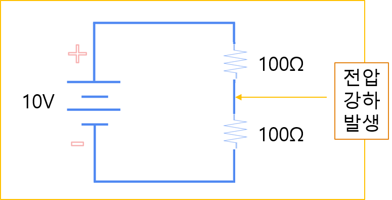
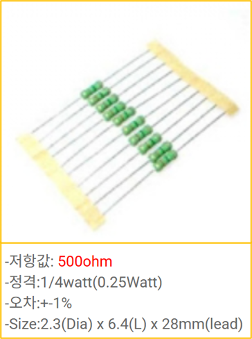

# 1-3. 전압 분배와 전력

회로에 저항을 여러 개 연결하면 전압과 전류가 연결 방식에 따라 나뉩니다. 이 원리를 이해하면 부품에 필요한 전압을 만들고, 부품이 견뎌야 할 전력을 계산할 수 있습니다.

---

#### 학습 목표

- 직렬·병렬 저항의 합성 저항을 계산할 수 있습니다.
- 전압 분배 법칙으로 각 저항에 걸리는 전압을 구할 수 있습니다.
- 전력 공식을 사용해 부품의 정격 전력을 선정할 수 있습니다.

---
#### 합산 저항

저항의 직렬 연결

총 저항은 200Ω (100 + 100) 이 됩니다.

*그림 1. 합산 저항 관련 자료입니다.*

저항의 병렬 연결

총 저항은 50Ω(1/(1/100 +1/100)) 이 됩니다.

*그림 2. 합산 저항 관련 자료입니다.*

---

#### 전압 분배법칙

직렬연결에서의 전압

V=I×R 에 의해 전류는 50mA
각 저항에 걸리는 전압은 V=I×R 에 의해 5V

*그림 3. 전압 분배법칙 관련 자료입니다.*

병렬연결에서의 전압

저항 하나당 폐회로가 되기 때문에 각 저항에
걸리는 전압과 전류는 10V, 100mA

*그림 4. 전압 분배법칙 관련 자료입니다.*

---

#### 전력(電力, electric power)

전력은 전기 에너지가 할 수 있는 일의 능력을 측정하는 단위이며 Watt를 사용합니다.

P = V×I

P는 전력, V는 전압 I는 전류

이 공식에서 얻을 수 있는 내용은 아래와 같습니다.

→ 전압이 높아지면 전기 에너지가 할 수 있는 일의 능력이 좋아집니다.

→ 전류가 높아지면 전기 에너지가 할 수 있는 일의 능력이 좋아집니다.

---

#### 마력과 전력

마력 (Horsepower): 말이 하는 일의 능력

- 기계적 마력 (Mechanical Horsepower): 745.7W
- 전기적 마력 (Electrical Horsepower): 746~756W

| 기기 | 출력(W) | 출력(HP) |
| --- | --- | --- |
| 일반 가정용 선풍기 | 50W | 0.067 HP |
| 일반 전기 모터 (소형) | 500W | 0.67 HP |
| 일반 가정용 진공청소기 | 1,000 (1kW) | 1.34 HP |
| 일반 오토바이 (125cc) | 7,500W (7.5kW) | 10 HP |
| 소형 자동차 엔진 (1.5L) | 110,000W (110kW) | 147 HP |

말 몇 마리의 힘이라고 하는 직관적인 단위로 주로 동력에서 많이 사용됨.

---

#### 전력 공식의 예

전압 [V =I × R ] =  2A × 12Ω   = 24V

전류 [I =V ÷ R ] =  24V ÷ 12Ω   = 2A

저항 [R =V ÷ I ] =  24V ÷ 2A  = 12Ω

전력 [P =V × I ] =  24V × 2A  = 48W

단위의 변환

- 2A = 2000mA = 0.002kA
- 24V = 24000mV = 0.024kV
- 12Ω = 12000mΩ = 0.012kΩ
- 48W = 48000mW = 0.048kW

*그림 5. 전력 공식의 예 관련 자료입니다.*

---

#### 부하의 전력이란

부하에서 전력을 계산하는 이유는

부하가 할 수 있는 일(즉, 부하가 버틸 수 있는 에너지)을 계산

저항과 같은 경우 버틸 수 있는 전력을 넘어가게 되면 터집니다.

*그림 6. 부하의 전력이란 관련 자료입니다.*

---

#### 저항의 선택

저항의 중요 요소는 저항 값과 전력입니다.

저항 값은 전압과 전류를 알고 있을 때, V = I × R 공식으로 유추할 수 있습니다.

R=I/V 임이 유추 되며, P = V × I 공식을 사용할 수 있습니다.

예를 들어 5V 에서 10mA 의 전류를 사용하고 싶다면

R=5V/10mA 가 되어 500Ω 이 되며, 전력은 P = 5V × 10mA 가 되어 0.05W 가 됩니다.

500Ω 저항에 1/4W (0.25W) 를 선택하면 무리 없이 저항을 사용할 수 있습니다.

(저항이 버틸 수 있는 전략을 넘어가면 저항은 터집니다.)

*그림 7. 저항의 선택 관련 자료입니다.*

---

#### 핵심 정리

- 직렬회로에서는 전류가 같고 전압이 저항값에 비례해 나뉩니다.
- 병렬회로에서는 전압이 같고 전류가 각 경로로 나뉩니다.
- 전력은 단위 시간에 사용한 에너지이며 $P=VI$로 계산했습니다.
- 저항은 계산값보다 여유가 있는 정격 전력의 제품을 선정해야 합니다.
