# 1-4. 직류와 교류

전기는 크게 직류와 교류로 나뉩니다. 배터리와 전자회로에는 주로 직류를 사용하고, 발전소에서 생산한 전력을 멀리 보내거나 산업용 모터를 구동할 때는 주로 교류를 사용했습니다.

---

#### 학습 목표

- 직류와 교류의 파형 및 용도를 비교할 수 있습니다.
- 단상과 3상, 선간전압과 상전압을 구분할 수 있습니다.
- 국가별 전압과 주파수 체계가 다른 배경을 이해할 수 있습니다.

---
#### 교류(交流, Alternating Current)

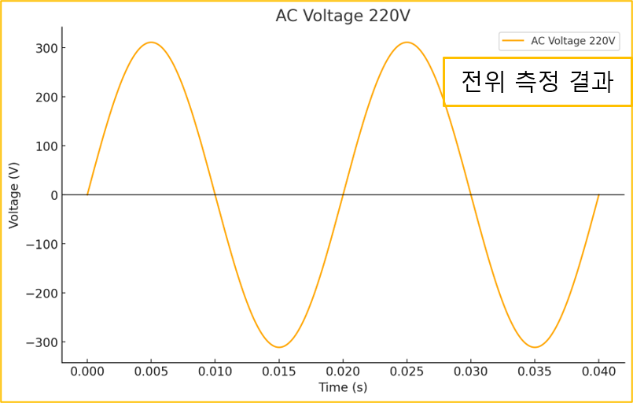

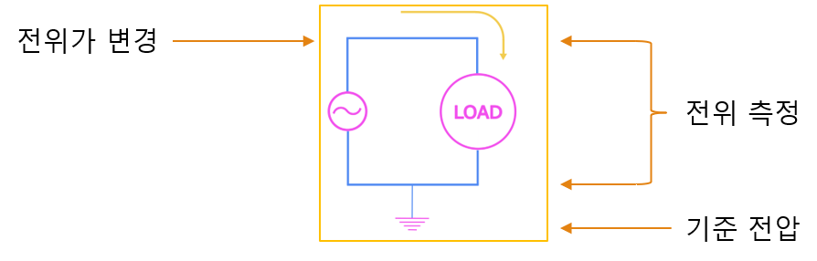

- 전압 변경에 대한 비용이 저렴하다는 점 때문에 장거리 전송이 유리
- 저장이 어렵습니다. (배터리 X)
- 사용하기 어렵다는 단점 때문에 디지털 회로에서 사용되지 않습니다.

---

#### 직류와 교류 비교

---

#### 직류 (DC, Direct Current)

- 전류의 방향이 변하지 않고 일정하게 흐르는 전류
- 저장하기 용이해 배터리 전압원에 적합
- 안저된 전압원으로 디지털 회로에서 사용하기 적합

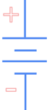

---

#### 교류 (AC, Alternating Current)

- 전류의 방향이 일정한 주기로 변하며 흐르는 전류
- 전압 레벨 변경이 용의
- 고 전압일 수록 전력 손실이 적기에 장거리 전송에 적합
- 회전체 구동과 회전체에서 전류를 얻기 용의

---

#### 교류의 전압 측정

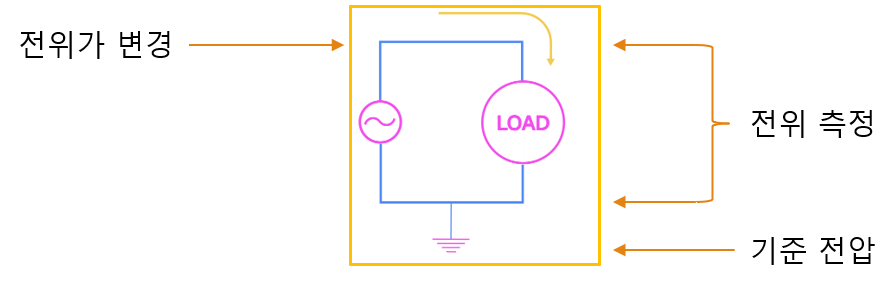

교류 전압은 일반적으로 실효값($V_{RMS}$, Root Mean Square)으로 표시합니다.

그림에서 약 311 V에 해당하는 값은 최대 전압($V_{peak}$)입니다.

$V_{peak}=220\,V\times\sqrt{2}\approx311\,V$가 됩니다.

테스터기로 측정하면 실효값이 측정됩니다.

---

#### 단상 2선식

활선(Live Wire)은 전원 전압이 인가되는 도선입니다.

중성선(Neutral)은 부하 전류가 전원으로 돌아가는 경로를 제공해 회로를 완성합니다.

단상 2선식에서는 활선과 중성선 사이의 전압을 사용하며, 이 예의 실효값은 220 V입니다.

중성선은 전원 측의 지정된 지점에서 접지와 연결될 수 있지만, 부하 측에서는 보호 접지와 같은 도체로 취급해서는 안 됩니다.

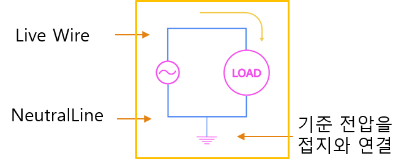

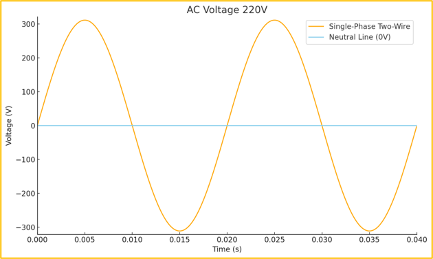

---

#### 단상의 위상

교류 신호는 주기적으로 변화하며, 한 주기 (360 ° 또는 2π) 안에서 신호의 특정 위치를 나타냅니다.

위상차는 각도 또는 시간 차이로 나타냈습니다.

- 각도: 한 주기 360°
- 시간: 50 Hz에서는 1초에 50주기가 반복되며 한 주기는 0.02초입니다.

한국은 60 Hz를 사용하며, 50 Hz를 사용하는 국가도 많습니다.

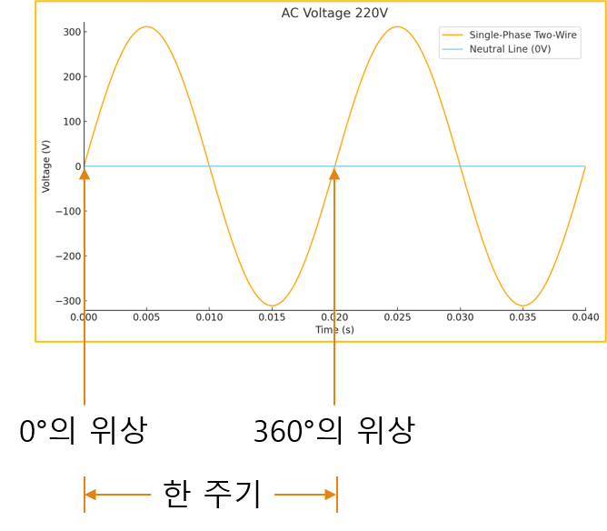

---

#### 단상 3선식

1가닥의 중성선과 2가닥의 활선을 사용하는 방식으로 2선식과 다르게 2가지 종류의 전압원을 제공합니다.

전류가 이동하는 구간은 다음과 같습니다.

- 활선 A에서 중성선,
중성선에서 활선 A 구간 220V
- 활선 B에서 중성선,
중성선에서 활선 B 구간 220V
- 활선 A에서 활선 B,
활선 B에서 활선 A 구간 440V

단, 단상 3선식은 흔히 사용되는 방식은 아닙니다.

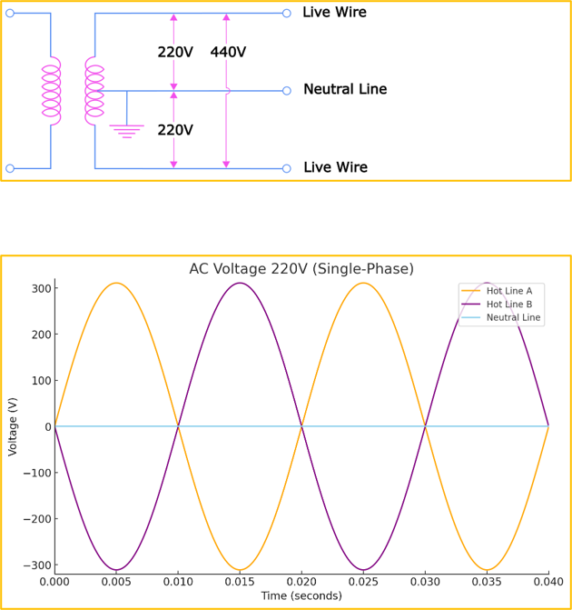

---

#### 3상 3선식

3가닥의 활선을 사용하는 방식으로 1개의 3상 전원과 3개의 단상 전원을 사용할 수 있는 전압원입니다.

전류가 이동하는 구간은 다음과 같습니다.

- Phase A에서 Phase B,
Phase B에서 Phase A 구간 380V
- Phase B에서 Phase C,
Phase C에서 Phase B 구간 380V
- Phase C에서 Phase A,
Phase A에서 Phase C 구간 380V

---

#### 3상 3선식 분전함

3개의 선이 연결되어 각 차단기로 분배하고 있습니다.

380V 3상 3선식은 다음과 같은 전원을 얻습니다.

- 380V 단상 3개 (RS, ST, TR)
- 380V 3상 1개 (RST)

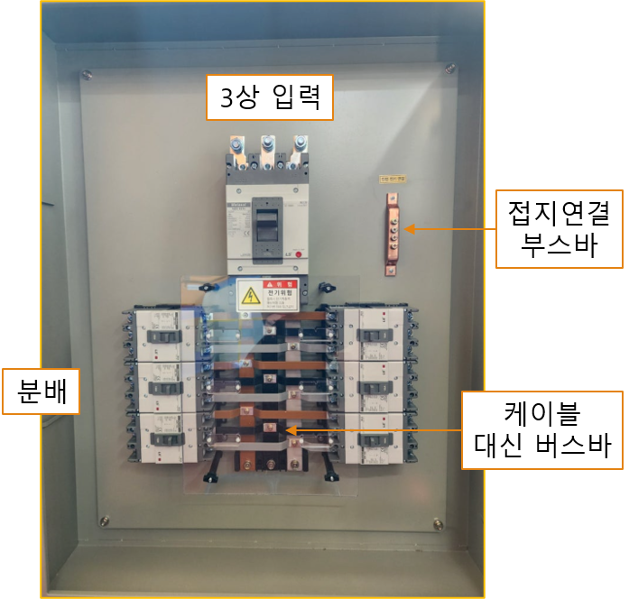

---

#### 버스바와 케이블 비교

버스바 대신 케이블도 많이 사용

용량이 크면 케이블이 불편합니다.

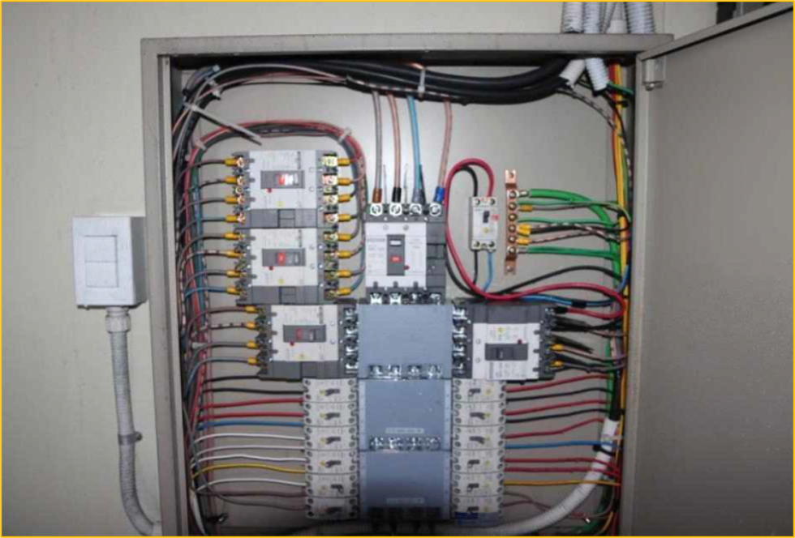

---

#### 3상 4선식

3가닥의 활선과 1개의 중성선으로 이루어진 전압원으로 1개의 3상 전원과, 2가지 종류의 단상 전압원을 제공합니다.

전류가 이동하는 구간은 다음과 같습니다.

- Phase A에서 Phase B,
Phase B에서 Phase A 구간 (380V)
- Phase B에서 Phase C,
Phase C에서 Phase B 구간 (380V)
- Phase C에서 Phase A,
Phase A에서 Phase C 구간 (380V)
- Phase A에서 Neutral,
Neutral에서 Phase A 구간 (220V)
- Phase B에서 Neutral,
Neutral에서 Phase B 구간 (220V)
- Phase C에서 Neutral,
Neutral에서 Phase C 구간 (220V)

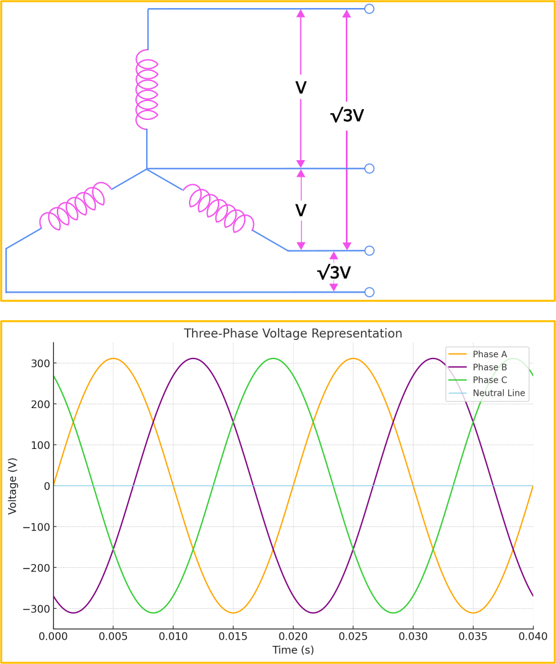

---

#### 3상 4선식 분전함

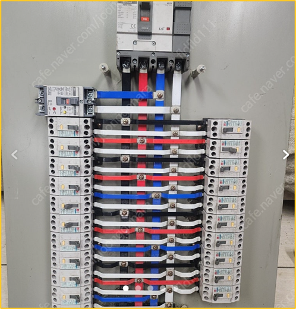

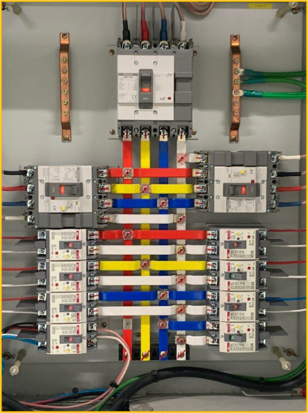

3상 또는 단상으로 분기합니다.

380V 3상 4선식은 다음과 같은 전원을 얻습니다.

- 380V 단상 3개 (RS, ST, TR)
- 220V 단상 3개 (RN, SN, TN)
- 380V 3상 3선식 1개 (R, S, T)

- 380V 3상 4선식 1개 (R, S, T, N)

---

#### 단상과 3상

단상

- 한 개의 활선 를 사용
- 두 개의 전선에서 1개의 단상 전원 공급 가능

3상

- 3개의 Wire를 사용
- 3개의 전선에서 3개의 단상 전원과 1개의 3상 전원 공급 가능 (3상 3선식)

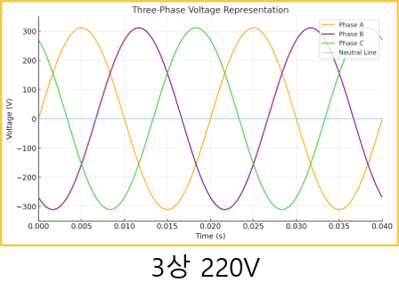

---

#### 단상과 3상 도면표기

단상 전원의 표기

- L(활선)과 N(중성선)을 사용
- 예: L0, L1, N0, N1…

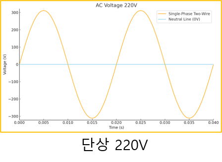

3상 전원의 표기

- 미국기준: A, B, C, N(중성선)을 사용
- 유럽기준: R, S, T, N(중성선)을 사용

---

#### 110V 사용 이유

최초 에디슨이 100V에서 동작하는 백열전구를 개발

다만, 송전상에 손실되는 전류를 감안해 전기는 안전율을 더해 110V를 사용

이후 더 높은 배전 전압을 사용하면 같은 전력을 더 작은 전류로 전달해 배선 손실을 줄일 수 있어 220 V 또는 230 V 체계가 널리 사용되었습니다.

미국과 일본은 기존 110V 전기가 많이 사용되고 있어 변경을 못함

220V는 110V로 전환하기 쉬워 사용했으며 330V 또는 그 이상의 전기는 위험해서 적용하지 않음

220V는 2~3mm로 절연이 유지되지만, 전압이 높아지면 절연 거리 증가로 인해 비용 증가

---

#### 50Hz, 60Hz 사용 이유

전력 주파수는 조명 깜박임, 회전기기의 특성, 변압기 크기와 손실 등에 영향을 주었습니다.

현재의 50 Hz와 60 Hz 체계는 기술적 절충과 각 지역 전력망의 역사적 선택을 통해 정착했습니다. 주파수가 다른 장비를 사용할 때는 정격 주파수와 제조사 사양을 반드시 확인해야 합니다.

---

#### 핵심 정리

- 직류는 극성과전류 방향이 일정하며, 교류는 시간에 따라 크기와 방향이 변했습니다.
- 단상은 일반 가정과 소형 부하에, 3상은 산업용 대형 부하에 주로 사용되었습니다.
- 3상 4선식에서는 선간전압과 상전압을 모두 사용할 수 있습니다.
- 전압이나 결선 방식을 확인할 때는 임의로 판단하지 말고 도면과 측정값을 함께 확인해야 합니다.
