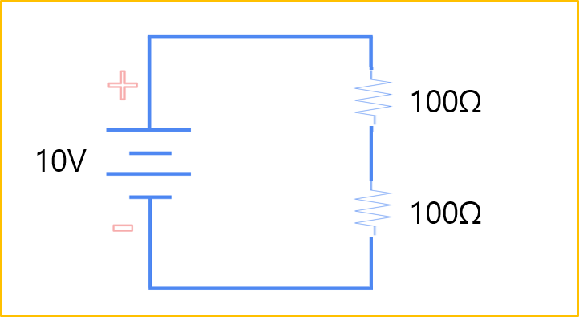

# 1-04. 전압 분배와 전력

이번에는 옴의 법칙인 V = IR을 더 자세히 이해하기 위해 저항의 연결 방식과 특성을 살펴보겠습니다. 이어서 옴의 법칙과 함께 전기회로에서 가장 많이 사용되는 전력 공식인 P = VI에 대해서도 알아보겠습니다.

---

#### 합성저항

여러 개의 저항을 연결하면 연결 방식에 따라 전체 저항값이 달라집니다.

저항의 연결 방식은 크게 직렬 연결과 병렬 연결로 구분됩니다.

**저항의 직렬 연결**

저항을 직렬로 연결하면 각 저항의 값을 모두 더해 전체 저항을 계산합니다.

100Ω 저항 두 개를 직렬로 연결한 경우 전체 저항은 다음과 같습니다.

R = 100Ω + 100Ω = 200Ω

따라서 전체 저항은 200Ω이 됩니다.

직렬 회로에서는 모든 저항에 동일한 전류가 흐릅니다.

---

**저항의 병렬 연결**

저항을 병렬로 연결하면 전체 저항은 다음과 같이 계산합니다.

1/R = 1/R₁ + 1/R₂

100Ω 저항 두 개를 병렬로 연결한 경우

R = 1 ÷ (1/100Ω + 1/100Ω)

R = 50Ω

따라서 전체 저항은 50Ω이 됩니다.

병렬 연결에서는 전체 저항이 각 저항의 값보다 작아집니다.

---

#### 전압 분배 법칙

**직렬 회로에서의 전압**

직렬 회로에서는 전체 전압이 각 저항의 크기에 비례하여 분배됩니다.

예를 들어 100Ω 저항 두 개를 직렬로 연결하고 10V를 인가하면 전체 저항은 200Ω이 됩니다.

옴의 법칙에 따라 회로에 흐르는 전류는 다음과 같습니다.

I = V ÷ R

I = 10V ÷ 200Ω = 0.05A

따라서 회로에는 50mA의 전류가 흐릅니다.

각 저항에 걸리는 전압은 다음과 같습니다.

V = I × R

V = 0.05A × 100Ω = 5V

두 저항의 값이 같으므로 각 저항에는 5V씩 전압이 걸립니다.

직렬 회로에서는 저항값이 큰 저항일수록 더 높은 전압이 걸립니다.

---

**병렬 회로에서의 전압**

병렬 회로에서는 각 저항이 전원에 직접 연결된 독립적인 폐회로를 구성합니다.

따라서 각 저항에는 전원과 동일한 전압이 걸립니다.

예를 들어 100Ω 저항 두 개를 병렬로 연결하고 10V를 인가하면 각 저항에는 10V가 걸립니다.

각 저항에 흐르는 전류는 다음과 같습니다.

I = V ÷ R

I = 10V ÷ 100Ω = 0.1A

따라서 각 저항에는 100mA의 전류가 흐릅니다.

두 저항의 전류를 합하면 전체 전류는 200mA가 됩니다.

병렬 회로에서는 모든 부하에 동일한 전압이 걸리며, 각 부하에 흐르는 전류는 저항값에 따라 달라집니다.

---

#### 전력(電力, Electric Power)

전력은 전기 에너지가 일정한 시간 동안 할 수 있는 일의 크기를 의미합니다.

전력의 단위는 와트(Watt, W)를 사용합니다.

전력은 다음 공식으로 계산합니다.

P = V × I

- P : 전력(Power)
- V : 전압(Voltage)
- I : 전류(Current)

이 공식을 통해 다음과 같은 관계를 알 수 있습니다.

- 같은 전류에서는 전압이 높아질수록 전력이 커집니다.
- 같은 전압에서는 전류가 높아질수록 전력이 커집니다.

즉, 전압과 전류가 증가하면 부하에 전달되는 전력도 증가합니다.

---

#### 마력과 전력

마력(Horsepower, HP)은 말이 할 수 있는 일의 능력을 기준으로 만든 동력 단위입니다.

모터나 엔진의 출력 성능을 표현할 때 주로 사용합니다.

일반적으로 1HP는 약 746W입니다.

- 기계 마력(Mechanical Horsepower) : 745.7W
- 전기 마력(Electrical Horsepower) : 약 746W

| 기기 | 출력(W) | 출력(HP) |
| --- | --- | --- |
| 일반 가정용 선풍기 | 50W | 약 0.067HP |
| 소형 전기 모터 | 500W | 약 0.67HP |
| 일반 가정용 진공청소기 | 1,000W (1kW) | 약 1.34HP |
| 일반 오토바이(125cc) | 7,500W (7.5kW) | 약 10HP |
| 소형 자동차 엔진(1.5L) | 110,000W (110kW) | 약 147HP |

마력은 장비가 낼 수 있는 힘을 직관적으로 표현할 수 있어 모터와 엔진의 출력 단위로 많이 사용합니다.

---

#### 전압, 전류, 저항, 전력 계산

전압, 전류, 저항은 옴의 법칙을 이용해 계산합니다.

V = I × R

예를 들어 전류가 2A이고 저항이 12Ω인 경우 전압은 다음과 같습니다.

- V = 2A × 12Ω = 24V
- I = 24V ÷ 12Ω = 2A
- R = 24V ÷ 2A = 12Ω
- P = 24V × 2A = 48W

따라서 이 회로의 전압은 24V, 전류는 2A, 저항은 12Ω, 전력은 48W입니다.

---

#### 단위 변환

전기에서는 값의 크기에 따라 m(Milli), k(Kilo)와 같은 접두어를 사용합니다.

- m(Milli) : 1/1,000
- k(Kilo) : 1,000

앞의 계산값을 변환하면 다음과 같습니다.

- 2A = 2,000mA = 0.002kA
- 24V = 24,000mV = 0.024kV
- 12Ω = 12,000mΩ = 0.012kΩ
- 48W = 48,000mW = 0.048kW

단위를 변환할 때에는 숫자뿐 아니라 단위도 함께 변환해야 합니다.

---

#### 부하의 전력

부하에서 전력을 계산하는 이유는 해당 부하가 소비하거나 처리하는 전기 에너지의 크기를 확인하기 위해서입니다.

전력은 부하가 사용할 수 있는 에너지의 크기를 나타냅니다.

모터에서는 출력과 소비 전력을 확인하는 기준이 되며, 히터에서는 발생하는 열의 크기를 판단하는 기준이 됩니다.

저항과 같은 부품은 허용 전력을 초과하면 과도한 열이 발생합니다.

이 상태가 계속되면 저항이 변색되거나 손상되고, 심한 경우에는 파손될 수도 있습니다.

따라서 부품을 선택할 때에는 필요한 전력보다 충분히 큰 허용 전력을 가진 부품을 선택해야 합니다.

---

#### 저항의 선택

저항을 선택할 때에는 저항값과 허용 전력을 함께 고려해야 합니다.

저항값은 옴의 법칙으로 계산합니다.

R = V ÷ I

예를 들어 5V 전원에서 10mA의 전류를 사용하려면 먼저 전류를 A 단위로 변환합니다.

10mA = 0.01A

필요한 저항은 다음과 같습니다.

R = 5V ÷ 0.01A = 500Ω

저항에서 소비되는 전력은 다음과 같습니다.

P = V × I = 5V × 0.01A = 0.05W

따라서 필요한 저항은 500Ω, 소비 전력은 0.05W입니다.

이 경우 500Ω, 1/4W(0.25W) 저항을 선택하면 충분한 여유를 가지고 사용할 수 있습니다.

저항의 허용 전력보다 실제 소비 전력이 커지면 많은 열이 발생합니다. 이 상태가 계속되면 저항이 손상되거나 파손될 수 있으므로, 저항값 뿐 아니라 허용 전력도 반드시 함께 확인해야 합니다.
