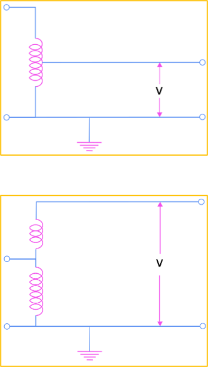
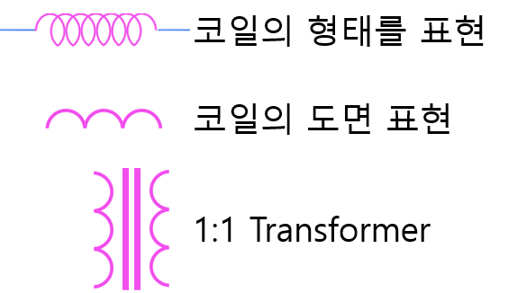
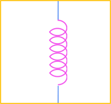
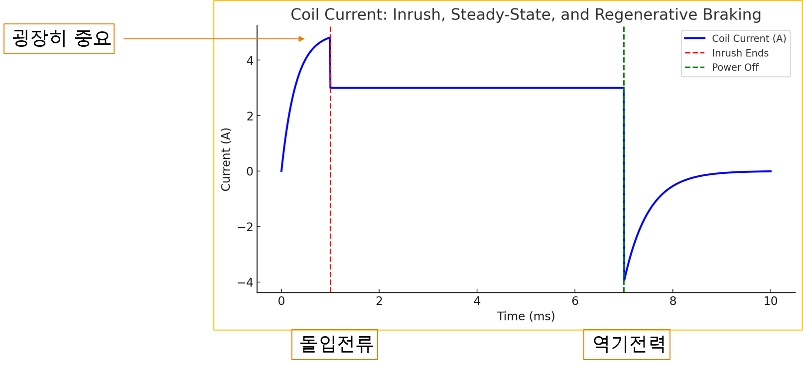

# 1-6. 변압기, 코일, 인덕터, 솔레노이드

---

#### 변압기 (Transformer)

변압기를 사용하면 1차측 전원에서 2차측 전원으로 전기가 전달됩니다.

전원에 연결된 구리선은 그림과 같이 코어를 감싸고 있는 형태인데 이를 코일이라고 합니다.

1차측에 연결된 코일과 2차측에 연결된 코일의 감기는 횟수에 따라 전압이 달라집니다. 이러한 원리로 변압기는 전압을 변경하는데 유용하게 사용됩니다.

이렇게 간단한 장치로 전압을 변경할 수 있기 때문에 교류 전원이 레벨 변경은 비교적 저렴합니다.

---

#### 전류의 손실

전류는 이동을 할 때 손실이 발생하며 손실은 Ploss = I^2×R 로 구합니다.

손실을 줄이기 위해서는 저항(R)을 낮추거나 전류(I)를 낮춰야 하는데, 저항을 낮추는 것은 물리적으로 한계가 있습니다.

같은 전력을 공급할 때, 전압을 높이면 전류를 낮출 수 있기 때문에 손실을 줄일 수 있습니다.

높은 전압(765kV)으로 공급 후 가정이나 공장에서 전압을 낮춰 사용합니다.
(변압기, Down Transformer)

---

#### 복권 변압기

앞서 공부했던 변압기는 복권 변압기라고 합니다.

1차측과 2차측이 서로 다른 코일로 분리가 되어 있는 형태인데, 코일을 분리해서 사용하기 때문에 비교적 비싸며 무겁습니다.

다만, 1차측과 2차측이 완전히 절연되어 있어 노이즈 유입이 차단되는 장점이 있습니다.

절연(絕緣): 관계를 완전히 끊음

1:1 Transformer 로 Noise Filter 로도 사용

---

#### 단권 변압기

복권 변압기와 다르게 코일이 한 개만 있는 변압기를 단권 변압기라 합니다.

1차측과 2차측의 코일을 공유하기 때문에 비용이 복권 변압기 대비 저렴하고 크기가 작고 가볍습니다.

다만, 1차측과 2차측이 절연되어 있지 않기 때문에 노이즈 유입의 통로가 되기도 합니다.

---

#### 코일과 변압기

코일

- 전선을 나선형으로 감은 구조를 가진 도체
- 전류가 흐르면 강한 자기장이 형성됩니다.
- 코일의 자기장은 전류의 방향과 전선의 감김 상태에 따라 달라집니다.

변압기

- 코일에 흐른 전류로 인해 자기장이 형성됩니다.
- 형성된 자기장에 의해 큰처에 있는 코일에 전류가 유도됩니다.

---

#### 인덕터

코일 중 전류 변화에 대한 저항(인덕턴스)을 갖는 부품

많은 공식들이 있지만 PASS
(개념 위주로 이해하고, 공식은 추후 필요하다면 검색)

인덕터의 특징

- 전압이 증가하면 저항이 증가
(최초 전압 인가 시 저항이 0에 가깝기 때문에 돌입전류 발생)
- 전압이 공급되면 역기전력이 발생
(역기전력이 충분히 발생하면 공급전압과 평형을 이루어 유효 전류 감소)
- 전압이 차단되면 역기전력으로 인한 회생전력 발생

---

#### 인덕터의 이해

전류의 변화에 저항을 갖습니다. (≒관성)

- 자동차가 출발하거나 멈출 때 가속시간과 감속시간이 필요
- 사람이 달리기를 시작하거나 멈출 때 가속시간과 감속시간이 필요

인덕터의 전류 그래프

---

#### 솔레노이드

솔레노이드

- 코일의 한 종류로, 나선형으로 감긴 긴 전선으로 구성된 구조
- 보통 직선 모양의 원통형 형태
- 전류가 흐를 때, 솔레노이드 내부에 강한 자기장 형성

응용

- 솔레노이드 벨브
- 솔레노이드 엑추에이터
- 솔레노이드 릴레이

