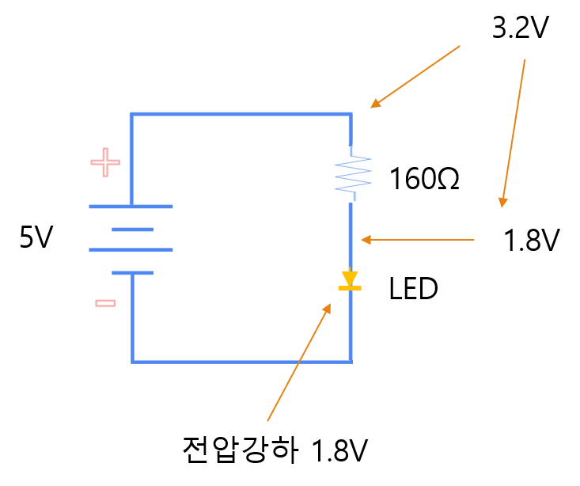
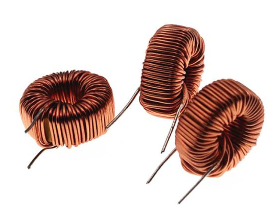
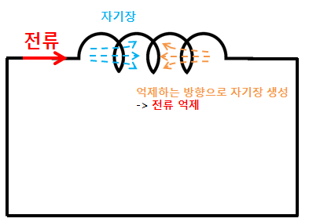

# 1-7. RLC 회로

---

#### 저항 선정

R = (5V - 1.8V) / 0.02A

저항 160Ω 이상인 200Ω 선택
(이상도 가능하지만 밝기가 어두워짐)

이때 200Ω 저항에 걸리는 전압은 3.2V 이기 때문에 전류를 계산하면

V = I × R 에 의해 I = 3.2V / 200Ω = 16mA

이때, 필요 전력은 P = V × I 에 의해

P = 3.2V × 16mA = 51mW 의 전력이 가능한 저항을 선택

---

#### 선정된 저항

200Ω에 0.25W (1/4W) 면 충분

한 개에 20원짜리 제품을 사용하면 더 저렴합니다.

---

#### 커패시터(C)

전하를 충전하는 특징이 있습니다.

배터리와 다르게 빠르게 충전되고 빠르게 방전됩니다.

---

#### 커패시터 선정

주로 사용되는 곳이 전원부이다 보니

사용되어야 하는 소자나 CPU 에 요구되는 커패시터가 존재

해당 CPU 와 소자등의 안정화와 연관이 깊기 때문에 제조사 추천 커패시터를 사용하면 됩니다.
(별도 계산을 하면서 적용해본 적이 없습니다.)

---

#### 인덕터(L)

인덕터는 전류가 흐를 때 자기장을 형성하여 에너지를 저장하는 소자입니다.

커패시터가 전압 변화를 싫어한다면,

인덕터는 전류 변화를 싫어합니다.

전류가 갑자기 증가하거나 감소하려고 하면 이를 방해하는 특징이 있습니다.

---

#### 인덕터의 특징

- 전류를 저장합니다.
- 자기장을 이용합니다.
- 전류 변화에 저항합니다.
- 코일 형태로 제작됩니다.

---

#### RLC 회로

- R → Resistor
    - 전류 제한
- L → Inductor
    - 전압 저장
- C → Capaciter
    - 전류 저장
- D → Diode
    - 전류 방향 제어
