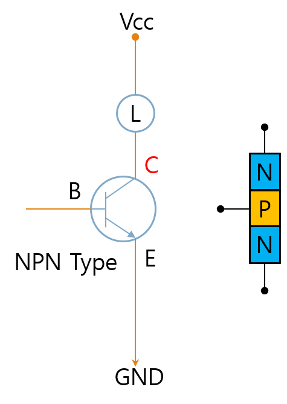
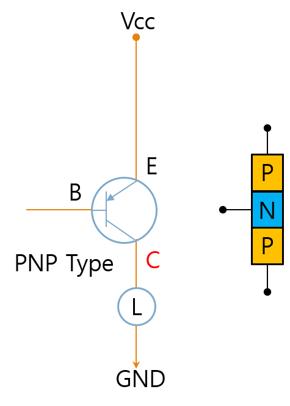
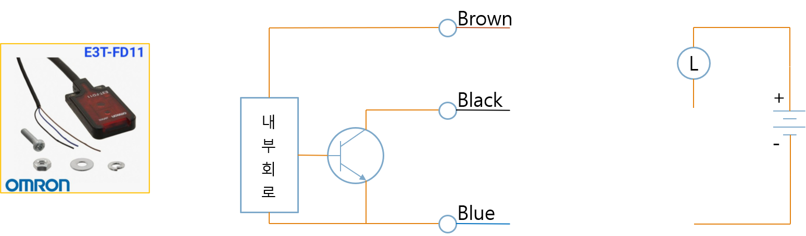
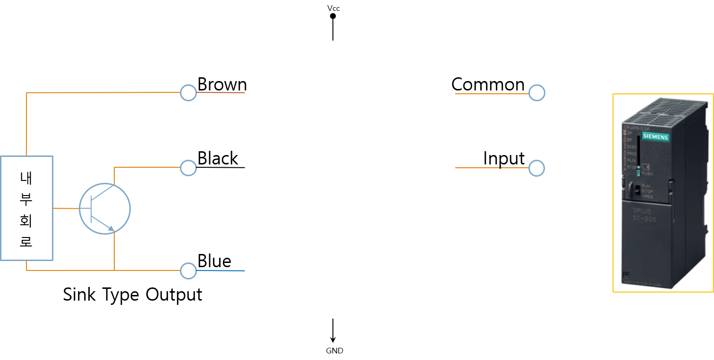
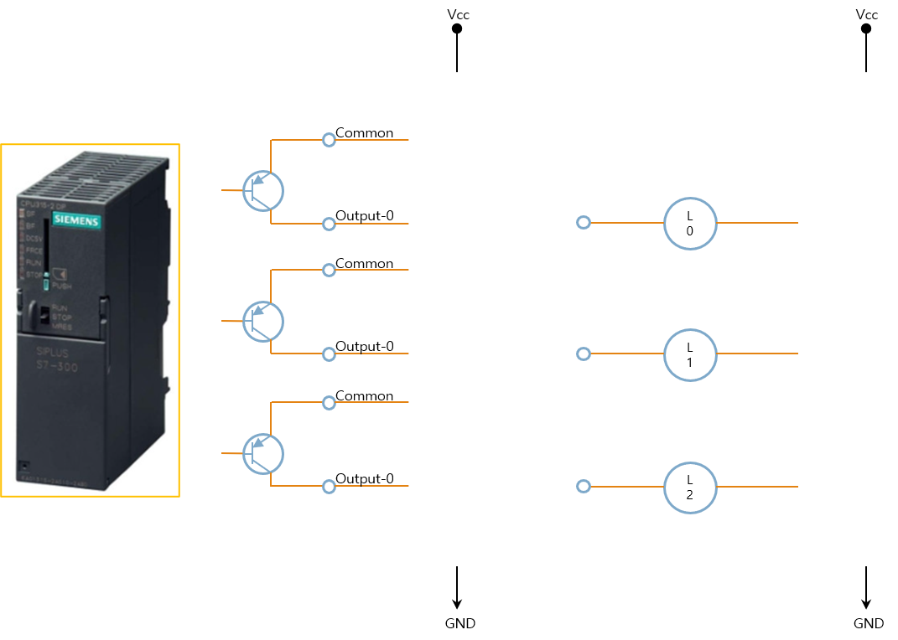
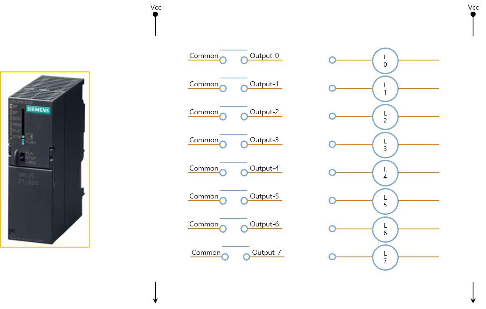
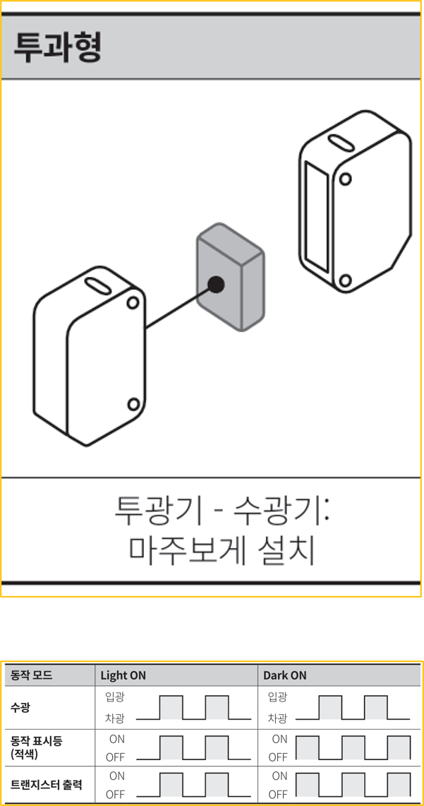
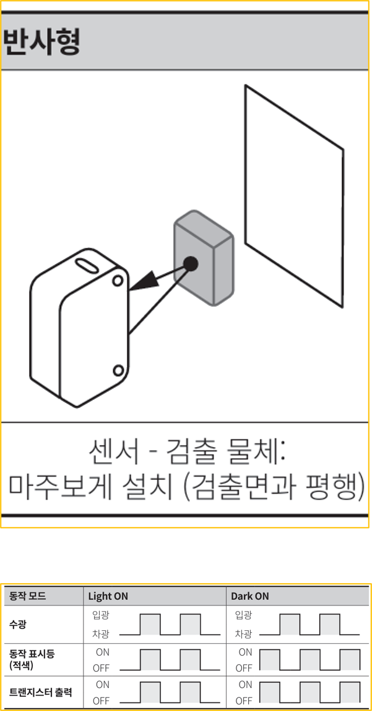
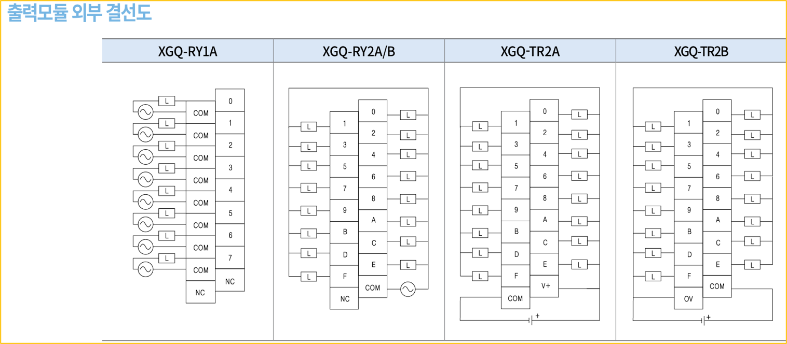

# 1-10. NPN/PNP 타입, Sink/Source 출력 구성 방식 이해

---

#### NPN 트랜지스터

Open Collector Type

---

#### PNP 트랜지스터

Open Collector Type

---

#### NPN Type Sensor

---

#### PNP Type Sensor

---

#### Source Type Input

---

#### Sink Type Input

---

#### PLC - Source Type Input Common

---

#### PLC - Sink Type Input Common

---

#### PLC - Source Type Output Common

---

#### PLC - Sink Type Output Common

---

#### Summary

- Sink Type Output - Source Type Input
- Source Type Output - Sink Type Input
- Sink Type Common - Positive
- Source Type Common - Negative

---

#### PLC - 릴레이 Type Output

---

#### 센서 도면 해석

신호선

- NPN 출력
- PNP 출력

동작 모드

- Light ON
- Dark ON

---

#### 투과형 (Dark On / Light ON)

---

#### 반사형 (Dark On / Light ON)

---

#### 출력

갈색 (Brown)

- P24

청색 (Blue)

- N24

흑색 (Black)

- Signal
- NPN : Signal -
- PNP : Signal +

---

#### PLC Module

입력 모듈

출력 모듈

입출력 혼합 모듈

---

#### 입력 모듈 사양

---

#### 입력 모듈 외부 결선도

---

#### 센서 연결

---

#### 입력 연결

---

#### 출력 모듈 사양

---

#### 출력 모듈 외부 결선도

---

#### 출력 연결

