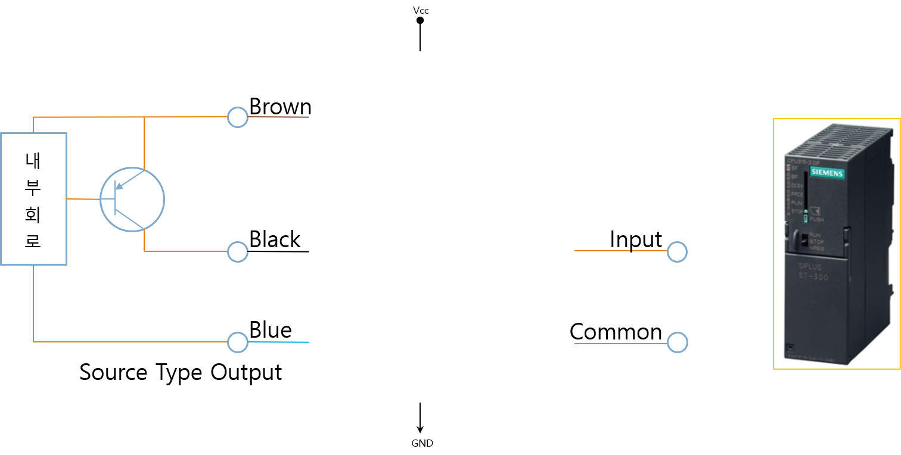
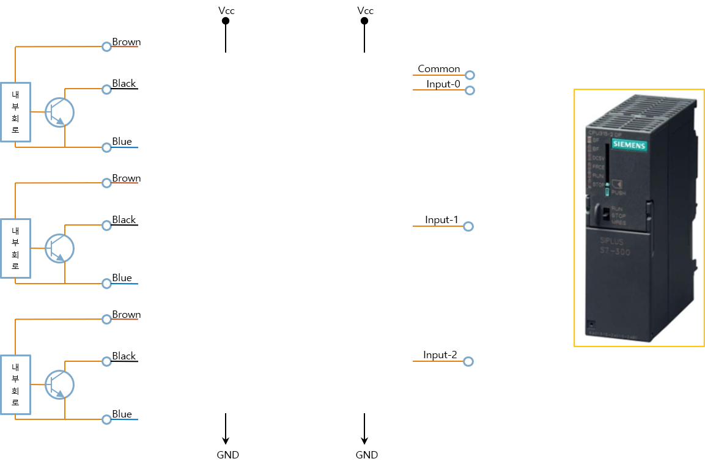
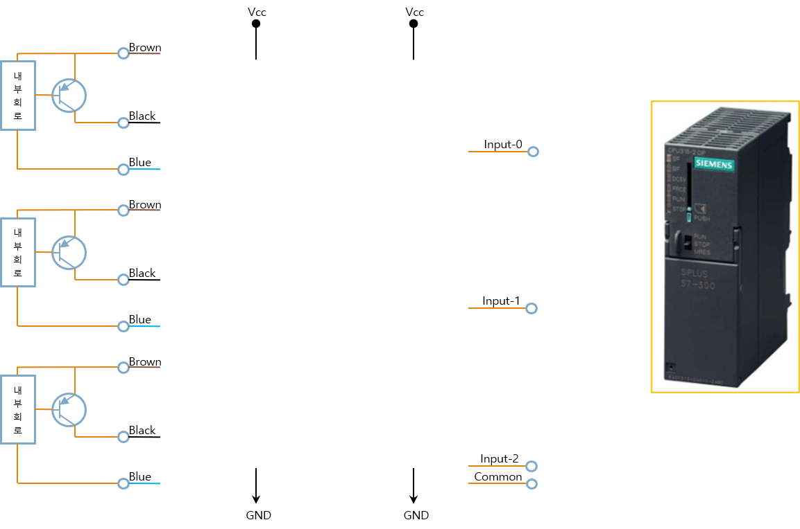
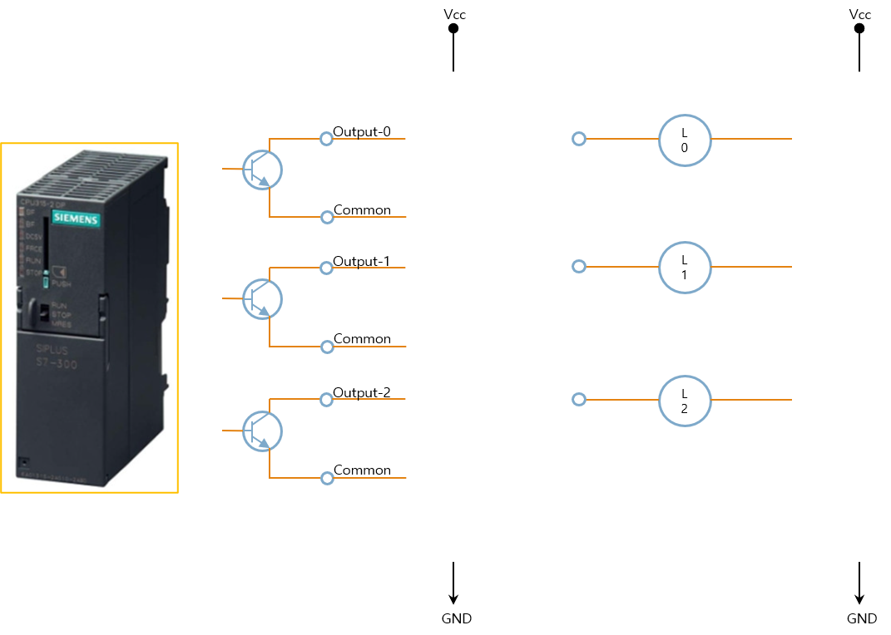
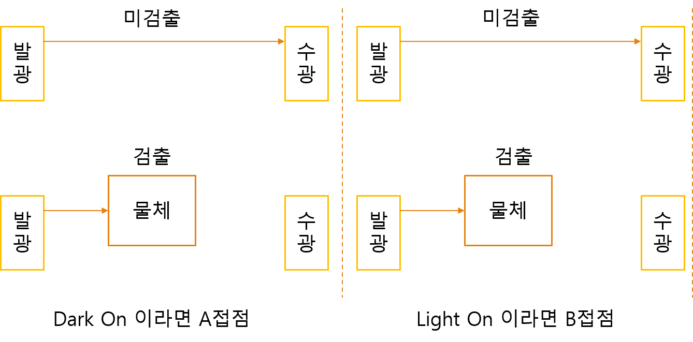
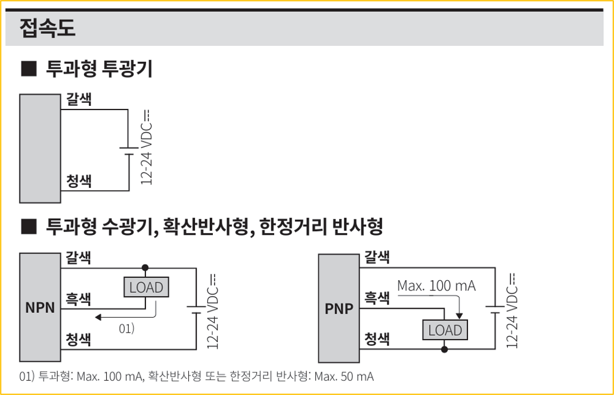
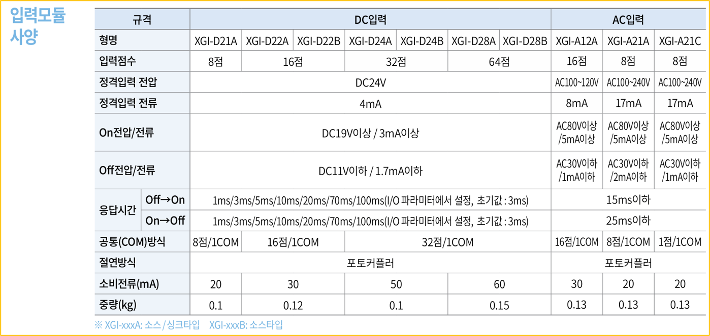
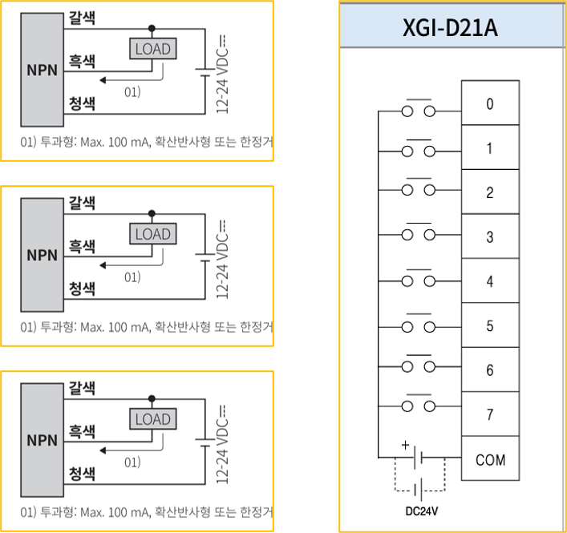

# 1-11. NPN/PNP 센서와 PLC 입출력

지금까지 스위치와 릴레이를 이용한 기본적인 시퀀스 회로를 살펴보았습니다.

실제 자동화 설비에서는 기계식 스위치보다 근접센서, 광센서, 포토센서와 같은 전자식 센서를 훨씬 많이 사용합니다. 이러한 센서는 대부분 NPN 또는 PNP 출력 방식을 사용하며, PLC의 입력 방식과 맞게 연결해야 정상적으로 동작합니다.

이번에는 NPN과 PNP이 차이, Source와 Sink 방식, 그리고 PLC 입출력 모듈의 연결 방법을 알아보겠습니다.

---

#### NPN 트랜지스터

NPN 트랜지스터는 가장 많이 사용되는 스위칭 소자 중 하나 입니다.

자동화 분야에서는 일반적으로 Open Collector 출력 방식으로 사용됩니다. 출력이 ON되면 출력 단자가 0V (GND)와 연결되어 전류가 흐르게 됩니다.

---

#### PNP 트랜지스터

PNP 트랜지스터 역시 Open Collector 방식으로 많이 사용됩니다. 출력이 ON되면 출력 단자가 +전원(P24)과 연결되어 전류가 흐르게 됩니다.

---

#### NPN 타입 센서

NPN 센서는 출력이 ON되면 신호선을 0V(GND)로 연결합니다. 이를 Sink 출력이라고도 합니다.

---

#### PNP 타입 센서

PNP 센서는 출력이 ON되면 신호선에 +24V를 출력합니다. 이를 Source 출력이라고도 합니다.

---

#### Source 입력

Source 입력은 입력 공통 (Common) 이 +24V에 연결되어 있으며, 입력 단자에 -전압이 들어오면 ON으로 인식합니다.

따라서 일반적으로 NPN 센서와 함께 사용합니다.

---

#### Sink Type Input

Sink 입력은 입력 공통(Common)이 0V에 연결되어 있으며, 입력 단자에 **전압이 들어오면 ON으로 인식합니다.** 따라서 일반적으로 PNP 센서와 함꼐 사용합니다.

---

#### PLC Source 입력 (Common)

Source 입력 모듈은 Common 단자를 +24V에 연결하여 사용합니다. 이 경우 NPN 센서를 연결해야 정상적으로 동작합니다.

---

#### PLC Sink 입력 (Common)

Sink 입력 모듈은 Common 단자를 0V에 연결하여 사용합니다. 이 경우 NPN 센서를 연결해야 정상적으로 동작합니다.

---

#### PLC Source 출력 (Common)

Source 출력 모듈은 출력시 +24V 를 공급하는 방식입니다. 따라서 Sink 입력 장치와 연결하여 사용합니다.

---

#### PLC Sink 출력 (Common)

Sink 출력 모듈은 출력시 0V를 연결하는 방식입니다. 따라서 Source 입력 장치와 연결하여 사용합니다.

---

#### Summury

Source와 Sink는 반드시 서로 반대되는 방식으로 연결해야 합니다.

- Sink 출력 ↔ Source 입력
- Source 출력 ↔ Sink 입력

또한 Common 단자의 연결도 다음과 같이 구분됩니다.

- Sink Type Common → +24V
- Source Type Common → 0V

이 규칙만 기억하면 대부분의 PLC와 센서를 올바르게 연결할 수 있습니다.

---

#### 릴레이 출력 모듈

릴레이 출력 모듈은 반도체 출력과 달리 내부에 실제 릴레이 접점이 있습니다. 따라서 AC와 DC 모두 사용할 수 있으며, NPN과 PNP를 구분하지 않습니다.

다만 기계식 접점을 사용하므로 반도체 출력보다 속도가 느리고 수명이 존재합니다.

---

#### 센서 출력 방식 해석

센서 도면에는 출력 방식이 표시되어 있습니다.

- NPN 출력
- PNP 출력

구매하거나 배선하기 전에 반드시 확인해야 하는 항목입니다.

---

#### 센서 동작 모드 해석

광센서는 일반적으로 두 가지 동작 방식을 제공합니다.

- Light ON
- Dark ON

Light ON은 빛을 받으면 출력이 ON되는 방식입니다.

Darn ON은 빛이 차단되면 출력이 ON되는 방식입니다.

---

#### 투과형 센서

투과형 센서는 발광부와 수광부가 서로 마주보는 구조입니다.

물체가 광선을 차단하는지 여부에 따라 출력이 결정 됩니다. Light ON과 Dark ON은 출력 조건만 서로 반대입니다.

---

#### 반사형 센서

반사형 센서는 발광부와 수광부가 하나의 센서 안에 있습니다.

물체에서 반사된 빛을 감지하여 출력합니다.

역시 Light ON과 Dark ON 두가지 동작 방식을 사용할 수 있습니다.

---

#### 센서 배선

센서는 일반적으로 3선식으로 구성됩니다.

갈색 (Brown)

- +24V (P24)

청색 (Blue)

- 0V (N24)

흑색 (Black)

- Signal 출력

출력 방식은 다음과 같습니다.

- NPN : Signal -
- PNP : Signal +

---

#### PLC 입출력 모듈

PLC의 입출력 모듈은 크게 3가지로 구분됩니다.

- 입력 모듈
- 출력 모듈
- 입출력 혼합 모듈

---

#### 입력 모듈 사양

입력 모듈은 스위치나 센서의 신호를 PLC로 전달하는 역할을 합니다.

입력 전압과 입력 방식(Source/Sink)을 반드시 확인해야 합니다.

---

#### 입력 모듈 외부 결선도

입력 모듈은 Common 단자와 센서를 올바르게 연결해야 정상적으로 동작합니다.

배선 전에 Source 타입인지 Sink 타입인지 반드시 확인해야 합니다.

---

#### 센서 연결

센서는 전원선과 신호선을 각각 연결하여 PLC 입력으로 전달합니다.

배선 색상과 출력 방식을 함께 확인하는 것이 중요합니다.

---

#### 입력 연결

센서의 출력 신호는 PLC 입력 단자로 연결되며, PLC는 이를 ON/OFF 신호로 인식합니다.

---

#### 출력 모듈

출력 모듈은 PLC 내부의 제어 신호를 외부 장치로 전달합니다.

램프, 릴레이, 솔레노이드 밸브, 모터 드라이버 등이 대표적인 출력 대상입니다.

출력 방식은 릴레이 출력, 트랜지스터 출력, SSR 출력 등으로 구분됩니다.

---

#### 출력모듈 외부 결선도

출력 모듈의 Common 단자를 올바르게 연결한 후 부하를 연결합니다.

트랜지스터 출력은 Source 타입과 Sink 타입을 반드시 구분해야 합니다.

---

#### 출력 연결

PLC 출력이 ON되면 부하에 전원이 공급되어 장치가 동작합니다.

부하의 전압과 소비 전류가 출력 모듈의 허용 범위를 초과하지 않는지 반드시 확인해야 합니다.

---

#### 핵심 정리

- NPN 출력 = Sink 출력
- PNP 출력 = Source 출력
- NPN 센서 (Sink 출력) → Source 입력 PLC
- PNP 센서 (Source 출력) → Sink 입력 PLC
- Sink 출력은 Source 입력과 연결합니다.
- Source 출력은 Sink 입력과 연결합니다.
- 릴레이 출력은 무극성 접점이므로 일반적으로 NPN과 PNP를 구분하지 않습니다.
- PLC와 센서를 연결하기 전에 출력 방식과 입력 Common의 결선 방식을 반드시 확인해야 합니다.

다만 제조사 메뉴얼에서 Source Input, Sink Input 이라는 명칭을 반대 관점으로 표기하는 사례(미쓰비시)가 있어 혼동될 수 있습니다. 따라서 실제 구매, 결선에서는 이름만 보지 말고 입력 Common이 0V인지, +24V인지를 확인하는 것이 가장 정확합니다.

실 예로, Chat GPT 도 반대로 이야기 하는 경우가 많습니다.
