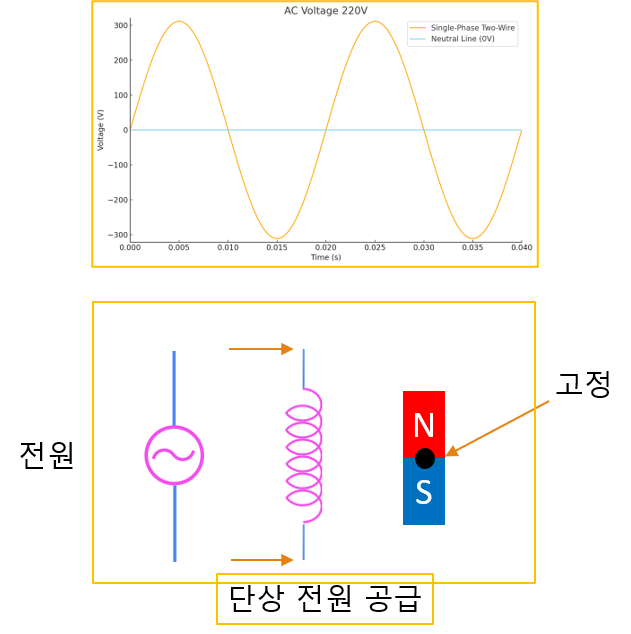
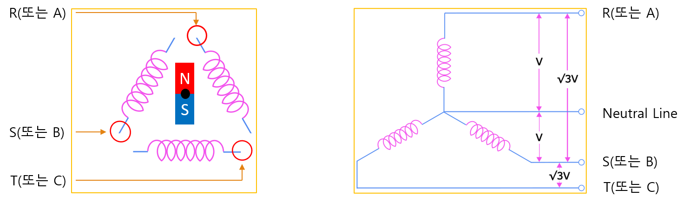

# 1-11. 회전기기와 발전기

---

#### 단상과 회전체

자석을 그림과 같이 가운데를 고정

코일에 전류를 흐르게 하면 코일 주위에 자기장이 형성

이때, 단상 전원은 자석의 회전 방향을 결정할 수 없습니다.
(AC 모터 원리에서 단상 모터의 경우 방향을 결정하는 추가적인 회로가 반드시 필요)

---

#### 3상과 회전체

자석을 그림과 같이 가운데를 고정

단상과 동일하게 코일에 전류를 흐르게 하면 코일 주위에 자기장이 형성

이때, 3상 전원은 자석 회전의 방향을 결정할 수 있습니다.

---

#### 3상 3선식의 결선

회전체에 3상 전원을 3개의 선으로 입력하는 방식

3개의 코일에 3상 3선식으로 결선하여 안정적인 전압원을 공급

---

#### 3상 3선식과 발전기

이번에는 회전체에 전원을 공급하는 대신 발전 원리를 살펴보았습니다.
회전체를 물리적인 힘으로 회전 시켜 봅니다.

(풍력, 수력 발전기 원리는 회전체에서 전력을 얻습니다.)

---

#### 3상 3선식의 일반적인 도식

---

#### 3상 3선식의 결선과 발전기

회전체에 3상의 전원을 4개의 선으로 입력하는 방식

3개의 코일에 3상 4선식으로 결선하여 안정적인 전압원을 공급

3상 3선식과 마찬가지로 회전체에서 전력을 얻을 수 있습니다.

---

#### 3상 4선식의 일반적인 도식

---

#### 3상 전원의 전압

3상 3선식 △(델타) 결선

- 1개의 380V 3상 전원
- 3개의 380V 단상 전원 (RS, ST, TR): 선간전압

3상 4선식

- 1개의 380V 3상 전원
- 3개의 380V 단상 전원 (RS, ST, TR): 선간전압
- 3개의 220V 단상 전원 (RN, SN, TN): 상전압

선간전압과 상전압과의 관계

- 선간전압 = √3 × 상전압

---

#### Note

3상 3선식의 전압에서 상전압은 없습니다.

간혹 3상3선식에서는 “선간전압 = 상전압” 이라고 정의를 하기도 함

3상 4선식에 대한 오해

- R, S, T, L (또는 A, B, C, L) 을 3상 4선식으로 정의
- R, S, T, G (또는 A, B, C, G) 은 3상 3선식 + 접지로 정의 (곧, 3상 4선식이 아님)
