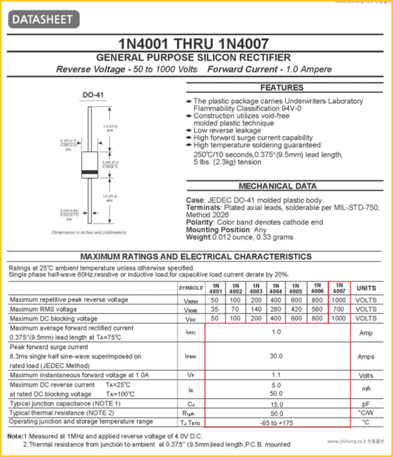
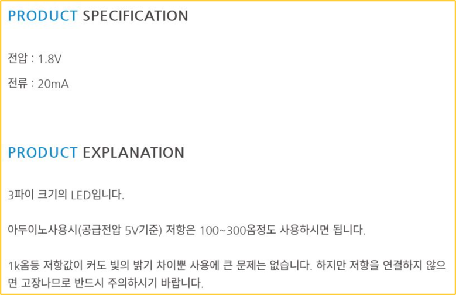
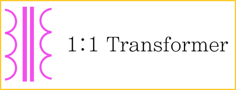
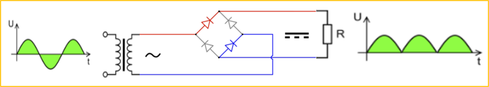
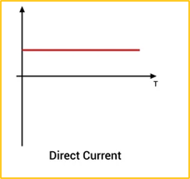
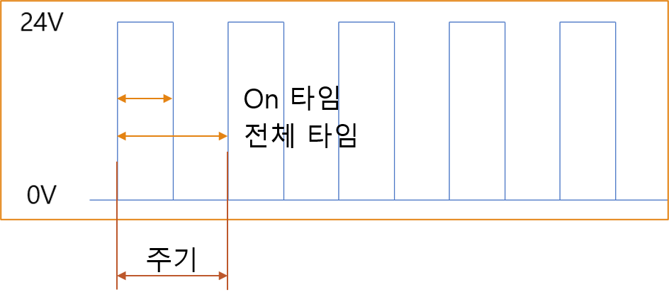
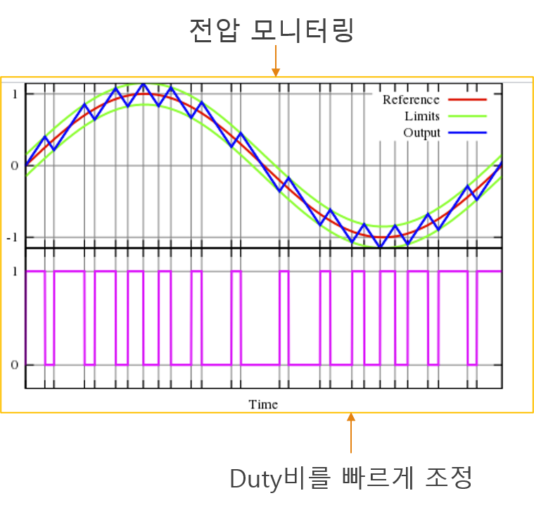

# 1-12. 전력 변환기 및 컨버터 회로 구조

---

#### 다이오드

다이오드는 한쪽 방향으로만 전류가 흐르는 특징이 있는 소자

---

#### 다이오드 선정

다이오드의 허용 전류 확인 (Point)

- Maximum average forward retified current 1.0 Amp

순방향 전압 강하

- Maximum instantaneous forward voltate at 1.0A - 1.1Volts

최대 역전압

- Maximum repetitive peak reverse voltate 1000 Volts

---

#### 순방향 전압 강하

LED(발광 다이오드)와 저항 선택 예제

전압이라고 표시 했지만 순방향 전압 강하 정보로 1.8V 로 되어 있고 허용전류는 20mA

5V 전압 공급시 추천 저항은 100 ~ 300옴

---

#### 저항 선정

R = (5V - 1.8V) / 0.02A

저항 160Ω 이상인 200Ω 선택
(이상도 가능 단, 밝기가 어두움)

이 때 200Ω 저항에 걸리는 전압은 3.2V
이기 때문에 전류는 V = I × R 에 의해
I = 3.2V / 200Ω  = 16mA

이때, 전력은 P = V × I 에 의해
P = 3.2V × 16mA = 51mW
의 전력이 가능한 저항을 선택  

---

#### Converter

- DC to DC Converter
- AC to DC Converter
- DC to AC Converter : Inverter
- AC to AC Converter : Transformer

---

#### AC to AC Converter

코일의 권선수에 따라 전압 레벨이 변경 됩니다.

가장 간단하며 비용이 저렴합니다.

---

#### AC to DC Converter

브릿지 다이오드를 사용해서 극성을 바꾸어 줍니다.

커패시터를 사용해 평활회로를 만들어 줍니다.

마지막 정전압 장치로 DC 를 만듭니다.

---

#### DC to AC Converter

DC 를 AC 로 변경하는 것은 상당한 비용을 만들어 냅니다.

이것에 대한 내용은 “마이크로 컨트롤러” 에서 PWM 을 제대로 배우고 익힐테니 지금은 약식으로만 학습합니다.

DC 전원 주파수로 나누어 아주 빠르게 ON / OFF 를 반복해 AC 로 변경합니다.

전압을 모니터링 하면서 스위치 ON / OFF 를 조절하는 주파수는 고정, Duty  비만 조절

→ AC 전원 생성 가능

더 자세한 건 마이크로 컨트롤러 편에서 진행

태양광으로 만들어지는 전원은 배터리와 같이 DC 전원을 사용합니다.

그래서, 태양광 전원을 우리가 사용할 수 있게 AC 로 변환해 주는 장치를 Inverter 라 합니다.

마찬가지로 차량에서는 배터리의 DC 전원을 사용하며, AC 전원이 필요하면 인버터를 사용해야 합니다.

---

#### DC to DC Converter

DC 직접 변환 (비절연 방식)

- Buck Converter: DC 전압 강하 (Step-Down)
- Boost Converter: DC 전압 상승 (Step-Up)

DC 를 AC 로 다시 DC 로 변환 (절연 방식)

- SMPS 등

---

#### AC to AC Converter

앞서 사용했던 AC to AC Converter 는 전압 레벨만 변경 가능

AC to AC 에서 주파수를 변경하기 위해서는 AC 를 DC 로, 그리고 다시 AC 로 변환해야 하는데,
재밌게도 이것이 우리가 알고 있는 모터 구동용 Inverter 이지만, 사실 정식 명칭은 아닙니다.

AC 전원을 입력 받아서 모터의 회전속도를 변경하기 위해서는 주파수 변경이 필요하기 때문에 모터 구동용 Inverter (=모터 구동용 컨트롤러 또는 모터 드라이브) 를 사용합니다.
