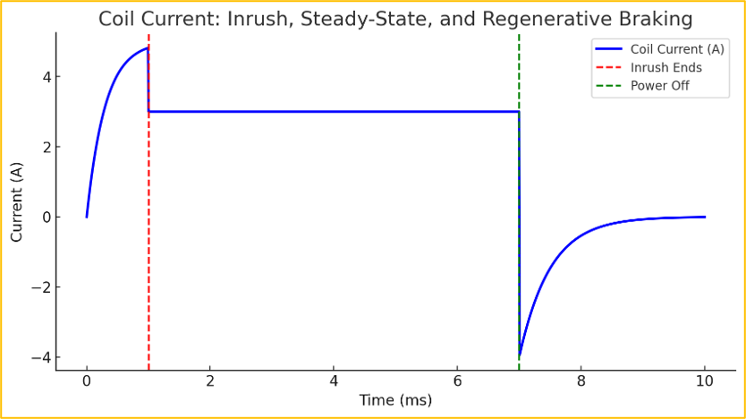
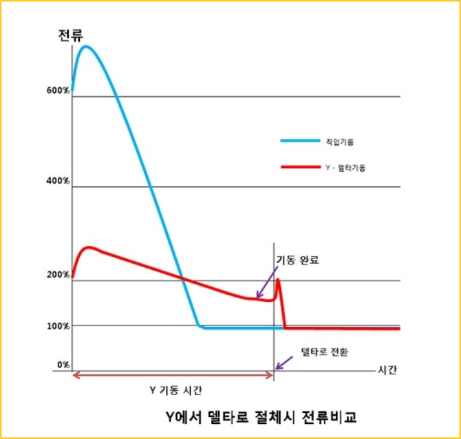
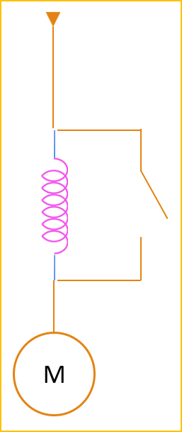
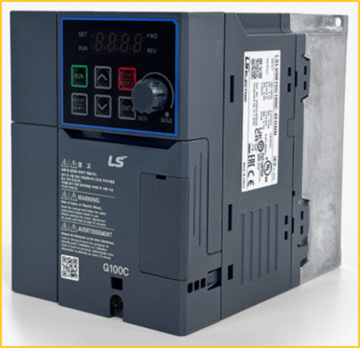

# 1-13. 모터 구동 기술

모터는 정지 상태에서 기동할 때 정격 운전보다 큰 전류를 요구할 수 있습니다. 전원과 배선을 보호하면서 필요한 기동 토크를 확보하기 위해 여러 기동 방식을 사용했습니다.

---

#### 학습 목표

- 모터 기동 전류가 크게 발생하는 이유를 이해할 수 있습니다.
- Y-△, 리액터, 소프트 스타터, 인버터 기동을 비교할 수 있습니다.
- 부하 특성에 맞는 기동 방식을 선택하는 기준을 설명할 수 있습니다.

---
#### AC 모터 기동의 문제

모터 기동 시 많은 전류가 흐르게 됩니다.

이 문제들을 해결하는 방법들을 소개합니다.

- Y-△ 기동
- 리액터 기동
- 전자식 Soft Starter
- 인버터 기동
- 별도의 컨트롤러를 사용 (=서보 모터)

*그림 1. AC 모터 기동의 문제 관련 자료입니다.*

---

#### Y-△ 기동

초기에는 Y 결선으로 낮은 전압을 공급해 기동 전류를 줄였고, 일정 속도에 도달하면 △ 결선으로 변경했습니다.

- Y: 3상 4선식
- △: 3상 3선식

**장점**

- 기동 전류를 많이 줄일 수 있습니다.
- 비교적 저렴한 비용으로 사용할 수 있습니다.

**단점**

- 초기 기동 토크도 줄어들기 때문에 매우 큰 모터에는 적합하지 않습니다.

부하가 작거나 기동 토크가 크지 않은 산업용 모터에 적합했습니다.
(펌프, 팬, 컨베이어 등)

*그림 2. Y-△ 기동 관련 자료입니다.*

---

#### 리액터 기동

기동 시 모터에 리액터(인덕터)를 직렬로 연결해 전압과 전류를 낮추었습니다.

- 일정 속도에 도달하면 리액터를 제거하고 정상 운전했습니다.

**장점**

- 기동 전류를 줄이면서도 비교적 높은 기동 토크를 유지할 수 있습니다.

**단점**

- 별도의 리액터를 추가로 설치해야 합니다.

어느 정도의 기동 부하가 필요한 설비에 적합했습니다.

*그림 3. 리액터 기동 관련 자료입니다.*

---

#### 전자식 Soft Starter

전력 반도체를 사용해 전압을 점진적으로 높이는 기동 방식입니다.

**장점**

- 부드럽게 기동하며 전류 급증을 방지했습니다.
- 기계적 충격을 줄여 기어와 벨트 등을 보호했습니다.

**단점**

- 비용이 다소 높습니다.

산업용 모터와 대형 펌프에 적합했습니다.

*그림 4. 전자식 Soft Starter 관련 자료입니다.*

---

#### 인버터 기동

여기서 말하는 인버터는 단순한 DC-AC 전력 변환 장치만을 뜻하지 않습니다.

산업 현장에서는 모터 드라이브도 인버터라고 부릅니다.

- 엄밀히는 가변 주파수 드라이브(VFD)라는 표현이 더 정확합니다.
- 국내 산업 현장에서는 일반적으로 인버터라는 명칭을 사용했습니다.

**장점**

- 기동 전류를 낮추고 모터와 부하에 전달되는 충격을 줄일 수 있습니다.
- 속도 제어가 가능합니다.

**단점**

- 비용이 높습니다.

고출력 산업용 모터와 엘리베이터 등에 적용했습니다.

*그림 5. 인버터 기동 관련 자료입니다.*

---

#### 핵심 정리

- Y-△ 기동은 초기 인가 전압과 기동 전류를 낮춘 뒤 정상 결선으로 전환했습니다.
- 리액터 기동은 직렬 인덕턴스로 기동 전류를 제한했습니다.
- 소프트 스타터는 전력 반도체로 인가 전압을 점진적으로 높였습니다.
- 인버터는 전압과 주파수를 함께 제어해 부드러운 기동과 속도 제어를 가능하게 했습니다.
