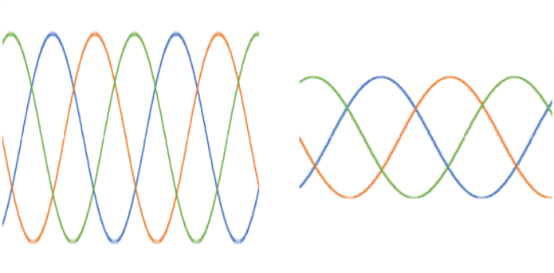
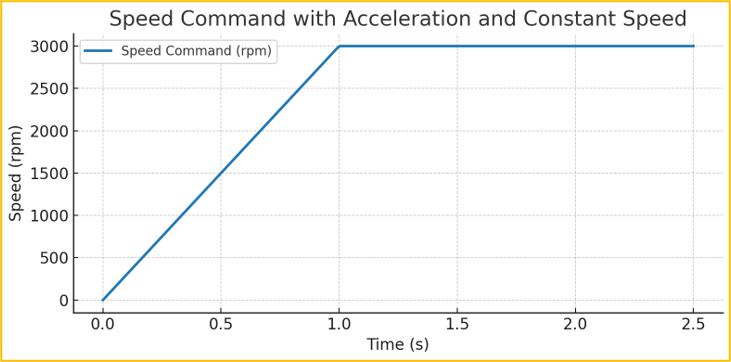
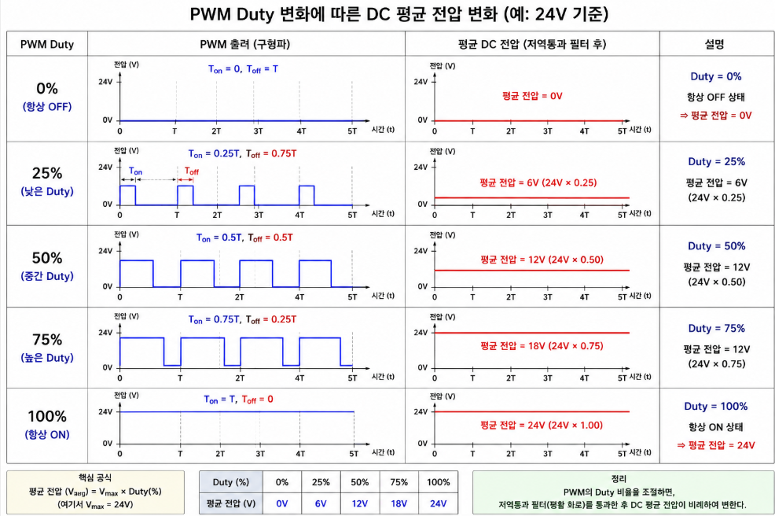
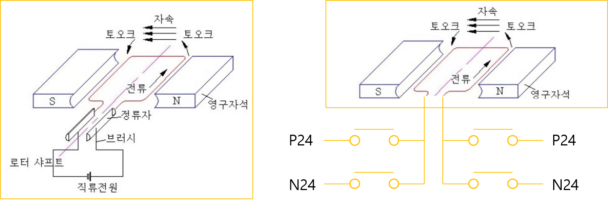
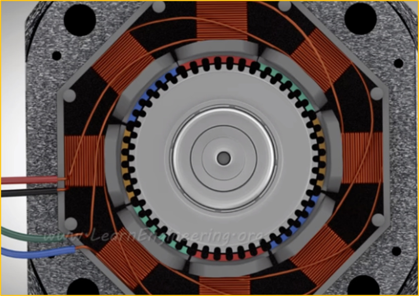
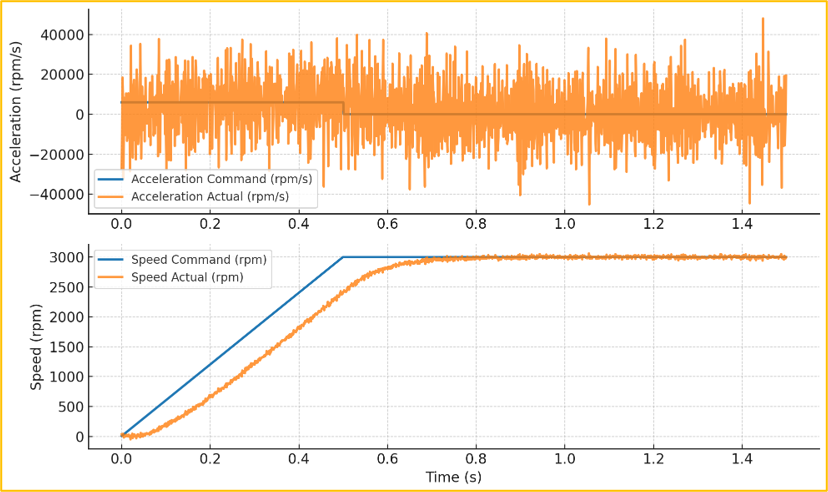

# 1-14. AC, DC, BLDC, 스테핑 모터, 서보 모터의 펄스 제어 방식

모터는 전원 방식과 구조에 따라 속도, 토크, 정밀도, 유지보수 특성이 달라집니다. AC, DC, BLDC, 스테핑, 서보 모터의 제어 방식을 비교하고 피드백 제어의 기초를 살펴보았습니다.

---

#### 학습 목표

- 주요 모터 종류의 구조와 용도를 비교할 수 있습니다.
- PWM, V/F, FOC 제어의 목적과 차이를 이해할 수 있습니다.
- 피드백과 PID 제어가 오차를 줄이는 과정을 설명할 수 있습니다.

---
#### AC 모터 제어 방식

AC 모터는 주파수를 변경해서 모터 속도를 조절합니다.

$$
N_s=120f/P
$$

- f = 주파수
- P = 극수

---

#### V/F (=Voltage / Frequency)

*저렴한 인버터에서 주력으로 사용*

- AC → DC → PWM → AC
- 자세한 내용은 전력 변환기 내용 참조

단순 전압, 속도 변경



---

#### FOC (=Field Oriented Control)

*고가의 인버터 혹은 서보 모터에서 주력으로 사용*

주파수 변경 → 속도 변경

전압 변경 → 토크 변경

V/F 제어는 토크 제어 불가능

홀 센서를 사용해 현재 위치와 속도를 감시하면서 전압과 주파수를 정밀하게 제어

---

#### V/F vs FOC

V/F

실시간 제어 기능 없음



FOC

피드백 을 기반으로 실시간 제어 포함


---

#### DC 모터 제어 방식


DC 모터는 가장 직관적입니다.

전압 ↑ → 속도 ↑

$V = E + IR$

- V = 공급전압
- E = 역기전력
- I = 전류

---

#### PWM (=Pulse Width Modulation)



듀티를 변화시켜 원하는 전압으로 변환할 수 있습니다.

실제 전압을 만들어내는 과정은 전자실습 (마이크로컨트롤러) 과정에서 진행합니다.

---

#### BLDC 모터

BLDC(=Brushless DC) 모터는 이름에서 알 수 있듯이 브러시가 없는 DC 모터입니다.



---

#### DC vs BLDC

| 구분 | 브러시 DC 모터 | BLDC 모터 |
| --- | --- | --- |
| 정류 방식 | 브러시와 정류자가 기계적으로 정류합니다. | 전자회로가 전자적으로 정류합니다. |
| 유지보수 | 브러시가 마모되므로 점검과 교체가 필요합니다. | 브러시가 없어 유지보수 부담이 비교적 작습니다. |
| 소음과 수명 | 접촉 소음이 있으며 브러시 수명의 영향을 받습니다. | 접촉 소음이 적고 수명이 비교적 깁니다. |
| 제어 | 전압이나 PWM으로 비교적 간단히 제어합니다. | 회전자 위치를 확인하고 상전류를 전환하는 드라이버가 필요합니다. |

---

#### 스테핑 모터



---

#### 모터 비교

| 구분 | AC 모터 | 브러시 DC 모터 | BLDC 모터 | 스테핑 모터 |
| --- | --- | --- | --- | --- |
| 장점 | 내구성이 좋고 대용량 연속 운전에 적합합니다. | 구조와 속도 제어가 비교적 단순하며 초기 토크가 큽니다. | 효율과 출력 밀도가 높고 정밀 제어에 유리합니다. | 펄스 수로 위치를 제어하기 쉽고 저속 토크가 큽니다. |
| 주의점 | 정밀 속도 제어에는 인버터가 필요합니다. | 브러시가 마모되며 전기적·기계적 소음이 발생합니다. | 전용 드라이버와 위치 검출 또는 정류 알고리즘이 필요합니다. | 고속에서 토크가 감소하고 과부하 시 탈조할 수 있습니다. |
| 주요 용도 | 펌프, 팬, 컨베이어, 공작기계 | 자동차 보조장치, 소형 가전, 교육용 장치 | 전기차, 드론, 로봇, 고성능 가전 | 3D 프린터, 소형 CNC, 프린터, 위치 결정 장치 |

---

#### 서보 모터

서보 시스템은 DC 모터, AC 모터, BLDC 모터 등에 엔코더와 제어기를 결합해 정밀 제어할 때 사용됩니다.

서보라는 말은 특정 모터 구조보다 피드백을 이용해 위치·속도·토크를 정밀하게 제어하는 시스템을 뜻합니다.

서보 모터는 반드시 엔코더와 모터 드라이브를 포함해야 합니다.

DC, AC, 스테핑 어느것이든 사용할 수 있지만, 산업에서는 주로 AC 모터를 주력으로 사용하는데 그 이유는 가격이 저렴하며 토크가 좋아 가성비가 매우 좋습니다.

BLDC는 토크가 좋지만 가격이 비싸기 때문에 소형화가 필요한 정밀 로봇에 주로 사용이 되며, 당연히 이때에도 BLDC에 엔코더를 사용해 서보 모터로 사용합니다.

---

#### 제어기



제어기의 목표는 기준값과 측정값 사이의 오차를 줄이는 것입니다.

현재 오차를 확인하고 다음 제어 주기의 출력값을 보정했습니다.

제어 주기가 짧을수록 변화에 빠르게 반응할 수 있지만, 센서 노이즈와 연산 부하도 함께 고려해야 합니다.

$$
MV(t)=K_p e(t)+K_i \int_0^t e(t)dt+K_d \frac{de(t)}{dt}
$$

MV(t) : 출력, 𝐾_𝑝 : 비례 상수, 𝐾_𝑖 : 적분 상수, 𝐾_𝑑 : 미분 상수

---

#### PID Controller

```cpp
double integral = 0, derivative = 0;
double PID_Control(double setpoint, double process_value)
{
    // 1. 오차 계산
    error = setpoint - process_value;			// 작은 Error에 대한 대응 불가능

    // 2. 적분항 계산
    integral += error * Ts;				 // 누적된 에러에 대해 보상할 수 있습니다.

    // 3. 미분항 계산
    derivative = (error - prev_error) / Ts;			 // 외란에 빠르게 대응할 수 있습니다.

    // 4. PID 합산
    MV = (Kp * error) + (Ki * integral) + (Kd * derivative);

    // 5. 현재 오차 저장
    prev_error = error;
    return MV;
}
```

P 제어기

- $MV(t) = K_pe(t)$
- Error에 대한 출력 변화를 증가

I 제어기

- $MV(t)=K_i ∫_0^te(t)dt$
- 적분(과거의 Error를 반영)해 출력 변화를 증가 : 정상상태 오차 감소

D제어기

- $MV(t)=K_p e(t)+K_i \int_0^t e(t)dt+K_d \frac{de(t)}{dt}$
- 미분(현재의 Error를 증폭)해 출력 변화를 증가 : 순간 외란에 대응

---

#### 핵심 정리

- AC 모터는 주파수로 속도를, 전압으로 자속과 토크 특성을 제어했습니다.
- DC 모터는 전압과 PWM 듀티비로 속도를 조절하기 쉬웠습니다.
- BLDC와 서보 시스템은 센서 피드백을 이용해 위치와 속도를 정밀하게 제어했습니다.
- PID 제어기는 현재·누적·변화 추세의 오차를 조합해 출력값을 보정했습니다.
