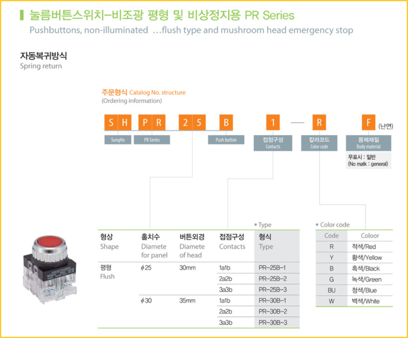
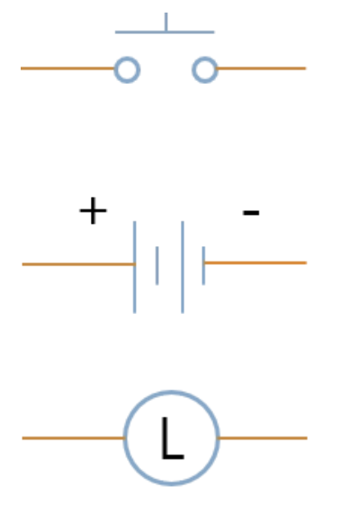
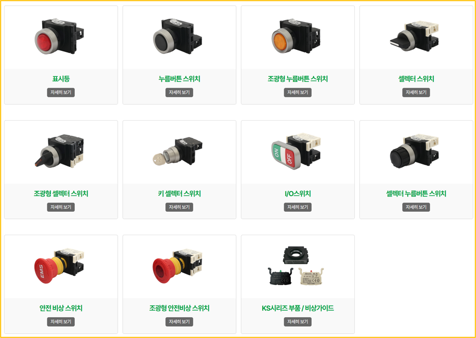
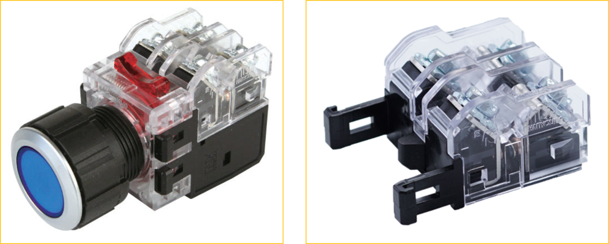
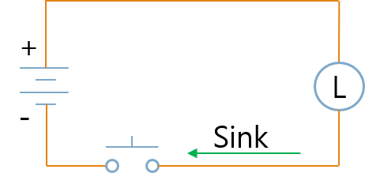
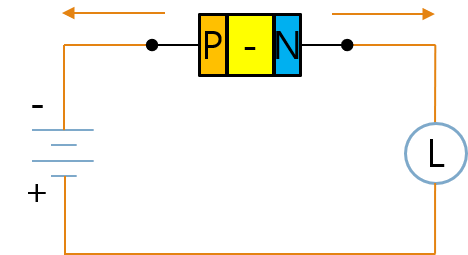
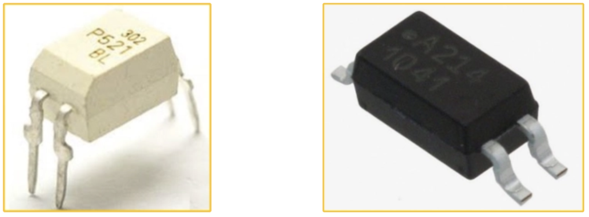
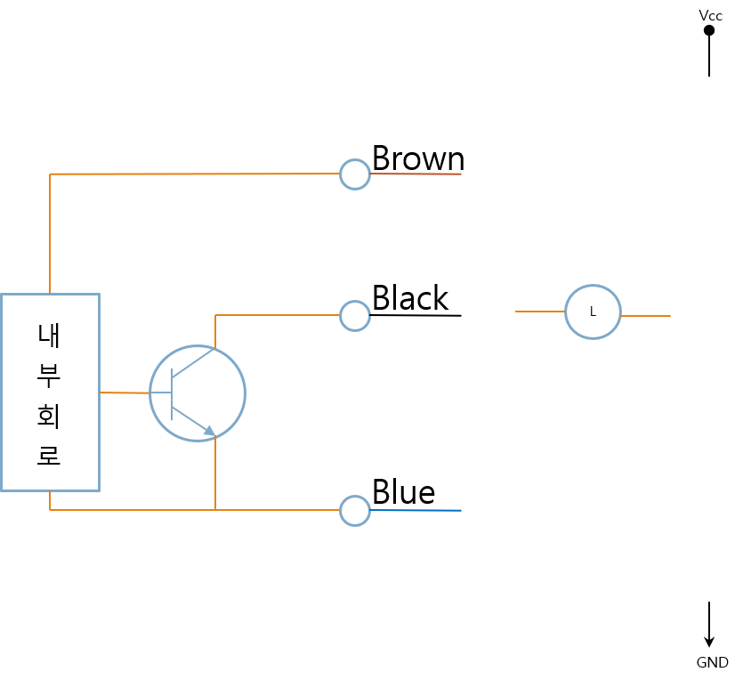
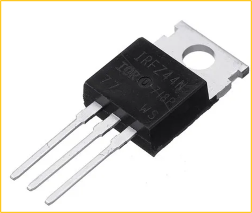

# 1-9. 스위칭 소자와 제어 장치

지금까지 전기의 기본 원리와 수동 소자에 대해 살펴보았습니다.

이번에는 자동화 장비에서 가장 많이 사용하는 스위치(Switch)와 릴레이(Relay), 그리고 이를 대체하는 다양한 반도체 스위칭 소자에 대해 알아보겠습니다.

이러한 소자들은 전원을 연결하거나 차단하는 역할을 하며, 자동화 시스템에서는 센서의 입력을 받아 모터, 램프, 솔레노이드 등을 제어하는 핵심 부품입니다.

---

#### 스위치

자동화 설비에서 자주 사용하는 스위치는 다음과 같습니다.

- 표시등
- 누름 버튼 스위치
- 조광형 누름 버튼 스위치
- 셀렉터 스위치
- 조광형 셀렉터 스위치

---

#### 누름버튼 스위치 모델

스위치 제조사 메뉴얼 또는 자료를 참조하면 다양한 옵션을 선택할 수 있습니다. 타공 사이즈(홀치수) 와 버튼 크기, 색상과 접점 구성등을 확인해서 사용하면 됩니다.

---

#### 표시등

표시등은 장비의 현재 상태를 사용자에게 알려주는 역할을 합니다.

제품의 정격 전압에 맞는 전원을 공급하면 점등되며, 장비의 동작 상태나 이상 여부를 직관적으로 확인할 수 있습니다.

---

#### 스위치의 접점

일반적인 푸시 버튼 스위치는 다음과 같은 접점을 가지고 있습니다.

- NC (Normally Closed): 평상시에 연결되어 있으며 버튼을 누르면 회로가 열립니다.
    - B접점(=B Contact)
- NO (Normally Open) : 평상시에는 열려 있으며 버튼을 누르면 연결됩니다.
    - A접점(=A Contact)
- Lamp : 표시등 전원 단자

---

#### 스위치 배선

버튼을 누를 때 램프에 불이 들어오게 하는 배선도

---

#### 소자 설명

스위치는 사용자가 입력을 주는 장치 입니다.

전원은 회로에 필요한 전압을 공급하며, 그림에 표시된 전원 공급 장치는 DC 전원 공급장치 입니다.

부하는 전원을 이용해 실제 동작하는 장치입니다. 대표적인 부하는 다음과 같습니다.

- 램프
- 모터
- 솔레노이드 밸브

---

#### 시퀀스 회로

자동화 장비에서는 스위치의 접점을 이용하여 다양한 논리 회로를 구성합니다.

**A접점(NO)을 이용한 램프 ON**

버튼을 누르면 접점이 연결되어 램프가 켜집니다.

**B접점(NC)을 이용한 램프 OFF**

버튼을 누르면 접점이 끊어져 램프가 꺼집니다.

이와 같은 회로를 기본으로 다양한 시퀀스 회로를 구성할 수 있습니다.

---

#### 스위치 종류

대표적인 스위치의 종류는 다음과 같습니다.

**누름 버튼 스위치**

- 누르면 ON, 떼면 OFF
- 누르면 OFF, 떼면 ON

**셀렉터 스위치**

- 왼쪽 OFF, 오른쪽 ON
- 왼쪽 ON, 오른쪽 OFF

**토글 스위치**

- 왼쪽 ON, 오른쪽 OFF
- 왼쪽 OFF, 오른쪽 ON

**비상 스위치**

- Lock OFF, Release ON
- Lock ON, Release OFF

---

#### 접점 추가

하나의 스위치에는 여러 개의 접점을 추가할 수 있습니다. (추가접점 : 우측 이미지)

이를 이용하면 하나의 버튼으로 여러 회로를 동시에 제어 할 수 있습니다.

---

#### 디지털 출력(Digital Output)

자동화 장비의 출력은 크게 Source 방식과 Sink 방식으로 구분합니다.

**Source 출력**

출력에서 (+) 전원을 공급하는 방식입니다.

---

**Sink 출력**

출력이 GND(0V)를 연결하는 방식입니다.

부하를 기준으로 보면 Source와 Sink는 극성만 서로 반대입니다.

---

**Source 출력과 Sink 출력**

PLC와 센서를 연결할 때는 반드시 Source 방식과 Sink 방식을 확인해야 합니다.

---

#### 릴레이와 반도체 스위치

기계적인 접점을 사용하는 릴레이와 달리, 현대의 전자회로에서는 반도체를 이용한 다양한 스위칭 소자가 사용됩니다.

각 소자는 장단점이 다르므로 용도에 따라 적절한 부품을 선택해야 합니다.

---

#### 릴레이(Relay)

릴레이는 자동제어에서 가장 많이 사용되는 스위칭 장치입니다.

코일에 전류를 흘려 자기장을 만들고, 그 힘으로 기계적인 접점을 움직여 부하를 제어합니다.

특징은 다음과 같습니다.

- 기계식 접점을 사용합니다.
- 점점이 마모되므로 소모성 부품입니다.
- 동작 속도가 비교적 느립니다.
- 코일을 구동하기 위한 전력이 필요합니다.
- 높은 전류를 안전하게 개폐할 수 있습니다.
- 제어 회로와 부하 회로를 완전히 절연할 수 있습니다.

---

#### 반도체 Package

**DIP (=Dual In-line Package)**

PCB를 관통하여 납땜하는 방식입니다.

- 크기가 큽니다.
- 납땜과 교체가 쉽습니다.

---

**SMD (=Surface Mount Device)**

PCB 표면에 직접 실장하는 방식입니다.

- 크기가 작습니다.
- 자동 생산에 적합합니다.

---

#### 다이오드

다이오드는 P형 반도체와 N형 반도체를 접합한 가장 기본적인 반도체입니다.

전류는 Anode(+)에서 Cathode(-) 방향으로만 흐를 수 있습니다.

---

#### 다이오드의 동작 원리

**순방향 바이어스**

다이오드는 P형 반도체와 N형 반도체를 접합한 가장 기본적인 반도체입니다.

전류는 Anode(+)에서 Cathode(-) 방향으로만 흐를 수 있습니다.

---

#### 다이오드의 동작 원리

**순방향 전압**

- 다이오드의 P극은 전원의 P극에 의해 공핍층 쪽으로 이동
- 다이오드의 N극은 전원의 N극에 의해 공핍층 쪽으로 이동
- 공핍층이 사라져 전류가 통하게 됩니다.]

---

**역방향 전압**

- 다이오드의 P극은 전원의 N극에 의해 전원 쪽으로 이동
- 다이오드의 N극은 전원의 P극에 의해 전원쪽으로 이동
- 공핍층이 넓어져 전류가 통하지 않습니다.

---

#### 트랜지스터 (=Bipolar Junction Transistor)

트랜지스터(BJT)는 전류를 이용하여 전류를 제어하는 대표적인 반도체 스위치입니다.

특징은 다음과 같습니다.

- 가격이 저렵합니다.
- 기계적인 접점이 없어 반영구적으로 사용할 수 있습니다.
- 릴레이보다 동작 속도가 빠릅니다.
- 스위칭에 필요한 소비 전력이 작습니다.
- 트랜지스터는 NPN 타입과 PNP 타입이 있습니다.

---

#### 절연 (=Isolation)

**Relay**

- 제어 회로와 부하 회로를 완전히 절연할 수 있습니다.
- 노이즈 차단에 유리합니다.

---

**트랜지스터**Transistor

- 제어 회로와 부하 회로가 전기적으로 연결 됩니다.
- 절연이 불가능합니다.
- Ground를 통해 노이즈가 전달될 수 있습니다.

---

#### 포토 커플러 (=Optocoupler)비교적 비싼 비용

포토커플러는 LED의 빛으로 반대편의 포토트랜지스터를 동작시키는 소자입니다.

빛을 이용하여 신호를 전달하기 때문에 두 회로를 완전히 절연할 수 있습니다.

특징은 다음과 같습니다.

- 릴레이보다 빠릅니다.
- 기계적인 접점이 없습니다.
- 반영구적으로 사용할 수 있습니다.
- 소비 전력이 작습니다.
- 제어 회로와 부하 회로를 절연할 수 있습니다.

---

#### Optocoupler vs Transistor

**Optocoupler**

빛으로 신호를 전달하므로 전기적으로 절연됩니다.

---

**Transistor**

전기적으로 직접 연결되어 절연되지 않습니다.

---

#### MOSFET

MOSFET(Metal-Oxide-Semiconductor Field-Effect Transistor)은 전압으로 제어하는 반도체 스위치입니다.

BJT보다 가격은 다소 높지만 매우 빠른 스위칭 속도와 높은 효율을 제공합니다.

SMPS와 같은 전원 회로나 DC 모터 제어에서 가장 많이 사용되는 소자입니다.

---

#### IGBT

IGBT(Insulated Gate Bipolar Transistor)는 MOSFET과 BJT의 장점을 결합한 고전력 스위칭 소자입니다.

대전류와 고전압을 빠르게 스위칭할 수 있기 때문에 다음과 같은 장비에서 많이 사용됩니다.

- 인버터
- 서보 드라이브
- 모터 드라이브
- 산업용 전력 제어 장치

---

#### SSR (=Solid State Relay)

SSR은 반도체(포토커플러)를 이용하여 릴레이의 기능을 구현한 스위칭 장치입니다.

기계적인 접점이 없기 때문에 반영구적으로 사용할 수 있으며, 릴레이보다 훨씬 빠르게 동작합니다.

특징은 다음과 같습니다.

- 기계식 접점이 없습니다.
- 수명이 매우 깁니다.
- 스위칭 속도가 빠릅니다.
- 소음이 없습니다.
- 반복 동작이 많은 자동화 장비에서 많이 사용됩니다.
