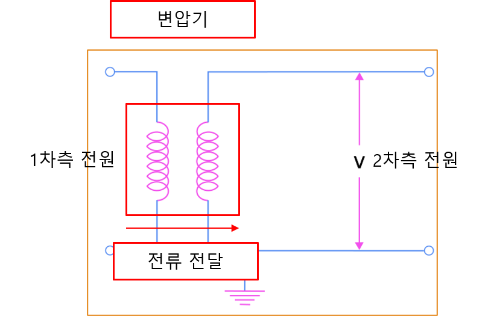

# 1-6. 변압기, 코일, 인덕터, 솔레노이드

#### 변압기와 코일

앞에서는 직류와 교류의 차이, 그리고 교류가 장거리 송전에 적합한 이유를 살펴보았습니다.

이번에는 교류를 이해하기 위해 반드시 알아야 하는 **코일**과 **변압기**에 대해 알아보겠습니다.

코일은 변압기뿐만 아니라 모터, 릴레이, 솔레노이드 등 다양한 전기·전자 장치에서 사용되는 가장 기본적인 부품입니다. 먼저 코일의 원리를 이해한 후, 이를 응용한 다양한 장치들을 살펴보겠습니다.

---

#### 코일

코일은 전선을 여러 번 나선형으로 감아 만든 도체입니다.

코일에 전류가 흐르면 강한 자기장이 형성되며, 전류의 방향과 코일의 감긴 방향에 따라 자기장의 방향도 달라집니다.

코일은 자기장을 이용하는 거의 모든 전기 장치의 기본 요소이며, 변압기, 모터, 릴레이, 솔레노이드 등에서 널리 사용됩니다.

---

#### 인덕터(Inductor)

인덕터는 코일의 성질을 이용하여 전류의 변화를 방해하는 부품입니다.

이러한 성질을 인덕턴스(Inductance)라고 합니다.

인덕터의 주요 특징은 다음과 같습니다.

- 전류가 갑자기 증가하는 것을 방해합니다.
- 전압이 인가되는 순간 돌입전류(Inrush Current)가 발생할 수 있습니다.
- 전류가 변화하면 역기전력(Back EMF)이 발생합니다.
- 전원이 차단되면 저장되어 있던 자기 에너지가 방출됩니다.

인덕터에는 다양한 계산식이 존재하지만, 이 책에서는 개념을 이해하는 데 집중하겠습니다.

---

#### 솔레노이드

솔레노이드는 코일의 한 종류로, 원통형으로 길게 감은 구조를 가지고 있습니다.

코일에 전류가 흐르면 내부에 강한 자기장이 형성되며, 철심을 넣으면 자기력이 더욱 강해집니다.

이 자기력을 이용하여 직선 운동을 만들어 낼 수 있습니다.

---

#### 솔레노이드 응용

솔레노이드는 자기력을 이용하여 다양한 장치를 동작시킵니다.

대표적인 예는 다음과 같습니다.

- 솔레노이드 밸브(Solenoid Valve)
- 솔레노이드 액추에이터(Solenoid Actuator)
- 솔레노이드 릴레이(Solenoid Relay)

이처럼 코일 하나만으로도 전기 에너지를 기계적인 힘으로 변환할 수 있습니다.

---

#### 변압기 (Transformer)

변압기는 코일 두 개를 이용하여 교류 전압의 크기를 변경하는 장치입니다.

변압기는 철심(Core)에 감긴 두 개의 코일로 구성됩니다.

전원에 연결된 코일을 1차측, 전압을 출력하는 코일을 2차측이라고 합니다.

1차측 코일에 교류 전류가 흐르면 자기장이 형성되고, 변화하는 자기장이 코어를 통해 2차측 코일에 전달되면서 전압이 유도됩니다.

이러한 원리를 전자기 유도(Electromagnetic Induction)라고 합니다.

1차측과 2차측의 코일 감은 횟수(권수)에 따라 출력 전압이 달라집니다.

따라서 변압기를 이용하면 높은 전압을 낮추거나, 낮은 전압을 높은 전압으로 쉽게 변경할 수 있습니다.

이처럼 비교적 간단한 구조로 전압을 변경할 수 있기 때문에 교류 전원은 전압 변환이 매우 용이합니다.

---

#### 복권 변압기

앞에서 살펴본 일반적인 변압기를 **복권 변압기(Isolation Transformer)**라고 합니다.

복권 변압기는 1차측과 2차측이 서로 다른 코일로 완전히 분리되어 있습니다.

따라서 제작 비용이 비교적 높고 크기와 무게도 큰 편입니다.

하지만 1차측과 2차측이 전기적으로 절연되어 있으므로 노이즈가 전달되지 않는 장점이 있습니다.

'절연(絕緣)'이란 전기적으로 연결되지 않은 상태를 의미합니다.

1:1 복권 변압기는 전압을 변경하지 않고도 노이즈를 차단하는 절연 변압기(Noise Isolation Transformer)로도 많이 사용됩니다.

---

#### 단권 변압기

단권 변압기(Auto Transformer)는 하나의 코일을 1차측과 2차측이 함께 사용하는 변압기입니다.

복권 변압기보다 구조가 단순하여 가격이 저렴하고 크기와 무게도 작습니다.

하지만 1차측과 2차측이 전기적으로 연결되어 있기 때문에 절연 기능이 없습니다.

따라서 외부의 노이즈가 그대로 전달될 수 있으며, 감전 보호 측면에서도 복권 변압기보다 불리합니다.

---

#### 전류의 손실

전류가 도선을 따라 흐르면 항상 전력 손실이 발생합니다.

손실은 다음과 같이 계산합니다.

Ploss = I² × R

전력 손실을 줄이기 위해서는 다음 두 가지 방법이 있습니다.

- 도선의 저항(R)을 줄입니다.
- 흐르는 전류(I)를 줄입니다.

하지만 도선의 저항을 줄이는 데에는 물리적인 한계가 있습니다.

같은 전력을 전달할 때 전압을 높이면 전류를 줄일 수 있으며, 결과적으로 전력 손실도 크게 감소합니다.

이러한 이유로 발전소에서는 수백 kV의 초고압으로 송전하고, 사용 장소에서는 변압기를 이용하여 필요한 전압으로 낮춘 후 사용합니다.

예를 들어 국내에서는 765kV와 같은 초고압으로 송전한 후, 변전소와 변압기를 거쳐 22.9kV, 380V, 220V 등으로 낮추어 사용합니다.

즉, 교류가 장거리 송전에 적합한 가장 큰 이유는 변압기를 이용해 전압을 쉽게 변경할 수 있기 때문입니다.
